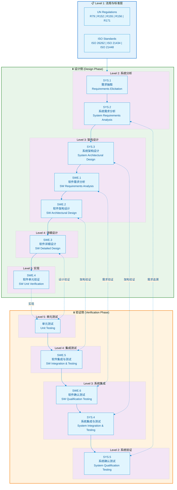
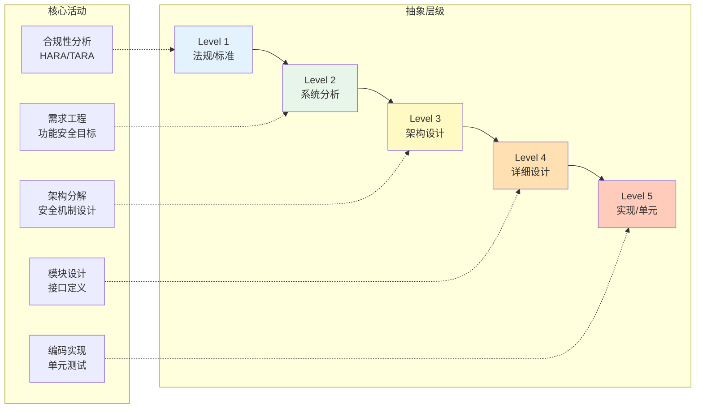

# ASPICE V-Model 架构图

> 本文档展示 Automotive SPICE V模型的完整架构，将 SYS (系统工程) 和 SWE (软件工程) 过程域映射到设计侧（左）与验证侧（右）。

## V-Model 整体架构

## 过程域详细映射表

### 系统工程过程域 (SYS)

| 过程ID | 过程名称 | V模型位置 | 主要输出物 | 对应验证活动 |
|--------|----------|-----------|------------|--------------|
| SYS.1 | 需求抽取 | Level 2 左侧 | 利益相关者需求 | SYS.5 系统确认 |
| SYS.2 | 系统需求分析 | Level 2 左侧 | 系统需求规格 | SYS.5 系统确认 |
| SYS.3 | 系统架构设计 | Level 3 左侧 | 系统架构描述 | SYS.4 系统集成测试 |
| SYS.4 | 系统集成与测试 | Level 3 右侧 | 集成测试报告 | - |
| SYS.5 | 系统确认测试 | Level 2 右侧 | 确认测试报告 | - |

### 软件工程过程域 (SWE)

| 过程ID | 过程名称 | V模型位置 | 主要输出物 | 对应验证活动 |
|--------|----------|-----------|------------|--------------|
| SWE.1 | 软件需求分析 | Level 3 左侧 | 软件需求规格 | SWE.6 软件确认测试 |
| SWE.2 | 软件架构设计 | Level 3 左侧 | 软件架构描述 | SWE.5 软件集成测试 |
| SWE.3 | 软件详细设计 | Level 4 左侧 | 详细设计文档 | SWE.4 单元验证 |
| SWE.4 | 软件单元验证 | Level 5 | 单元测试报告 | - |
| SWE.5 | 软件集成与测试 | Level 4 右侧 | 集成测试报告 | - |
| SWE.6 | 软件确认测试 | Level 3 右侧 | 确认测试报告 | - |

## 层级关系说明

## 双向追溯性要求

V模型的核心原则是 **双向追溯性 (Bidirectional Traceability)**：

1. **向下追溯 (Forward Traceability)**
   - 需求 → 设计 → 实现
   - 确保所有需求都被实现

2. **向上追溯 (Backward Traceability)**
   - 测试用例 → 需求
   - 确保每个测试都对应明确的需求

3. **水平追溯 (Horizontal Traceability)**
   - 设计阶段 ↔ 验证阶段
   - 确保验证活动覆盖对应的设计决策

---

*最后更新: 2026-01-25*
