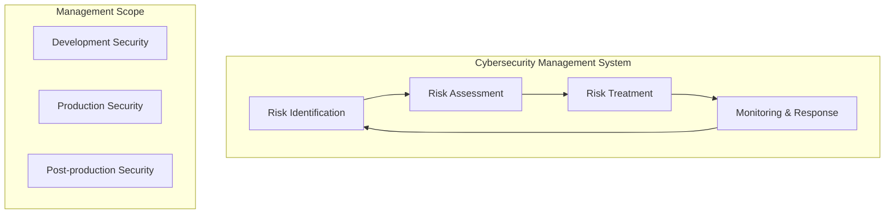
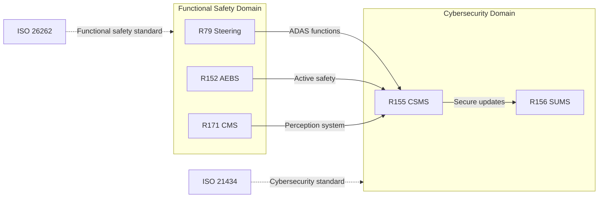

# Regulations Matrix - UN ECE Regulations

> This document summarizes core UN regulations relevant to automotive E/E architecture, defining system boundary constraints and compliance requirements.

---

!!! success "💡 Field Insight from Michael Lin"
    **Background**: UN R155/R156 Type Approval for an ADAS domain controller at a German OEM

    **Key Challenges**:

    - First encounter with R155/R156 dual certification, no internal compliance process
    - Inconsistent supplier understanding of CSMS/SUMS, uneven documentation quality
    - No RXSWIN version management, making OTA traceability difficult

    **My Solution**:

    1. Designed a **CSMS-SUMS unified compliance framework** to integrate both regulations into one process
    2. Authored a **supplier compliance checklist** to ensure Tier-2 deliverables meet Type Approval
    3. Built an **RXSWIN version management system** to link software versions with regulatory certification
    4. Organized **cross-department regulation training** across dev, test, and production

    **Quantified Results**:

    | Metric | Outcome |
    |:-----|:--------:|
    | TÜV SÜD audit | Passed on first attempt |
    | First R155/R156 dual-certified product | ✅ |
    | Compliance document delivery cycle | -40% |
    | Supplier compliance pass rate | 60% → 95% |

---

## Regulations Overview

| Regulation | Name | Scope | Key System Boundary | Effective Date |
|----------|----------|----------|--------------|----------|
| UN R79 | Steering equipment | ADAS/Automated Driving | Steering control authority | In force |
| UN R152 | AEBS Advanced Emergency Braking | Active Safety | Braking intervention boundary | 2024+ |
| UN R155 | Cybersecurity Management | All vehicle types | CSMS governance boundary | 2022+ |
| UN R156 | Software Update Management | All vehicle types | SUMS update boundary | 2022+ |
| UN R171 | Camera Monitoring System | CMS systems | Visual perception boundary | In force |

---

## UN R79 - Steering Equipment

### Scope

```
Applicable to: Steering equipment of M and N category vehicles
Core goal: Ensure safety and controllability of steering systems
```

### System Boundary Constraints

| Constraint Category | Requirement | System Impact |
|----------|----------|----------|
| **ACSF Class A** | Driver-initiated assisted steering | Driver confirmation required |
| **ACSF Class B1** | Lane Keeping Assist (LKA) | Lateral acceleration ≤ 3 m/s² |
| **ACSF Class B2** | Emergency Steering Function (ESF) | May override driver input |
| **ACSF Class C** | Automated lane change | Driver confirmation + monitoring |
| **ACSF Class D** | High automation | Full system control |
| **ACSF Class E** | Remote-controlled driving | External operator control |

### Key Technical Requirements

| Item | R79 Requirement | Design Considerations |
|------|----------|----------|
| Fault response | Single fault must not cause sudden unintended steering | Redundancy required |
| Driver priority | Driver can take over anytime for ACSF A–C | Takeover request strategy |
| Speed limits | ACSF B1 activates above 10 km/h | Low-speed handling |
| Lateral acceleration | ≤ 3 m/s² (normal), ≤ 5 m/s² (emergency) | Control algorithm constraints |

---

## UN R152 - AEBS Advanced Emergency Braking System

### Scope

```
Applicable to: M1 vehicles (passenger cars)
Core goal: Mitigate or avoid collisions
```

### System Boundary Constraints

| Scenario | Target | Minimum Performance |
|----------|----------|--------------|
| CCR (stationary vehicle) | Stationary vehicle ahead | Fully avoid when Vrel ≤ 60 km/h |
| CCRm (moving vehicle) | Slow vehicle ahead | Mitigate at relative speed ≤ 60 km/h |
| VRU-P (pedestrian) | Crossing pedestrian | Fully avoid at 20–60 km/h |
| VRU-B (cyclist) | Crossing cyclist | Fully avoid at 20–60 km/h |

### Functional Safety Boundaries

| Boundary Type | Constraint | Suggested ASIL |
|----------|----------|--------------|
| False activation | Extremely low false braking probability | ASIL B+ |
| Response time | Brake within TTC thresholds | Real-time constraints |
| Sensor availability | Multi-sensor fusion tolerance | Redundancy design |

---

## UN R155 - Cybersecurity Management System (CSMS)

### Scope

```
Applicable to: All M and N category vehicles
Core goal: Establish cybersecurity management system
```

### CSMS Management Boundary



### System Boundary Constraints

| Constraint Category | Requirement | Implementation Impact |
|----------|----------|----------|
| **Organizational capability** | Establish cybersecurity management process | ISMS/TARA integration |
| **Risk management** | Continuous identification and management | Threat intelligence mechanisms |
| **Design & development** | Security by Design principles | SDLC security activities |
| **Supply chain** | Supplier cybersecurity capability assessment | Supplier audit process |
| **Incident response** | Cybersecurity incident response capability | SIRT team build-up |
| **Update capability** | Secure update delivery | Coordination with R156 |

### Type Approval Requirements

| Phase | Certification Content | Evidence |
|------|----------|----------|
| CSMS compliance | Organization-level cybersecurity management | CSMS certificate |
| Vehicle type approval | Vehicle-specific cybersecurity measures | Tech docs + test reports |

---

## UN R156 - Software Update Management System (SUMS)

### Scope

```
Applicable to: M and N vehicles with OTA capability
Core goal: Ensure safe and effective software updates
```

### SUMS Management Boundary

| Boundary Type | Management Content | Implementation Requirement |
|----------|----------|----------|
| **Update identification** | Software version management (RXSWIN) | Traceable versioning |
| **Update validation** | Integrity and authenticity of update packages | Signature verification |
| **Rollback capability** | Recovery after update failure | Dual partition / safe rollback |
| **User notification** | Pre- and post-update notice | HMI interaction design |
| **Safety updates** | Control of safety-related updates | Functional safety impact analysis |

### RXSWIN Software Identification

```
RXSWIN = Rx Software Identification Number
Purpose: Uniquely identify software versions affecting type approval
```

| RXSWIN Component | Description | Example |
|-------------|------|------|
| Manufacturer code | OEM identifier | ABC |
| Vehicle line code | Vehicle series | X123 |
| Software version | Functional version | V2.1.0 |
| Checksum | Integrity check | A7B3 |

---

## UN R171 - Camera Monitoring System (CMS)

### Scope

```
Applicable to: Camera monitoring systems replacing traditional mirrors
Core goal: Ensure CMS provides equivalent or superior field of view
```

### System Boundary Constraints

| Constraint Category | Requirement | Technical Metrics |
|----------|----------|----------|
| **Field of view** | Equivalent to R46 mirror requirements | Horizontal/vertical angles |
| **Image quality** | Minimum resolution and contrast | ≥ 100 pixels/° |
| **Response time** | Display latency limit | ≤ 200 ms |
| **Brightness adaptation** | Adaptation to lighting conditions | Dynamic range |
| **Fault detection** | System fault warning | Driver alert mechanism |

### Functional Safety Considerations

| Failure Mode | Impact | Safety Measure |
|----------|------|----------|
| Camera failure | Loss of view | Redundant camera / mirror backup |
| Display failure | Loss of information | Fault warning + fallback |
| Image processing delay | Perception lag | Real-time monitoring |

---

## Regulation Interaction Matrix



## Compliance Checklist

| Regulation | Check Item | Status |
|------|--------|------|
| R79 | ACSF classification confirmed | ☐ |
| R79 | Fault response strategy defined | ☐ |
| R152 | Scenario coverage analysis complete | ☐ |
| R152 | Performance test plan defined | ☐ |
| R155 | CSMS system established | ☐ |
| R155 | TARA analysis complete | ☐ |
| R156 | SUMS process defined | ☐ |
| R156 | RXSWIN scheme confirmed | ☐ |
| R171 | FOV equivalence validated | ☐ |
| R171 | Image quality test | ☐ |

---

*Last updated: 2026-01-25*
