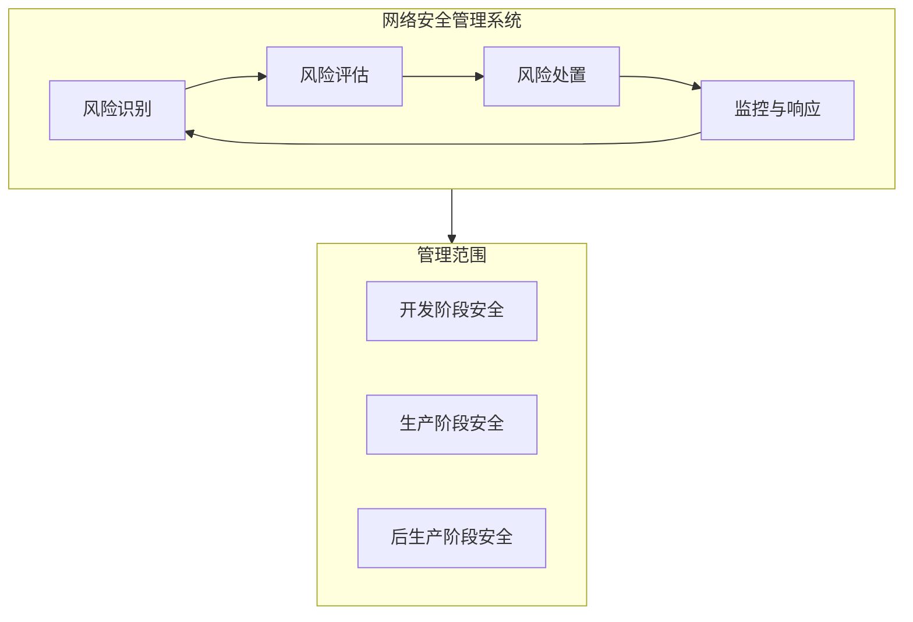
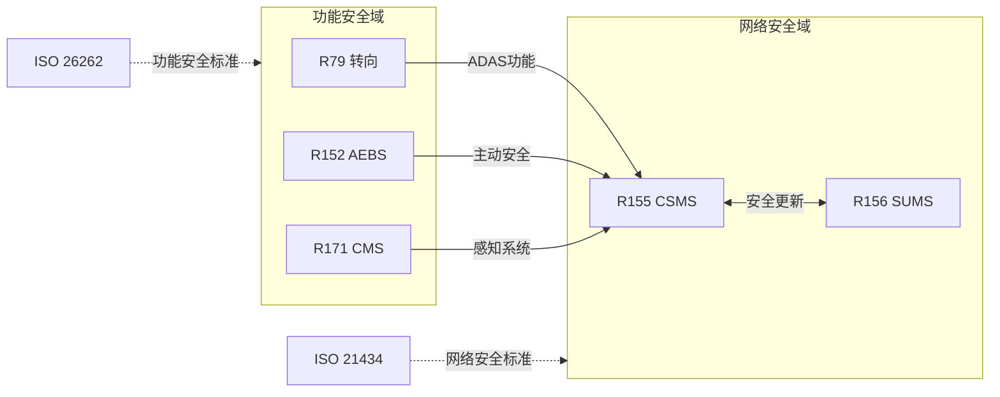

# 法规矩阵 - UN ECE Regulations

> 本文档汇总汽车电子电气架构相关的核心UN法规，定义系统边界约束与合规要求。

---

!!! success "💡 Michael Lin 的实战经验"
    **项目背景**: 某德国 OEM 的 ADAS 域控制器 UN R155/R156 Type Approval
    
    **核心挑战**: 
    
    - 客户首次面对 R155/R156 双重认证，内部合规流程完全空白
    - 供应商对 CSMS/SUMS 要求理解不一致，文档质量参差不齐
    - RXSWIN 版本管理体系未建立，OTA 更新追溯困难
    
    **我的解决方案**:
    
    1. 设计 **CSMS-SUMS 一体化合规框架**，将两个法规要求整合到统一流程
    2. 编写 **供应商合规检查清单**，确保 Tier-2 交付物满足 Type Approval 要求
    3. 建立 **RXSWIN 版本管理体系**，实现软件版本与法规认证的可追溯关联
    4. 组织 **跨部门法规培训**，覆盖开发、测试、生产各环节
    
    **量化成果**:
    
    | 指标 | 达成效果 |
    |:-----|:--------:|
    | TÜV SÜD 审核 | 一次通过 |
    | 首个 R155/R156 双认证产品 | ✅ |
    | 合规文档交付周期 | 缩短 40% |
    | 供应商合规通过率 | 从 60% 提升至 95% |

---

## 核心法规概览

| 法规编号 | 法规名称 | 适用范围 | 关键系统边界 | 生效时间 |
|----------|----------|----------|--------------|----------|
| UN R79 | 转向装置 | ADAS/自动驾驶 | 转向系统控制权限 | 已生效 |
| UN R152 | AEBS 高级紧急制动 | 主动安全 | 制动干预边界 | 2024+ |
| UN R155 | 网络安全管理 | 全车型 | CSMS 管理边界 | 2022+ |
| UN R156 | 软件更新管理 | 全车型 | SUMS 更新边界 | 2022+ |
| UN R171 | 后视镜摄像头 | CMS系统 | 视觉感知边界 | 已生效 |

---

## UN R79 - 转向装置法规

### 法规范围

```
适用于: M类和N类车辆的转向装置
核心目标: 确保转向系统的安全性和可控性
```

### 系统边界约束

| 约束类别 | 具体要求 | 系统影响 |
|----------|----------|----------|
| **ACSF A类** | 驾驶员触发的辅助转向功能 | 需要驾驶员确认 |
| **ACSF B1类** | 车道保持辅助 (LKA) | 横向加速度 ≤ 3 m/s² |
| **ACSF B2类** | 紧急转向功能 (ESF) | 可超越驾驶员输入 |
| **ACSF C类** | 自动变道功能 | 需驾驶员确认+监控 |
| **ACSF D类** | 高度自动驾驶 | 系统全权控制 |
| **ACSF E类** | 远程遥控驾驶 | 外部操作员控制 |

### 关键技术要求

| 项目 | R79 要求 | 设计考量 |
|------|----------|----------|
| 故障响应 | 单一故障不得导致突然非预期转向 | 冗余设计要求 |
| 驾驶员优先 | ACSF A-C 驾驶员可随时接管 | 接管请求策略 |
| 速度限制 | ACSF B1: 10 km/h 以上激活 | 低速场景处理 |
| 横向加速度 | ≤ 3 m/s² (正常), ≤ 5 m/s² (紧急) | 控制算法约束 |

---

## UN R152 - AEBS 高级紧急制动系统

### 法规范围

```
适用于: M1类车辆 (乘用车)
核心目标: 减轻或避免碰撞事故
```

### 系统边界约束

| 场景类别 | 目标对象 | 最低性能要求 |
|----------|----------|--------------|
| CCR (静止车辆) | 前方静止车辆 | Vrel ≤ 60 km/h 完全避免 |
| CCRm (移动车辆) | 前方慢速车辆 | 相对速度 ≤ 60 km/h 减轻碰撞 |
| VRU-P (行人) | 横穿行人 | 20-60 km/h 完全避免 |
| VRU-B (骑行者) | 横穿骑行者 | 20-60 km/h 完全避免 |

### 功能安全边界

| 边界类型 | 约束内容 | ASIL等级建议 |
|----------|----------|--------------|
| 误触发率 | 极低误刹车概率 | ASIL B+ |
| 响应时间 | TTC阈值内完成制动 | 实时性要求 |
| 传感器可用性 | 多传感器融合容错 | 冗余设计 |

---

## UN R155 - 网络安全管理系统 (CSMS)

### 法规范围

```
适用于: 所有M类和N类车辆
核心目标: 建立网络安全管理体系
```

### CSMS 管理边界



### 系统边界约束

| 约束类别 | 具体要求 | 实施影响 |
|----------|----------|----------|
| **组织能力** | 建立网络安全管理流程 | ISMS/TARA 集成 |
| **风险管理** | 持续识别和管理网络安全风险 | 威胁情报机制 |
| **设计开发** | 安全设计原则 (Security by Design) | SDLC 安全活动 |
| **供应链** | 供应商网络安全能力评估 | 供应商审核流程 |
| **事件响应** | 网络安全事件响应能力 | SIRT 团队建设 |
| **更新能力** | 安全更新分发能力 | 与 R156 协同 |

### 车辆型式认证要求

| 阶段 | 认证内容 | 证据要求 |
|------|----------|----------|
| CSMS 符合性 | 组织级网络安全管理体系 | CSMS证书 |
| 车型认证 | 具体车型网络安全措施 | 技术文档+测试报告 |

---

## UN R156 - 软件更新管理系统 (SUMS)

### 法规范围

```
适用于: 具有OTA能力的M类和N类车辆
核心目标: 确保软件更新的安全性和有效性
```

### SUMS 管理边界

| 边界类型 | 管理内容 | 实施要求 |
|----------|----------|----------|
| **更新识别** | 软件版本管理 (RXSWIN) | 可追溯的版本号体系 |
| **更新验证** | 更新包完整性和真实性 | 签名验证机制 |
| **回滚能力** | 更新失败后的恢复能力 | 双分区/安全回退 |
| **用户通知** | 更新前后的用户告知 | HMI 交互设计 |
| **安全更新** | 安全相关软件的更新控制 | 功能安全影响评估 |

### RXSWIN 软件标识

```
RXSWIN = Rx Software Identification Number
用途: 唯一标识影响型式认证的软件版本
```

| RXSWIN 组成 | 说明 | 示例 |
|-------------|------|------|
| 制造商代码 | OEM 标识 | ABC |
| 车型代码 | 车型系列 | X123 |
| 软件版本 | 功能版本号 | V2.1.0 |
| 校验码 | 完整性校验 | A7B3 |

---

## UN R171 - 摄像机监视系统 (CMS)

### 法规范围

```
适用于: 替代传统后视镜的摄像机监视系统
核心目标: 确保CMS提供等效或更优的视野
```

### 系统边界约束

| 约束类别 | 具体要求 | 技术指标 |
|----------|----------|----------|
| **视野范围** | 等效于 R46 后视镜要求 | 水平/垂直视角 |
| **图像质量** | 最低分辨率和对比度 | ≥ 100 像素/° |
| **响应时间** | 显示延迟限制 | ≤ 200 ms |
| **亮度适应** | 明暗环境适应能力 | 动态范围要求 |
| **故障检测** | 系统故障告警 | 驾驶员提醒机制 |

### 功能安全考量

| 失效模式 | 影响 | 安全措施 |
|----------|------|----------|
| 摄像头失效 | 视野丧失 | 冗余摄像头/传统镜面备份 |
| 显示器失效 | 信息丢失 | 故障警告+应急措施 |
| 图像处理延迟 | 感知滞后 | 实时性监控 |

---

## 法规间关联矩阵



## 合规检查清单

| 法规 | 检查项 | 状态 |
|------|--------|------|
| R79 | ACSF 功能分类确认 | ☐ |
| R79 | 故障响应策略定义 | ☐ |
| R152 | 场景覆盖分析完成 | ☐ |
| R152 | 性能测试方案制定 | ☐ |
| R155 | CSMS 体系建立 | ☐ |
| R155 | TARA 分析完成 | ☐ |
| R156 | SUMS 流程定义 | ☐ |
| R156 | RXSWIN 方案确定 | ☐ |
| R171 | 视野等效性验证 | ☐ |
| R171 | 图像质量测试 | ☐ |

---

*最后更新: 2026-01-25*
