# HARA / TARA / STPA Analysis Guide

> This document details the methodologies, inputs/outputs, and implementation guidance for functional safety analysis (HARA), cybersecurity analysis (TARA), and System-Theoretic Process Analysis (STPA).

---

!!! success "💡 Field Insight from Michael Lin"
    **Background**: ASIL D brake system functional safety certification + ISO 21434 cybersecurity compliance at MAGNA

    **Key Challenges**:

    - HARA and TARA teams worked in silos; risk assessments could not align
    - Traditional FMEA missed multiple system-level interaction risks
    - German OEM required traceable linkage between functional safety and cybersecurity analysis

    **My Solution**:

    1. Designed a **HARA–TARA joint review template** to unify mappings
    2. Introduced **STPA control structure analysis**, identifying 3 UCAs missed by FMEA
    3. Established **cross-department risk sync meetings** on a weekly cadence

    **Quantified Results**:

    | Metric | Before | After | Improvement |
    |:-----|:------:|:------:|:----:|
    | Safety analysis coverage | 72% | 100% | +40% |
    | Review cycle | 6 weeks | 2 weeks | -67% |
    | OEM rejections | 3 / project | 0 | -100% |

---

## Methodology Overview

| Method | Standard Source | Goal | Core Output |
|----------|----------|----------|----------|
| **HARA** | ISO 26262 | Functional safety risk | ASIL level & safety goals |
| **TARA** | ISO 21434 | Cybersecurity risk | CAL level & security goals |
| **STPA** | MIT/Leveson | Systemic hazards | Control flaws & constraints |

---

## STPA (System-Theoretic Process Analysis)

### Core Concept

STPA is a system-theoretic hazard analysis method proposed by Prof. Nancy Leveson at MIT. The core idea is:

> **Accidents are not only caused by component failures, but also by inadequate control structures.**

### Generic STPA Control Loop Model

```mermaid
flowchart TB
    subgraph Controller["🎮 Controller"]
        direction TB
        PM["Process Model"]
        CA["Control Algorithm"]
        PM --> CA
    end

    subgraph Actuator["⚙️ Actuator"]
        ACT["Actuation"]
    end

    subgraph Process["🔄 Controlled Process"]
        CP["Physical process / system state"]
    end

    subgraph Sensor["📡 Sensor"]
        SEN["Sensing device"]
    end

    Controller -->|"Control Action"| Actuator
    Actuator -->|"Physical Input"| Process
    Process -->|"Physical Output"| Sensor
    Sensor -->|"Feedback"| Controller

    subgraph UCA["⚠️ Types of Unsafe Control Actions"]
        direction LR
        UCA1["1. Required control action not provided"]
        UCA2["2. Unsafe control action provided"]
        UCA3["3. Control action at wrong time"]
        UCA4["4. Control action for too long or too short"]
    end

    Controller -.->|"May lead to"| UCA

    style Controller fill:#e3f2fd,stroke:#1976d2
    style Actuator fill:#fff3e0,stroke:#f57c00
    style Process fill:#e8f5e9,stroke:#388e3c
    style Sensor fill:#fce4ec,stroke:#c2185b
    style UCA fill:#ffebee,stroke:#c62828
```

### STPA Analysis Steps

### ADAS STPA Control Structure Example

### UCA Analysis Template

| Control Action | Not Provided | Unsafe Provided | Too Early/Too Late | Too Long/Too Short |
|----------|--------|----------|---------------|--------------|
| Brake request | No braking despite collision risk | False braking with no risk | Braking too late to avoid | Braking too long causes rear-end |
| Steering request | No steering when needed | Steering in wrong direction | Timing causes loss of control | Steering angle too long |
| Accel request | No acceleration when merging | Accelerate into danger | Wrong timing | Acceleration too long |

---

## HARA vs TARA Comparative Analysis

### Input/Output Mapping

```mermaid
flowchart TB
    subgraph Inputs["📥 Common Inputs"]
        I1["System definition & boundaries"]
        I2["Functional description"]
        I3["Operational scenarios"]
        I4["Stakeholder information"]
    end

    subgraph HARA_Process["🛡️ HARA Process (ISO 26262)"]
        direction TB
        H1["Item definition"]
        H2["Hazard identification"]
        H3["Hazard scenario analysis"]
        H4["S/E/C assessment"]
        H5["ASIL determination"]
        H6["Safety goals definition"]
        H1 --> H2 --> H3 --> H4 --> H5 --> H6
    end

    subgraph TARA_Process["🔐 TARA Process (ISO 21434)"]
        direction TB
        T1["Asset identification"]
        T2["Threat identification"]
        T3["Attack path analysis"]
        T4["Impact/feasibility assessment"]
        T5["CAL determination"]
        T6["Security goals definition"]
        T1 --> T2 --> T3 --> T4 --> T5 --> T6
    end

    subgraph HARA_Outputs["📤 HARA Outputs"]
        HO1["Hazard list"]
        HO2["ASIL level"]
        HO3["Functional safety goals"]
        HO4["Safety requirements"]
    end

    subgraph TARA_Outputs["📤 TARA Outputs"]
        TO1["Threat list"]
        TO2["CAL level"]
        TO3["Cybersecurity goals"]
        TO4["Security requirements"]
    end

    Inputs --> HARA_Process
    Inputs --> TARA_Process
    HARA_Process --> HARA_Outputs
    TARA_Process --> TARA_Outputs

    style HARA_Process fill:#e8f5e9,stroke:#388e3c,stroke-width:2px
    style TARA_Process fill:#fff3e0,stroke:#f57c00,stroke-width:2px
```

### Key Concept Comparison

| Dimension | HARA (Functional Safety) | TARA (Cybersecurity) |
|------|-----------------|-----------------|
| **Standard** | ISO 26262 | ISO 21434 |
| **Object** | Item (system/function) | Asset (data/asset) |
| **Risk Source** | Failures/malfunctions | Malicious attacks/threats |
| **Scenario** | Hazardous event | Attack scenario |
| **Impact evaluation** | Severity (S) | Impact |
| **Exposure evaluation** | Exposure (E) | Attack feasibility |
| **Controllability** | Controllability (C) | - |
| **Risk level** | ASIL (A/B/C/D) | CAL (1/2/3/4) |
| **Output** | Functional safety goals (FSG) | Cybersecurity goals (CSG) |

### Severity Comparison

#### HARA - Severity (S)

| Level | Description | Injury Severity |
|------|------|----------|
| S0 | No injury | - |
| S1 | Light injury | Possible minor injury |
| S2 | Severe injury | Major injury, high survival probability |
| S3 | Life-threatening | Potentially fatal |

#### TARA - Impact

| Level | Safety Impact | Financial Impact | Operational Impact | Privacy Impact |
|------|----------|----------|----------|----------|
| Severe | Fatal injury | Massive loss | Operations stop | Large-scale leakage |
| Major | Severe injury | Major loss | Major disruption | Sensitive leak |
| Moderate | Minor injury | Medium loss | Partial disruption | Ordinary leak |
| Negligible | No injury | Minimal loss | Minor impact | No leakage |

### HARA–TARA Linked Scenario

```mermaid
flowchart LR
    subgraph Scenario["Scenario: AEB failure"]
        direction TB
        FUNC["Functional failure<br/>(HARA view)"]
        CYBER["Cyber attack<br/>(TARA view)"]
    end

    subgraph HARA_Analysis["HARA Analysis"]
        HA1["Hazard: AEB false trigger / no trigger"]
        HA2["S3: Potentially fatal collision"]
        HA3["E4: High exposure"]
        HA4["C2: Normally controllable"]
        HA5["ASIL D"]
    end

    subgraph TARA_Analysis["TARA Analysis"]
        TA1["Threat: CAN injection"]
        TA2["Impact: Severe (Safety)"]
        TA3["Attack feasibility: Medium"]
        TA4["CAL 4"]
    end

    FUNC --> HARA_Analysis
    CYBER --> TARA_Analysis

    HARA_Analysis -->|"Same failure mode"| Integration
    TARA_Analysis -->|"Attack can cause"| Integration

    subgraph Integration["🔗 Integrated Safety Requirements"]
        INT1["Must satisfy ASIL D and CAL 4"]
        INT2["Safety mechanisms must resist faults and attacks"]
    end
```

---

## Method Selection Guide

### Method Synergy

| Project Phase | Recommended Methods | Notes |
|----------|----------|------|
| Concept phase | STPA | Identify system-level hazards and control structure |
| Item definition | HARA + TARA | Establish baseline safety/security levels |
| Architecture design | STPA + HARA/TARA | Validate safety of architecture decisions |
| Detailed design | FMEA/FTA | Component-level failure analysis |
| Change impact | Incremental STPA | Assess impact of changes on control structure |

---

## Templates

### HARA Worksheet Template

| Item | Functional Failure | Hazard | Scenario | S | E | C | ASIL | Safety Goal |
|------|----------|------|------|---|---|---|------|----------|
| AEB | Insufficient braking | Collision | Urban road | S3 | E4 | C2 | D | FSG-001 |
| LKA | Wrong steering | Lane departure | Highway | S3 | E3 | C2 | C | FSG-002 |

### TARA Worksheet Template

| Asset | Threat | Attack Path | Impact | Feasibility | Risk | CAL | Security Goal |
|-------|------|----------|------|--------|------|-----|----------|
| Brake ECU | Message spoofing | CAN injection | Severe | Medium | High | 4 | CSG-001 |
| OTA Server | Firmware tampering | Network intrusion | Severe | Low | Medium | 3 | CSG-002 |

---

*Last updated: 2026-01-25*
