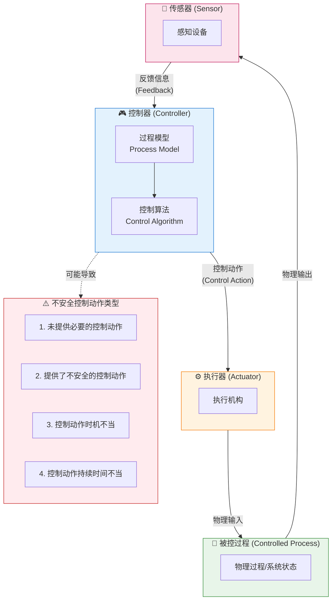
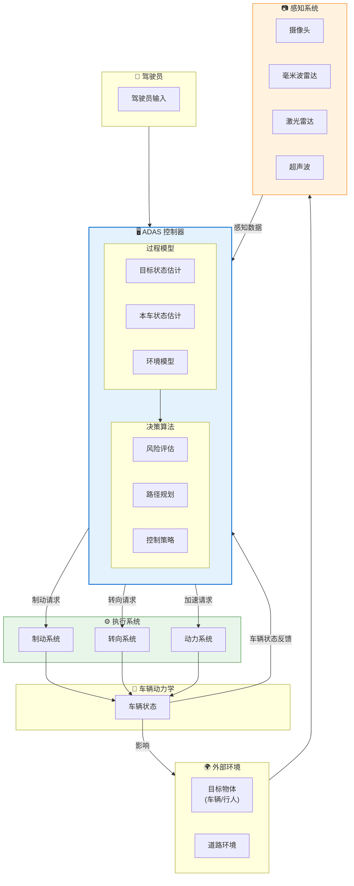
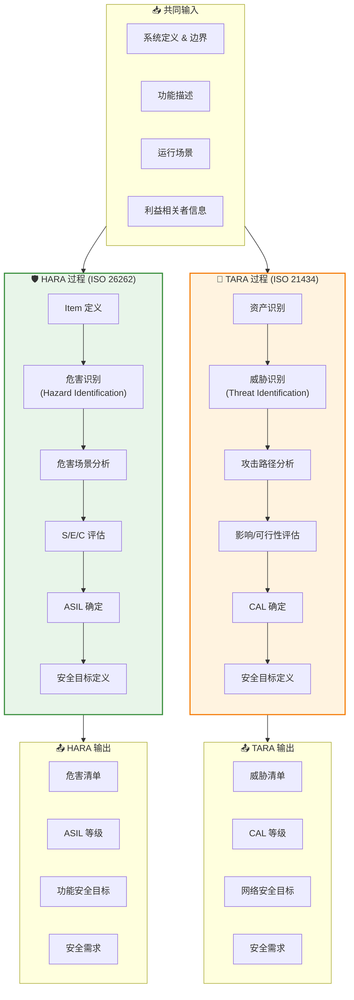
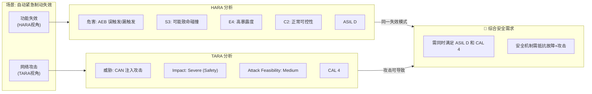
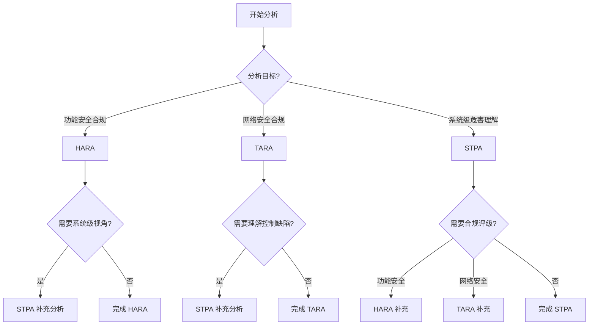

# HARA / TARA / STPA 分析指南

> 本文档详述功能安全分析 (HARA)、信息安全分析 (TARA) 和系统理论过程分析 (STPA) 的方法论、输入输出映射及实施指南。

---

!!! success "💡 Michael Lin 的实战经验"
    **项目背景**: MAGNA 某制动系统 ASIL D 功能安全认证 + ISO 21434 网络安全合规
    
    **核心挑战**: 
    
    - HARA 与 TARA 分析团队各自为战，风险评估结果无法对齐
    - 传统 FMEA 方法遗漏了多个系统级交互风险
    - 德国 OEM 客户要求功能安全与网络安全分析可追溯关联
    
    **我的解决方案**:
    
    1. 设计 **HARA-TARA 联合评审模板**，将功能安全与网络安全风险统一映射
    2. 引入 **STPA 控制结构分析**，识别出传统 FMEA 遗漏的 3 个 UCA
    3. 建立 **跨部门风险协调会议机制**，每周同步分析进展
    
    **量化成果**:
    
    | 指标 | 改进前 | 改进后 | 提升 |
    |:-----|:------:|:------:|:----:|
    | 安全分析覆盖率 | 72% | 100% | +40% |
    | 评审周期 | 6 周 | 2 周 | -67% |
    | OEM 退回次数 | 3 次/项目 | 0 次 | -100% |

---

## 方法论概览

| 分析方法 | 标准来源 | 分析目标 | 核心输出 |
|----------|----------|----------|----------|
| **HARA** | ISO 26262 | 功能安全风险 | ASIL等级 & 安全目标 |
| **TARA** | ISO 21434 | 网络安全风险 | CAL等级 & 安全目标 |
| **STPA** | MIT/Leveson | 系统性危害 | 控制缺陷 & 约束 |

---

## STPA 系统理论过程分析

### STPA 核心概念

STPA (System-Theoretic Process Analysis) 是一种基于系统理论的危害分析方法，由MIT的Nancy Leveson教授提出。其核心理念是：

> **事故不仅仅是组件失效的结果，更是控制结构不充分的结果。**

### STPA 控制回路图 - 通用模型

### STPA 分析步骤

```mermaid
flowchart LR
    subgraph Step1["Step 1: 定义分析目的"]
        S1A[识别系统级损失]
        S1B[识别系统级危害]
        S1C[建立危害-损失关联]
    end

    subgraph Step2["Step 2: 建模控制结构"]
        S2A[识别控制器]
        S2B[识别控制动作]
        S2C[识别反馈通道]
        S2D[绘制控制结构图]
    end

    subgraph Step3["Step 3: 识别UCA"]
        S3A[分析每个控制动作]
        S3B[应用4种UCA类型]
        S3C[记录不安全控制动作]
    end

    subgraph Step4["Step 4: 识别致因场景"]
        S4A[控制器致因]
        S4B[控制路径致因]
        S4C[反馈路径致因]
        S4D[过程模型致因]
    end

    Step1 --> Step2 --> Step3 --> Step4
```

### ADAS 系统 STPA 控制结构示例

### UCA 分析表模板

| 控制动作 | 未提供 | 错误提供 | 时机过早/过晚 | 持续时间不当 |
|----------|--------|----------|---------------|--------------|
| 制动请求 | 前方有碰撞风险时未制动 | 无风险时误制动 | 制动时机过晚无法避障 | 制动持续过长导致追尾 |
| 转向请求 | 需规避时未转向 | 错误方向转向 | 转向时机导致失控 | 转向角度持续过大 |
| 加速请求 | 需汇入时未加速 | 危险区域加速 | 加速时机不当 | 加速持续过长 |

---

## HARA vs TARA 对比分析

### 输入输出映射图

### 关键概念对比

| 维度 | HARA (功能安全) | TARA (信息安全) |
|------|-----------------|-----------------|
| **标准依据** | ISO 26262 | ISO 21434 |
| **分析对象** | Item (系统/功能) | Asset (资产/数据) |
| **风险来源** | 系统故障/失效 | 恶意攻击/威胁 |
| **场景描述** | 危害场景 (Hazardous Event) | 攻击场景 (Attack Scenario) |
| **影响评估** | Severity (严重度) | Impact (影响程度) |
| **暴露评估** | Exposure (暴露度) | Attack Feasibility (攻击可行性) |
| **可控评估** | Controllability (可控性) | - |
| **风险等级** | ASIL (A/B/C/D) | CAL (1/2/3/4) |
| **输出目标** | 功能安全目标 (FSG) | 网络安全目标 (CSG) |

### 严重度评估对比

#### HARA - Severity (S)

| 等级 | 描述 | 伤害程度 |
|------|------|----------|
| S0 | 无伤害 | - |
| S1 | 轻微伤害 | 可能轻伤 |
| S2 | 严重伤害 | 可能重伤, 生存概率高 |
| S3 | 致命伤害 | 可能致命 |

#### TARA - Impact

| 等级 | 安全影响 | 财务影响 | 运营影响 | 隐私影响 |
|------|----------|----------|----------|----------|
| Severe | 致命伤害 | 巨额损失 | 无法运营 | 大规模泄露 |
| Major | 严重伤害 | 重大损失 | 严重中断 | 敏感泄露 |
| Moderate | 轻微伤害 | 中等损失 | 部分中断 | 一般泄露 |
| Negligible | 无伤害 | 微小损失 | 轻微影响 | 无泄露 |

### HARA-TARA 关联场景

---

## 分析方法选择指南

### 方法协同应用

| 项目阶段 | 推荐方法 | 说明 |
|----------|----------|------|
| 概念阶段 | STPA | 系统级危害识别，理解控制结构 |
| Item 定义 | HARA + TARA | 建立安全等级基线 |
| 架构设计 | STPA + HARA/TARA | 验证架构决策的安全性 |
| 详细设计 | FMEA/FTA | 组件级失效分析 |
| 变更影响 | 增量 STPA | 评估变更对控制结构的影响 |

---

## 实施模板

### HARA 工作表模板

| Item | 功能失效 | 危害 | 场景 | S | E | C | ASIL | 安全目标 |
|------|----------|------|------|---|---|---|------|----------|
| AEB | 制动不足 | 碰撞 | 城市道路 | S3 | E4 | C2 | D | FSG-001 |
| LKA | 转向错误 | 偏离车道 | 高速公路 | S3 | E3 | C2 | C | FSG-002 |

### TARA 工作表模板

| Asset | 威胁 | 攻击路径 | 影响 | 可行性 | Risk | CAL | 安全目标 |
|-------|------|----------|------|--------|------|-----|----------|
| 制动ECU | 消息伪造 | CAN注入 | Severe | Medium | High | 4 | CSG-001 |
| OTA服务器 | 篡改固件 | 网络入侵 | Severe | Low | Medium | 3 | CSG-002 |

---

*最后更新: 2026-01-25*
