# Hardware Reliability Analysis - FTA / FMEA / FMEDA

> This document summarizes hardware reliability analysis methods in automotive functional safety, focusing on FTA (Fault Tree Analysis) and FMEA/FMEDA in hardware metric calculations.

---

!!! success "💡 Field Insight from Michael Lin"
    **Background**: ASIL D hardware safety metrics for an ADAS domain controller

    **Key Challenges**:

    - Supplier FMEDA data incomplete, with non-conservative failure rate assumptions
    - FTA and FMEDA results could not be linked, leaving PMHF gaps
    - Inconsistent understanding of SPFM/LFM targets within the hardware team

    **My Solution**:

    1. Built an **FMEDA data review checklist**, requiring IEC 62380 failure rates from suppliers
    2. Designed an **FTA–FMEDA mapping matrix**, ensuring each basic event has a failure rate
    3. Delivered **hardware safety metrics training**, aligning the team on ISO 26262-5

    **Quantified Results**:

    | Metric | Target | Achieved | Status |
    |:-----|:------:|:--------:|:----:|
    | SPFM | ≥ 99% | 99.3% | ✅ |
    | LFM | ≥ 90% | 94.2% | ✅ |
    | PMHF | < 10⁻⁸/h | 6.2×10⁻⁹/h | ✅ |

---

## Methodology Overview

```mermaid
flowchart TB
    subgraph TopDown["⬇️ Top-down"]
        FTA["FTA<br/>Fault Tree Analysis"]
    end

    subgraph BottomUp["⬆️ Bottom-up"]
        FMEA["FMEA<br/>Failure Mode & Effects Analysis"]
        FMEDA["FMEDA<br/>Failure Mode, Effects & Diagnostic Analysis"]
    end

    subgraph Metrics["📊 Hardware Metrics"]
        SPFM["SPFM<br/>Single-Point Fault Metric"]
        LFM["LFM<br/>Latent Fault Metric"]
        PMHF["PMHF<br/>Probabilistic Metric for Hardware Failures"]
    end

    FTA -->|"Identify minimal cut sets"| Metrics
    FMEA -->|"Failure classification"| FMEDA
    FMEDA -->|"Diagnostic coverage"| Metrics

    style FTA fill:#e3f2fd,stroke:#1976d2
    style FMEA fill:#fff3e0,stroke:#f57c00
    style FMEDA fill:#e8f5e9,stroke:#388e3c
    style Metrics fill:#fce4ec,stroke:#c2185b
```

---

## FTA - Fault Tree Analysis

### Overview

FTA is a **deductive (top-down)** analysis method:
- Start from a top event (undesired system failure)
- Decompose causes layer by layer
- Use logic gates (AND/OR) to model causal relationships

### FTA Symbols

```mermaid
flowchart TB
    subgraph Gates["Logic Gates"]
        OR_Gate["OR Gate<br/>Any input occurs<br/>→ output occurs"]
        AND_Gate["AND Gate<br/>All inputs occur<br/>→ output occurs"]
    end

    subgraph Events["Event Types"]
        TOP["Top Event<br/>(system-level failure)"]
        INT["Intermediate Event<br/>(subsystem failure)"]
        BASE["Basic Event<br/>(component failure)"]
        UNDEV["Undeveloped Event<br/>(to be analyzed)"]
    end
```

### Example FTA - AEB System Failure

### Core FTA Concepts

| Concept | Definition | Meaning |
|------|------|------|
| **Minimal Cut Set (MCS)** | Minimal combination of basic events leading to top event | Identify critical failure paths |
| **Single-Point Fault (SPF)** | Minimal cut set with one element | System weak point |
| **Common Cause Failure (CCF)** | Multiple components fail due to a common cause | Redundancy considerations |

### FTA in ISO 26262

| Use Case | Purpose | Output |
|----------|------|------|
| Safety goal decomposition | Validate FSR completeness | Safety requirement verification |
| Quantitative analysis | Calculate top event probability | PMHF contribution |
| Architecture assessment | Identify single-point faults | SPFM input |

---

## FMEA - Failure Mode & Effects Analysis

### Overview

FMEA is an **inductive (bottom-up)** analysis method:
- Start from component failure modes
- Analyze their effects on the system
- Evaluate severity, occurrence, and detection

### FMEA Process Flow

### FMEA Evaluation Dimensions

| Dimension | Abbrev. | Description | Scale |
|------|------|----------|----------|
| **Severity** | S | Severity of impact | 1-10 |
| **Occurrence** | O | Failure frequency | 1-10 |
| **Detection** | D | Detectability of failure | 1-10 |

**RPN = S × O × D** (Risk Priority Number)

### FMEA Worksheet Template

| Component | Function | Failure Mode | Effect | S | Cause | O | Current Controls | D | RPN |
|------|------|----------|------|---|------|---|----------|---|-----|
| Temp sensor | Measure temperature | Output drift | Control deviation | 6 | Aging | 3 | Range check | 4 | 72 |
| Temp sensor | Measure temperature | No output | Loss of function | 8 | Open circuit | 2 | Signal monitoring | 2 | 32 |

---

## FMEDA - Failure Mode, Effects & Diagnostic Analysis

### Overview

FMEDA is an extension of FMEA, focused on:
- Quantifying hardware failure rates
- Assessing diagnostic coverage
- Calculating ISO 26262 hardware metrics

### FMEDA vs FMEA

| Feature | FMEA | FMEDA |
|------|------|-------|
| Failure rate | Qualitative / semi-quantitative | Quantitative (FIT) |
| Diagnostic coverage | Not included | Core element |
| Failure classification | Risk level | Safe / SPF / RF / MPF |
| Standard | General quality | ISO 26262-specific |

### FMEDA Failure Classification

```mermaid
flowchart TD
    FM["Component Failure Mode"]

    FM --> Q1{Violates safety goals?}

    Q1 -->|No| SAFE["✅ Safe Fault"]

    Q1 -->|Yes| Q2{Diagnosed?}

    Q2 -->|Fully covered| DETECTED["🔍 Detected Fault"]

    Q2 -->|Partially covered| RESIDUAL["⚠️ Residual Fault"]

    Q2 -->|Not covered| Q3{Independent redundancy?}

    Q3 -->|Yes| MPF["🔸 Multi-Point Fault"]

    Q3 -->|No| SPF["🔴 Single-Point Fault"]

    style SAFE fill:#c8e6c9,stroke:#388e3c
    style DETECTED fill:#fff9c4,stroke:#f9a825
    style RESIDUAL fill:#ffe0b2,stroke:#f57c00
    style MPF fill:#ffccbc,stroke:#e64a19
    style SPF fill:#ffcdd2,stroke:#c62828
```

### Failure Rate Allocation

| Failure Category | Symbol | Definition | Metric Impact |
|----------|------|------|--------------|
| Safe fault | λ_S | Does not violate safety goals | Not counted in risk |
| Single-point fault | λ_SPF | Directly violates safety goals | Impacts SPFM |
| Residual fault | λ_RF | Not fully covered by diagnostics | Impacts SPFM |
| Multi-point (detected) | λ_MPF_D | Detected multi-point fault | - |
| Multi-point (latent) | λ_MPF_L | Latent multi-point fault | Impacts LFM |

---

## ISO 26262 Hardware Metrics

### Three Key Metrics

```mermaid
flowchart LR
    subgraph SPFM_Calc["SPFM Metric"]
        SPFM_F["SPFM = 1 - (λ_SPF + λ_RF) / λ_total"]
    end

    subgraph LFM_Calc["LFM Metric"]
        LFM_F["LFM = 1 - λ_MPF_L / (λ_MPF_L + λ_MPF_D)"]
    end

    subgraph PMHF_Calc["PMHF Metric"]
        PMHF_F["PMHF = Σ(failure probability contribution)"]
    end
```

### Metric Targets (ISO 26262-5)

| ASIL | SPFM Target | LFM Target | PMHF Target |
|-----------|-----------|----------|-----------|
| ASIL B | ≥ 90% | ≥ 60% | < 10⁻⁷/h |
| ASIL C | ≥ 97% | ≥ 80% | < 10⁻⁷/h |
| ASIL D | ≥ 99% | ≥ 90% | < 10⁻⁸/h |

### Diagnostic Coverage Levels

| Level | DC Range | Typical Measures |
|------|---------|----------|
| None | < 60% | No diagnostics |
| Low | 60-90% | Range check, plausibility check |
| Medium | 90-99% | Redundant comparison, CRC |
| High | ≥ 99% | HW redundancy, diversity design |

---

## FTA + FMEA/FMEDA Integration

### Recommended Workflow

| Phase | FTA Tasks | FMEA/FMEDA Tasks |
|------|----------|-----------------|
| Concept design | Initial FTA to identify critical paths | Initial FMEA to identify failure modes |
| System design | Refine FTA to validate architecture | System-level FMEA |
| Hardware design | Hardware FTA | Hardware FMEDA for metrics |
| Detailed design | Quantitative FTA (PMHF) | Component-level FMEDA |
| Verification | Validate FTA results | Validate FMEDA assumptions |

---

## Implementation Notes

### Data Sources

| Data Type | Source | Notes |
|----------|------|------|
| Failure rates | SN 29500, IEC 62380 | Industry standard databases |
| Supplier data | Component supplier FMEDA | More accurate real data |
| Field data | After-sales return analysis | Most real but delayed |

### Common Challenges

| Challenge | Mitigation |
|------|----------|
| Insufficient failure rate data | Conservative estimates + sensitivity analysis |
| Diagnostic coverage assessment difficulty | Fault injection testing |
| Common cause failure modeling | Beta-factor method |
| High analysis effort | Tool support + layered analysis |

---

*Last updated: 2026-01-25*
