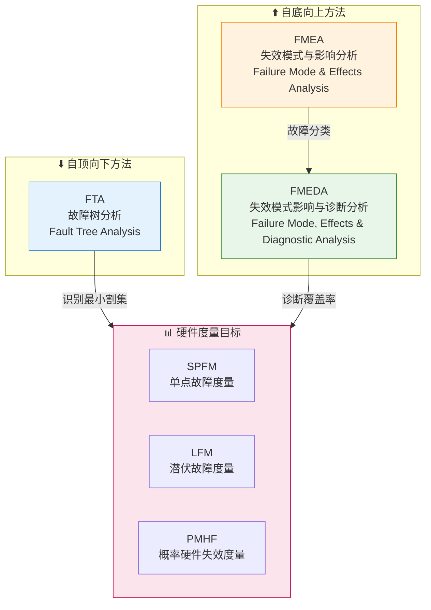
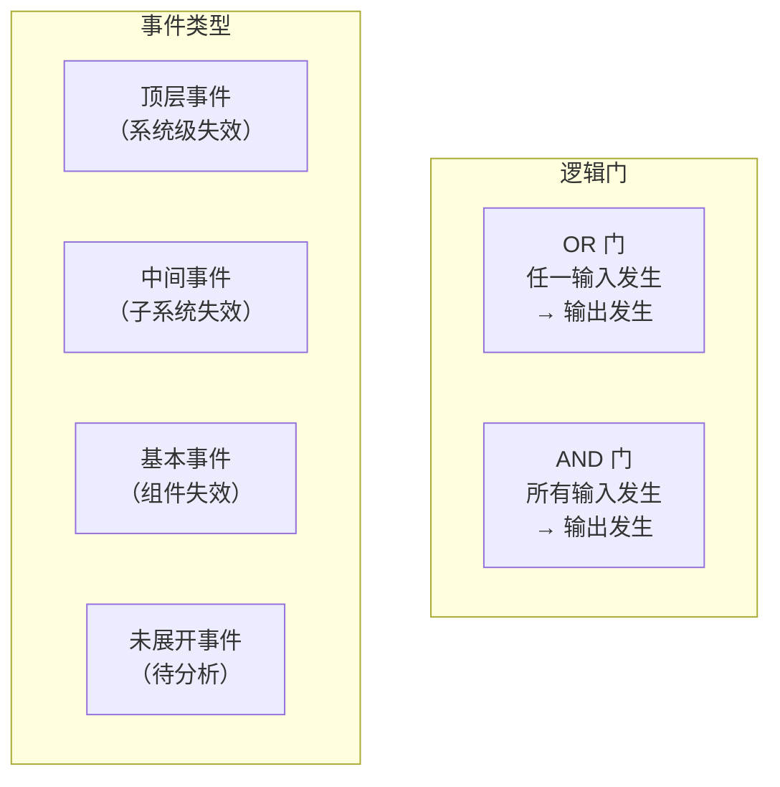
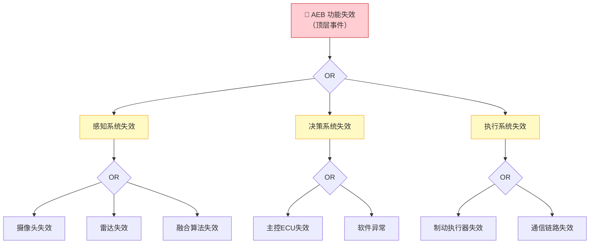
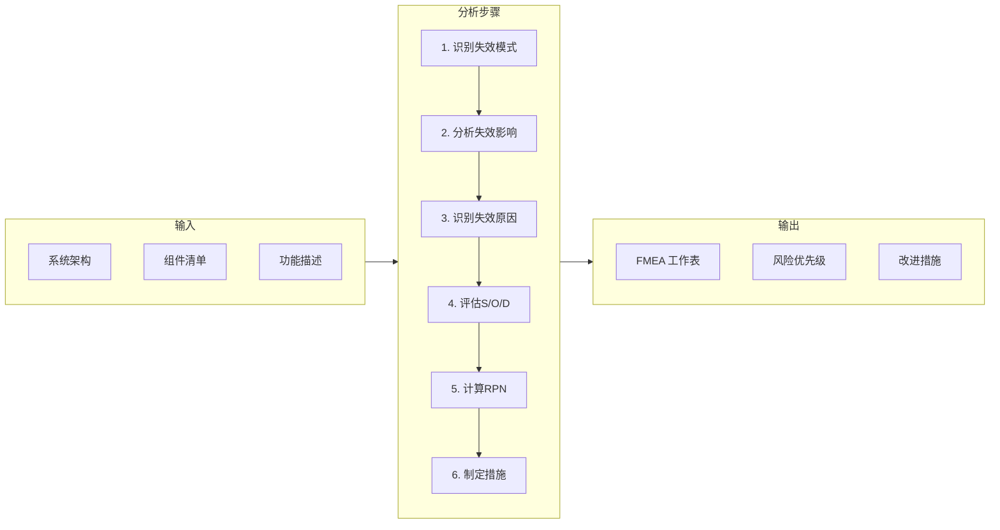
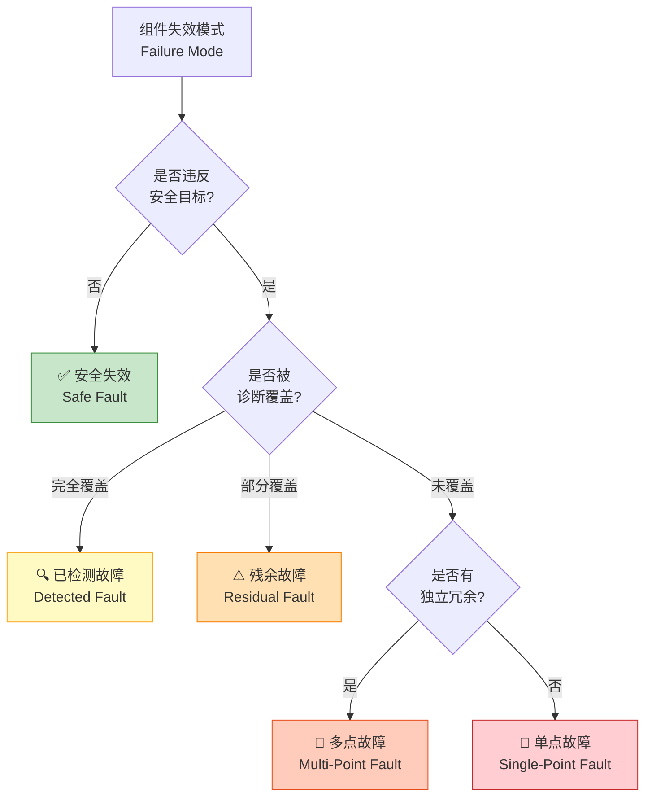
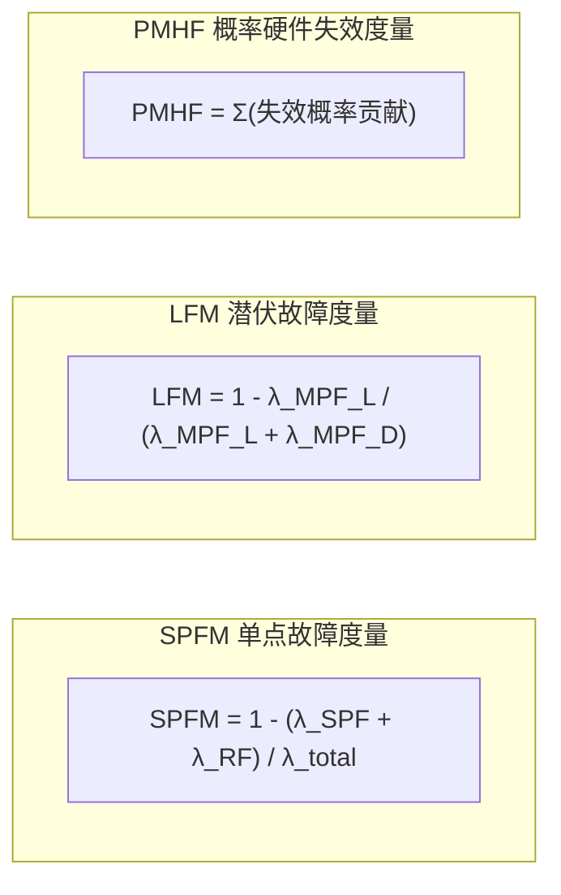
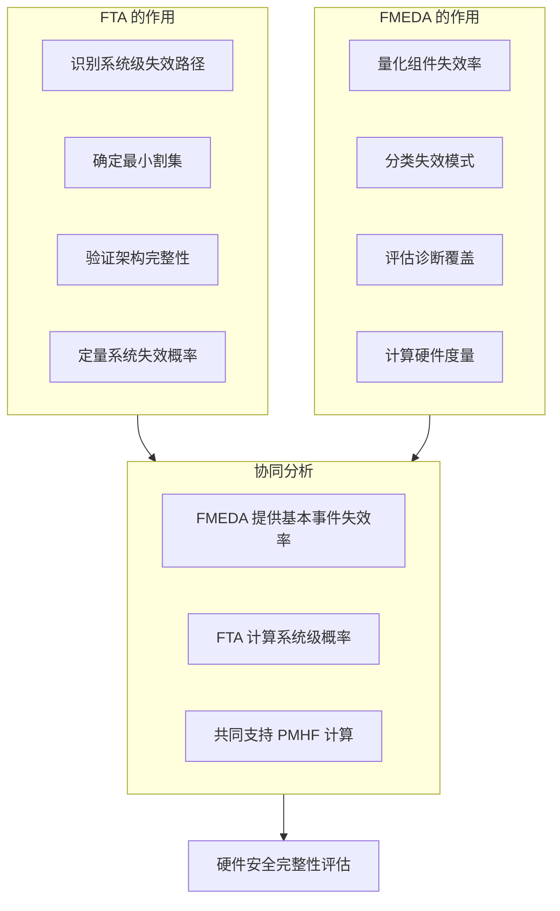

# 硬件可靠性分析 - FTA / FMEA / FMEDA

> 本文档概述硬件可靠性分析方法在汽车功能安全中的应用，重点介绍 FTA（故障树分析）和 FMEA/FMEDA（失效模式分析）在硬件度量计算中的作用。

---

!!! success "💡 Michael Lin 的实战经验"
    **项目背景**: 某 ADAS 域控制器 ASIL D 硬件安全度量计算
    
    **核心挑战**: 
    
    - 供应商提供的 FMEDA 数据不完整，失效率假设不保守
    - FTA 与 FMEDA 分析结果无法关联，PMHF 计算存在缺口
    - 硬件团队对 SPFM/LFM 目标值理解不一致
    
    **我的解决方案**:
    
    1. 建立 **FMEDA 数据审查清单**，要求供应商按 IEC 62380 标准提供失效率
    2. 设计 **FTA-FMEDA 关联矩阵**，确保每个基本事件都有对应失效率数据
    3. 组织 **硬件安全度量培训**，统一团队对 ISO 26262-5 要求的理解
    
    **量化成果**:
    
    | 指标 | 目标值 | 最终达成 | 状态 |
    |:-----|:------:|:--------:|:----:|
    | SPFM | ≥ 99% | 99.3% | ✅ |
    | LFM | ≥ 90% | 94.2% | ✅ |
    | PMHF | < 10⁻⁸/h | 6.2×10⁻⁹/h | ✅ |

---

## 方法论概览

---

## FTA - 故障树分析

### 概述

FTA (Fault Tree Analysis) 是一种**演绎式（自顶向下）**分析方法：
- 从顶层事件（不希望发生的系统失效）开始
- 逐层分解导致顶层事件的原因
- 使用逻辑门（AND/OR）建立因果关系

### FTA 符号说明

### FTA 示例 - AEB 系统失效

### FTA 核心概念

| 概念 | 定义 | 意义 |
|------|------|------|
| **最小割集 (MCS)** | 导致顶层事件的最小基本事件组合 | 识别关键失效路径 |
| **单点故障 (SPF)** | 单一元素构成的最小割集 | 系统薄弱点 |
| **共因失效 (CCF)** | 多个组件因共同原因同时失效 | 冗余设计考量 |

### FTA 在 ISO 26262 中的应用

| 应用场景 | 目的 | 输出 |
|----------|------|------|
| 安全目标分解 | 验证 FSR 的完整性 | 安全需求验证 |
| 定量分析 | 计算顶层事件概率 | PMHF 贡献 |
| 架构评估 | 识别单点故障 | SPFM 输入 |

---

## FMEA - 失效模式与影响分析

### 概述

FMEA (Failure Mode and Effects Analysis) 是一种**归纳式（自底向上）**分析方法：
- 从组件/元素的失效模式开始
- 分析每种失效模式对系统的影响
- 评估严重度、发生度和探测度

### FMEA 过程流程

### FMEA 评估维度

| 维度 | 缩写 | 评估内容 | 评分范围 |
|------|------|----------|----------|
| **严重度** | S (Severity) | 失效影响的严重程度 | 1-10 |
| **发生度** | O (Occurrence) | 失效发生的频率 | 1-10 |
| **探测度** | D (Detection) | 失效被检测的难易程度 | 1-10 |

**RPN = S × O × D** (风险优先级数)

### FMEA 工作表模板

| 组件 | 功能 | 失效模式 | 影响 | S | 原因 | O | 现有措施 | D | RPN |
|------|------|----------|------|---|------|---|----------|---|-----|
| 温度传感器 | 测量温度 | 输出偏移 | 控制偏差 | 6 | 老化 | 3 | 范围检查 | 4 | 72 |
| 温度传感器 | 测量温度 | 无输出 | 功能丧失 | 8 | 断路 | 2 | 信号监控 | 2 | 32 |

---

## FMEDA - 失效模式影响与诊断分析

### 概述

FMEDA (Failure Mode, Effects and Diagnostic Analysis) 是 FMEA 的扩展，专门用于：
- 量化硬件失效率
- 评估诊断覆盖率
- 计算 ISO 26262 硬件度量

### FMEDA 与 FMEA 的区别

| 特性 | FMEA | FMEDA |
|------|------|-------|
| 失效率 | 定性/半定量 | 定量 (FIT) |
| 诊断覆盖 | 不涉及 | 核心内容 |
| 失效分类 | 风险等级 | Safe/SPF/RF/MPF |
| 应用标准 | 通用质量 | ISO 26262 特定 |

### FMEDA 失效分类

### 失效率分配

| 失效类别 | 符号 | 定义 | 对度量的影响 |
|----------|------|------|--------------|
| 安全失效 | λ_S | 不违反安全目标的失效 | 不计入风险 |
| 单点故障 | λ_SPF | 直接导致安全目标违反 | 影响 SPFM |
| 残余故障 | λ_RF | 诊断未完全覆盖的故障 | 影响 SPFM |
| 多点故障（已检测） | λ_MPF_D | 被诊断检测的多点故障 | - |
| 多点故障（潜伏） | λ_MPF_L | 潜伏的多点故障 | 影响 LFM |

---

## ISO 26262 硬件度量

### 三大硬件度量

### 度量目标值 (ISO 26262-5)

| ASIL 等级 | SPFM 目标 | LFM 目标 | PMHF 目标 |
|-----------|-----------|----------|-----------|
| ASIL B | ≥ 90% | ≥ 60% | < 10⁻⁷/h |
| ASIL C | ≥ 97% | ≥ 80% | < 10⁻⁷/h |
| ASIL D | ≥ 99% | ≥ 90% | < 10⁻⁸/h |

### 诊断覆盖率等级

| 等级 | DC 范围 | 典型措施 |
|------|---------|----------|
| 无 | < 60% | 无诊断 |
| 低 | 60-90% | 范围检查、合理性检查 |
| 中 | 90-99% | 冗余比较、CRC校验 |
| 高 | ≥ 99% | 硬件冗余、多样性设计 |

---

## FTA 与 FMEA/FMEDA 协同应用

### 分析流程建议

| 阶段 | FTA 任务 | FMEA/FMEDA 任务 |
|------|----------|-----------------|
| 概念设计 | 初步 FTA 识别关键路径 | 初步 FMEA 识别失效模式 |
| 系统设计 | 细化 FTA 验证架构 | 系统级 FMEA |
| 硬件设计 | 硬件 FTA | 硬件 FMEDA 计算度量 |
| 详细设计 | 定量 FTA (PMHF) | 组件级 FMEDA |
| 验证 | FTA 结果验证 | FMEDA 假设验证 |

---

## 实施注意事项

### 数据来源

| 数据类型 | 来源 | 说明 |
|----------|------|------|
| 失效率数据 | SN 29500, IEC 62380 | 行业标准数据库 |
| 供应商数据 | 组件供应商 FMEDA | 更准确的实际数据 |
| 现场数据 | 售后返回分析 | 最真实但滞后 |

### 常见挑战

| 挑战 | 应对策略 |
|------|----------|
| 失效率数据不足 | 使用保守估计 + 敏感性分析 |
| 诊断覆盖率评估困难 | 故障注入测试验证 |
| 共因失效建模 | Beta-factor 方法 |
| 分析工作量大 | 工具支持 + 分层分析 |

---

*最后更新: 2026-01-25*
