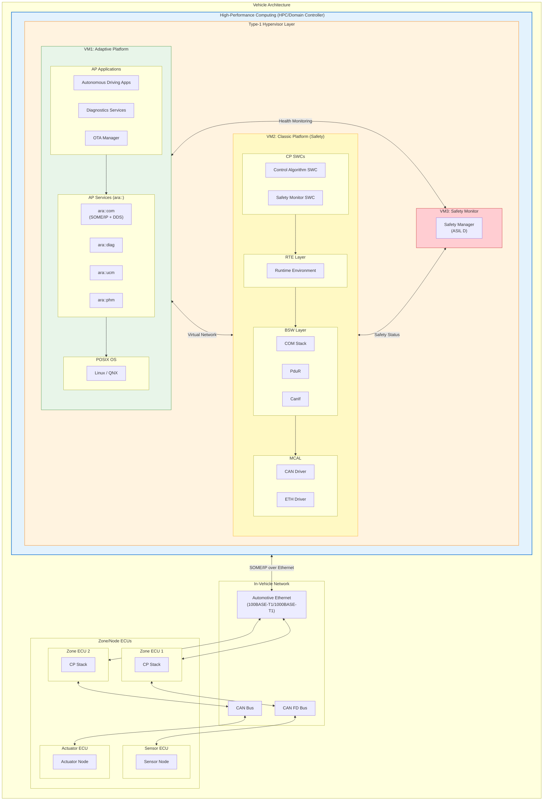
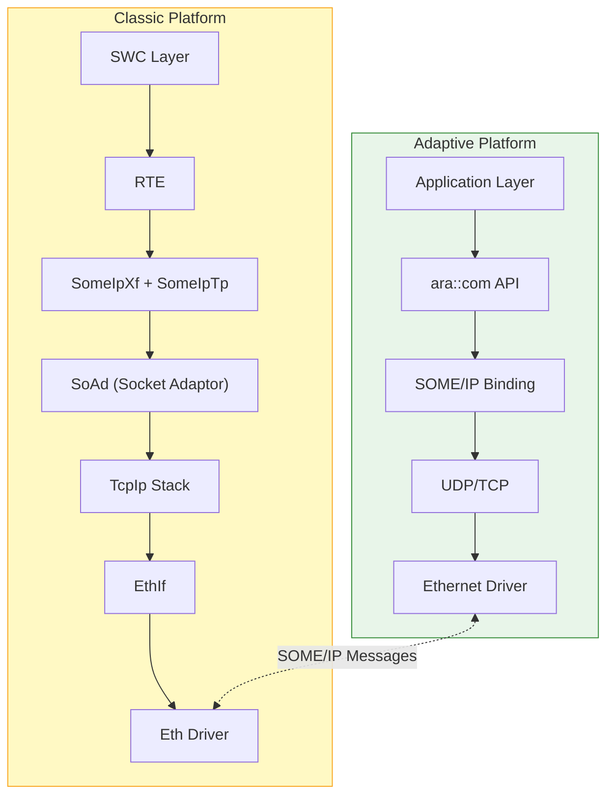
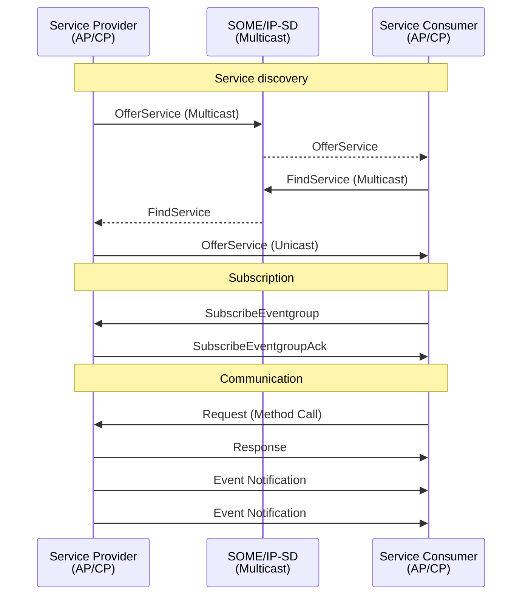
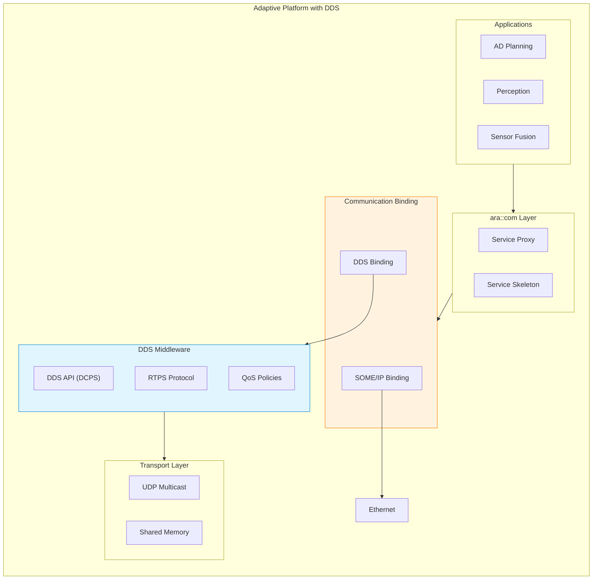
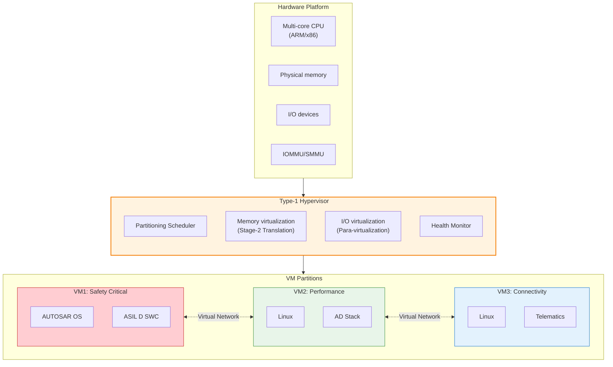
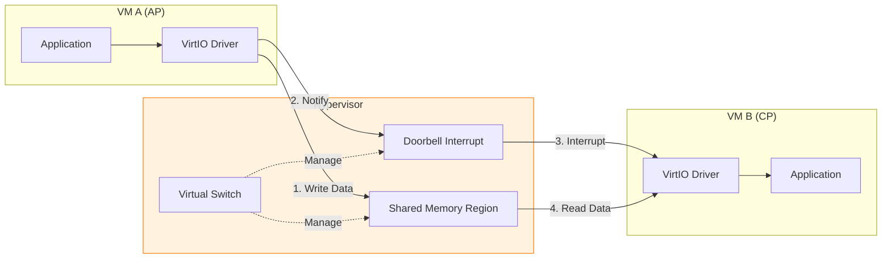
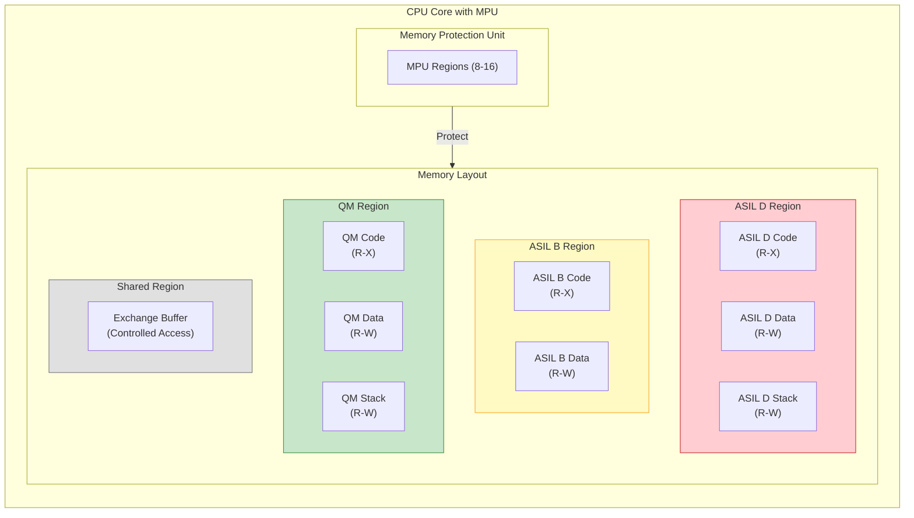
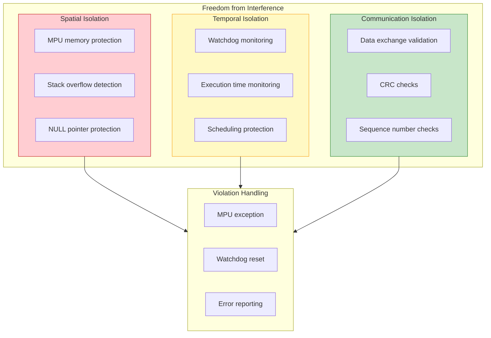
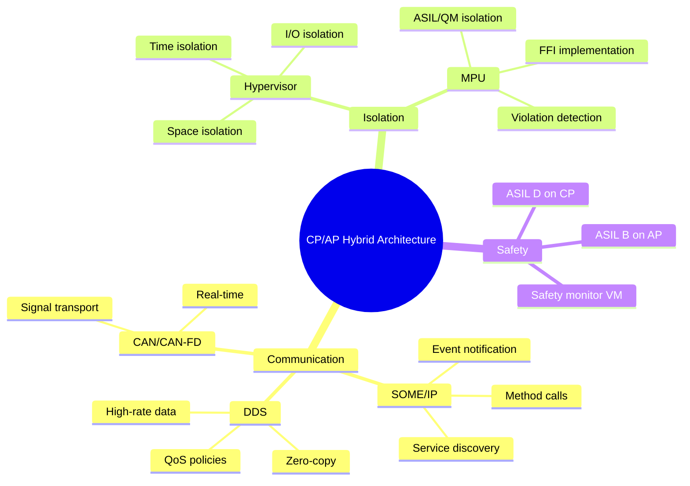

# AUTOSAR CP/AP Hybrid Architecture Design

> This document details the hybrid communication architecture of AUTOSAR Classic Platform (CP) and Adaptive Platform (AP), including SOME/IP, DDS mapping, and Hypervisor isolation mechanisms.

---

!!! success "💡 Field Insight from Michael Lin"
    **Background**: AUTOSAR AP + CP hybrid deployment on a domain controller

    **Key Challenges**:

    - ASIL D safety functions and QM infotainment co-exist on the same SoC
    - SW/HW teams disagree on FFI (Freedom from Interference)
    - Hypervisor + MPU dual isolation approach disputed

    **My Solution**:

    1. Led **FFI verification plan**, defining time/space isolation test cases
    2. Designed **MPU region partitioning**, mapping ASIL D/B/QM to separate memory regions
    3. Coordinated hypervisor vendor and silicon supplier for **joint safety analysis**
    4. Built **inter-VM secure communication** using VirtIO + shared memory

    **Quantified Results**:

    | Metric | Improvement |
    |:-----|:--------:|
    | Architecture review pass rate | First-pass |
    | Architecture rework | -30% |
    | FFI test coverage | 100% |
    | Schedule risk | Eliminated |

---

## Architecture Overview

### CP vs AP Positioning

| Feature | Classic Platform (CP) | Adaptive Platform (AP) |
|------|----------------------|------------------------|
| **Target scenario** | Deeply embedded, real-time control | High-performance compute, service architecture |
| **OS** | OSEK/AUTOSAR OS | POSIX-based (Linux, QNX) |
| **Communication** | Signal-based | Service-oriented |
| **Scheduling** | Static, cyclic tasks | Dynamic, event-driven |
| **Update mechanism** | Fixed config | Runtime config, OTA |
| **Typical ECU** | Sensor/actuator nodes | Domain controller, HPC |
| **Safety level** | Up to ASIL D | Typically up to ASIL B |

---

## CP/AP Hybrid Communication Architecture

### Overall System Architecture

---

## SOME/IP Communication Mechanism

### SOME/IP Stack Positioning

### SOME/IP Service Discovery Flow

### SOME/IP Message Format

| Field | Size | Description |
|------|------|------|
| Service ID | 16 bit | Service identifier |
| Method ID | 16 bit | Method/event identifier |
| Length | 32 bit | Message length |
| Client ID | 16 bit | Client identifier |
| Session ID | 16 bit | Session identifier |
| Protocol Version | 8 bit | Protocol version |
| Interface Version | 8 bit | Interface version |
| Message Type | 8 bit | Request/Response/Notification |
| Return Code | 8 bit | Return code |
| Payload | Variable | Serialized data |

---

## DDS Integration & Mapping

### DDS Positioning in AP

### SOME/IP vs DDS

| Feature | SOME/IP | DDS |
|------|---------|-----|
| **Discovery** | SOME/IP-SD | RTPS Discovery |
| **Communication** | Request/Response, Pub/Sub | Pub/Sub (data-centric) |
| **QoS support** | Limited | Rich (22+ QoS policies) |
| **Serialization** | SOME/IP Serialization | CDR (Common Data Representation) |
| **Use cases** | SOA service calls | High-rate data distribution |
| **Typical usage** | Diagnostics, OTA, remote services | Sensor data, point clouds, images |
| **Real-time** | Medium | High (configurable) |

### Key DDS QoS Policies

| QoS Policy | Description | ADAS Example |
|----------|------|---------------|
| **Reliability** | Reliable/best effort | Perception data: BEST_EFFORT |
| **Durability** | Data persistence | Map data: TRANSIENT_LOCAL |
| **Deadline** | Update deadline | Radar data: 50 ms |
| **Liveliness** | Liveness detection | Sensor health monitoring |
| **History** | History depth | Point cloud cache: KEEP_LAST(5) |
| **Ownership** | Data ownership | Primary/backup sensor switching |

---

## Hypervisor Isolation Mechanisms

### Type-1 Hypervisor Architecture

### Isolation Layers

| Isolation Layer | Mechanism | Function |
|----------|------|------|
| **Time isolation** | Partitioning scheduler | Deterministic CPU time for each VM |
| **Space isolation** | Stage-2 MMU | Memory isolation between VMs |
| **I/O isolation** | IOMMU/SMMU | DMA access isolation |
| **Interrupt isolation** | Virtual interrupt controller | Interrupt routing isolation |
| **Communication isolation** | Virtual network | Controlled inter-VM communication |

### Inter-VM Communication

---

## MPU Memory Isolation (Spatial Isolation)

### ASIL D and QM Coexistence

### MPU Configuration Table

| MPU Region | Start Address | Size | Attribute | ASIL | Access | Notes |
|------------|----------|------|------|-----------|----------|------|
| Region 0 | 0x0000_0000 | 4KB | Code | ASIL D | R-X (Privileged) | ASIL D boot code |
| Region 1 | 0x0000_1000 | 32KB | Code | ASIL D | R-X | ASIL D app code |
| Region 2 | 0x0000_9000 | 16KB | Data | ASIL D | R-W (No Execute) | ASIL D data |
| Region 3 | 0x0000_D000 | 4KB | Stack | ASIL D | R-W (No Execute) | ASIL D stack |
| Region 4 | 0x0001_0000 | 16KB | Code | ASIL B | R-X | ASIL B app code |
| Region 5 | 0x0001_4000 | 8KB | Data | ASIL B | R-W (No Execute) | ASIL B data |
| Region 6 | 0x0002_0000 | 64KB | Code | QM | R-X | QM app code |
| Region 7 | 0x0003_0000 | 32KB | Data | QM | R-W (No Execute) | QM data |
| Region 8 | 0x0004_0000 | 4KB | Shared | Mixed | R-W (Controlled) | Data exchange buffer |
| Region 9 | 0x0005_0000 | 8KB | Peripheral | - | R-W (Device) | Peripheral registers |

### Access Rights Matrix

| Accessor \ Region | ASIL D Code | ASIL D Data | ASIL B Code | ASIL B Data | QM Code | QM Data | Shared |
|---------------------|-------------|-------------|-------------|-------------|---------|---------|--------|
| **ASIL D Task** | R-X | R-W | R | R | R | R | R-W |
| **ASIL B Task** | - | - | R-X | R-W | R | R | R-W |
| **QM Task** | - | - | - | - | R-X | R-W | R-W |
| **ISR (ASIL D)** | R-X | R-W | R | R | R | R | R-W |

> **Note**: "-" means no access. MPU violations trigger exceptions.

### Freedom from Interference (FFI) Implementation

### ASIL Decomposition & Isolation Strategy

| Isolation Strategy | Implementation | ISO 26262 Requirement |
|----------|----------|----------------|
| **Same ASIL co-existence** | Software partition + MPU | Part 6 requirement |
| **Different ASIL co-existence** | MPU + FFI evidence | ASIL decomposition evidence |
| **ASIL D + QM** | Strict MPU isolation + diagnostics | QM must not affect ASIL D |
| **Multi-core allocation** | Core isolation + shared memory protection | Multi-core safety manual |

### MPU Best Practices

| Practice | Recommendation | Rationale |
|--------|------|------|
| Least privilege | Grant only necessary access | Reduce fault propagation |
| No-write code region | Prevent runtime code modification | Prevent code injection |
| No-execute data | Prevent data execution | Prevent buffer attacks |
| Stack guard page | Read-only guard page at stack base | Detect stack overflow |
| Peripheral isolation | Partition peripheral access by ASIL | Prevent misoperation |
| Default deny | Unconfigured regions have no access | Catch illegal access |

---

## Summary: Hybrid Architecture Key Points

---

*Last updated: 2026-01-25*
