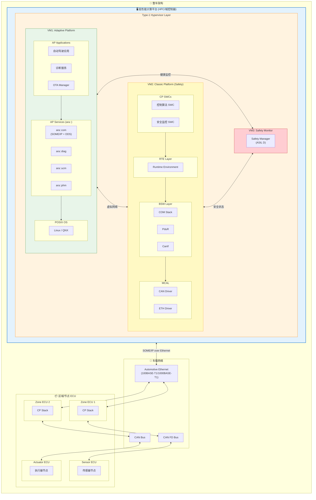
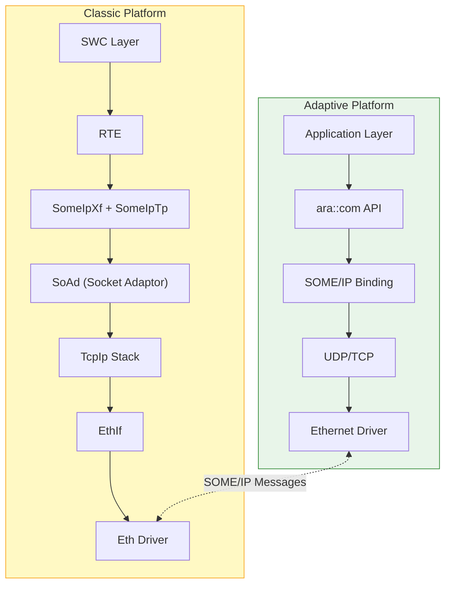
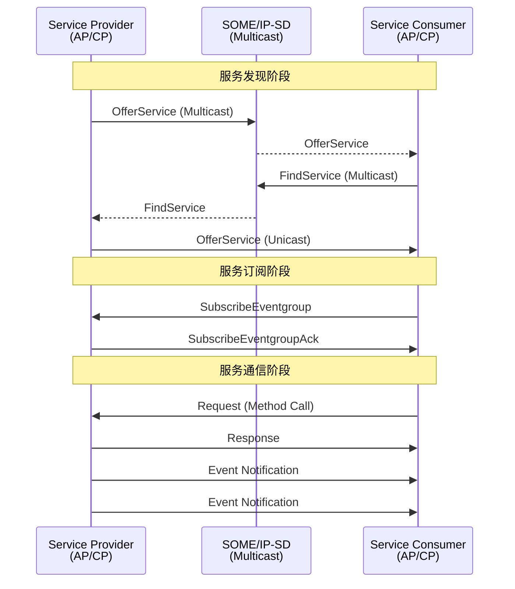
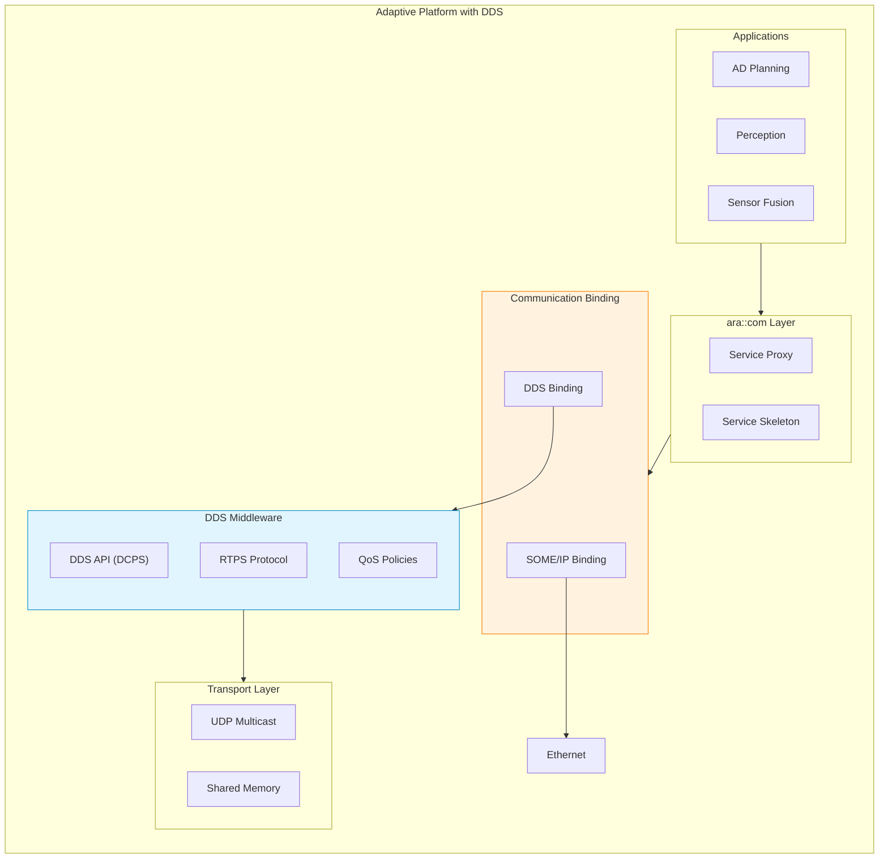
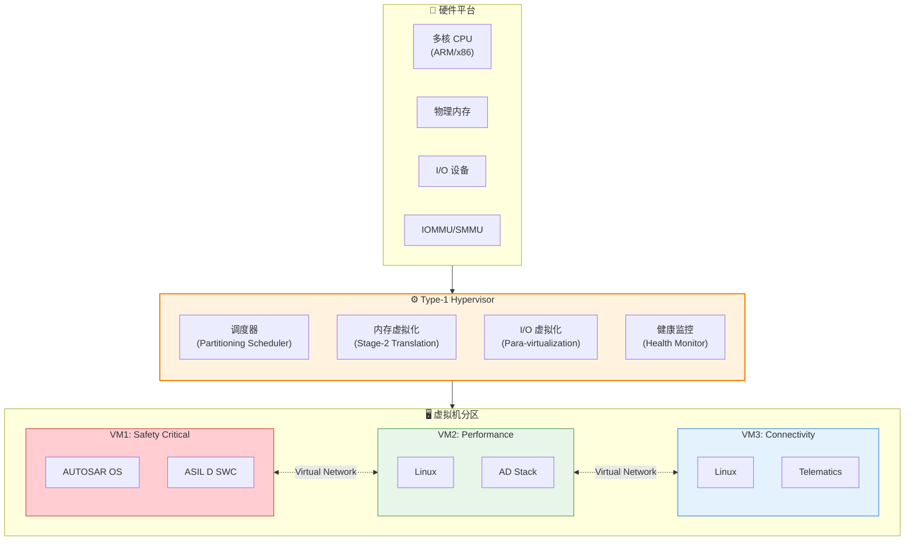
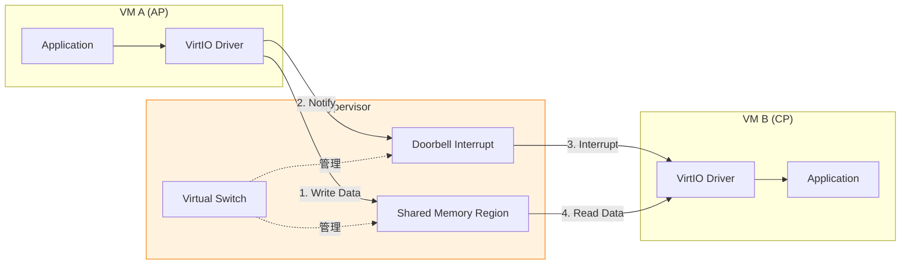
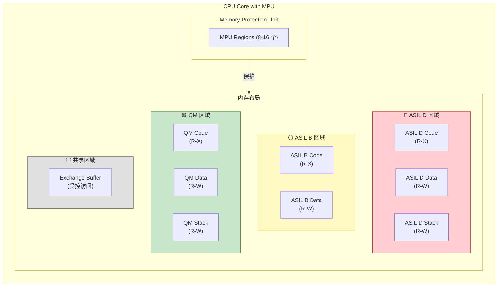
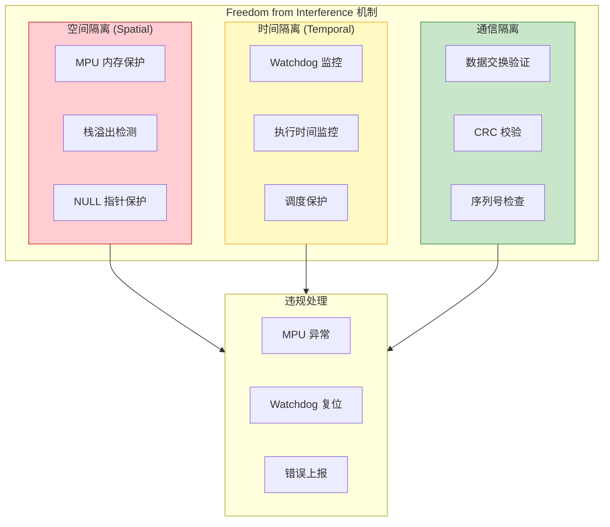
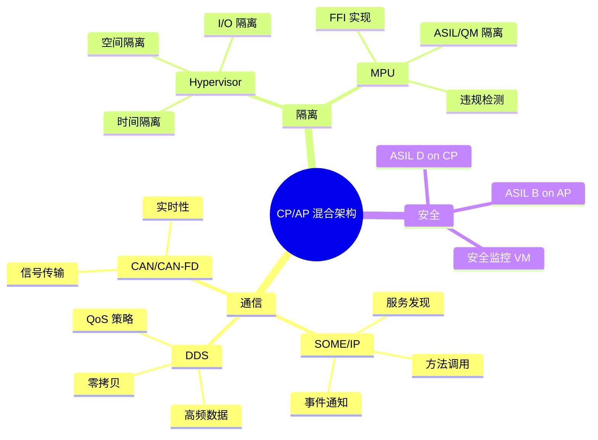

# AUTOSAR CP/AP 混合架构设计

> 本文档详述 AUTOSAR Classic Platform (CP) 与 Adaptive Platform (AP) 的混合通信架构，包含 SOME/IP、DDS 映射以及 Hypervisor 隔离机制。

## 架构概览

### CP 与 AP 定位对比

| 特性 | Classic Platform (CP) | Adaptive Platform (AP) |
|------|----------------------|------------------------|
| **目标场景** | 深度嵌入式、实时控制 | 高性能计算、服务化架构 |
| **操作系统** | OSEK/AUTOSAR OS | POSIX-based (Linux, QNX) |
| **通信范式** | 信号导向 (Signal-based) | 服务导向 (Service-Oriented) |
| **调度模型** | 静态调度、周期任务 | 动态调度、事件驱动 |
| **更新机制** | 固定配置 | 运行时配置、OTA |
| **典型 ECU** | 传感器/执行器节点 | 域控制器、HPC |
| **安全等级** | 最高支持 ASIL D | 最高支持 ASIL B (典型) |

---

## CP/AP 混合通信架构图

### 整体系统架构

---

## SOME/IP 通信机制

### SOME/IP 协议栈位置

### SOME/IP 服务发现流程

### SOME/IP 消息格式

| 字段 | 大小 | 描述 |
|------|------|------|
| Service ID | 16 bit | 服务标识符 |
| Method ID | 16 bit | 方法/事件标识符 |
| Length | 32 bit | 消息长度 |
| Client ID | 16 bit | 客户端标识 |
| Session ID | 16 bit | 会话标识 |
| Protocol Version | 8 bit | 协议版本 |
| Interface Version | 8 bit | 接口版本 |
| Message Type | 8 bit | 消息类型 (Request/Response/Notification) |
| Return Code | 8 bit | 返回码 |
| Payload | Variable | 序列化数据 |

---

## DDS 集成与映射

### DDS 在 AP 中的位置

### SOME/IP vs DDS 对比

| 特性 | SOME/IP | DDS |
|------|---------|-----|
| **发现机制** | SOME/IP-SD (Service Discovery) | RTPS Discovery |
| **通信模式** | Request/Response, Pub/Sub | Pub/Sub (Data-Centric) |
| **QoS 支持** | 有限 | 丰富 (22+ QoS 策略) |
| **序列化** | SOME/IP Serialization | CDR (Common Data Representation) |
| **适用场景** | SOA 服务调用 | 高频数据分发 |
| **典型应用** | 诊断、OTA、远程服务 | 传感器数据、点云、图像 |
| **实时性** | 中等 | 高 (可配置) |

### DDS QoS 关键策略

| QoS 策略 | 描述 | ADAS 应用示例 |
|----------|------|---------------|
| **Reliability** | 可靠/尽力传输 | 感知数据: BEST_EFFORT |
| **Durability** | 数据持久性 | 地图数据: TRANSIENT_LOCAL |
| **Deadline** | 数据更新截止时间 | 雷达数据: 50ms |
| **Liveliness** | 存活检测 | 传感器健康监控 |
| **History** | 历史数据保留 | 点云缓存: KEEP_LAST(5) |
| **Ownership** | 数据所有权 | 主备传感器切换 |

---

## Hypervisor 隔离机制

### Type-1 Hypervisor 架构

### 隔离机制层次

| 隔离层次 | 机制 | 功能 |
|----------|------|------|
| **时间隔离** | Partitioning Scheduler | 确保各 VM 获得确定性 CPU 时间 |
| **空间隔离** | Stage-2 MMU | 虚拟机间内存隔离 |
| **I/O 隔离** | IOMMU/SMMU | DMA 访问隔离 |
| **中断隔离** | Virtual Interrupt Controller | 中断路由隔离 |
| **通信隔离** | Virtual Network | 受控的 VM 间通信 |

### 虚拟机间通信 (Inter-VM Communication)

---

## MPU 内存隔离方案 (Spatial Isolation)

### ASIL D 与 QM 共存架构

### MPU 内存隔离配置表

| MPU Region | 起始地址 | 大小 | 属性 | ASIL 等级 | 访问权限 | 说明 |
|------------|----------|------|------|-----------|----------|------|
| Region 0 | 0x0000_0000 | 4KB | Code | ASIL D | R-X (Privileged) | ASIL D 安全启动代码 |
| Region 1 | 0x0000_1000 | 32KB | Code | ASIL D | R-X | ASIL D 应用代码 |
| Region 2 | 0x0000_9000 | 16KB | Data | ASIL D | R-W (No Execute) | ASIL D 数据段 |
| Region 3 | 0x0000_D000 | 4KB | Stack | ASIL D | R-W (No Execute) | ASIL D 栈空间 |
| Region 4 | 0x0001_0000 | 16KB | Code | ASIL B | R-X | ASIL B 应用代码 |
| Region 5 | 0x0001_4000 | 8KB | Data | ASIL B | R-W (No Execute) | ASIL B 数据段 |
| Region 6 | 0x0002_0000 | 64KB | Code | QM | R-X | QM 应用代码 |
| Region 7 | 0x0003_0000 | 32KB | Data | QM | R-W (No Execute) | QM 数据段 |
| Region 8 | 0x0004_0000 | 4KB | Shared | Mixed | R-W (Controlled) | 数据交换缓冲区 |
| Region 9 | 0x0005_0000 | 8KB | Peripheral | - | R-W (Device) | 外设寄存器映射 |

### 访问权限矩阵

| 访问者 \ 被访问区域 | ASIL D Code | ASIL D Data | ASIL B Code | ASIL B Data | QM Code | QM Data | Shared |
|---------------------|-------------|-------------|-------------|-------------|---------|---------|--------|
| **ASIL D Task** | R-X | R-W | R | R | R | R | R-W |
| **ASIL B Task** | - | - | R-X | R-W | R | R | R-W |
| **QM Task** | - | - | - | - | R-X | R-W | R-W |
| **ISR (ASIL D)** | R-X | R-W | R | R | R | R | R-W |

> **说明**: "-" 表示无访问权限，MPU 违规将触发异常

### Freedom from Interference (FFI) 实现

### ASIL 分解与隔离策略

| 隔离策略 | 实现方法 | ISO 26262 要求 |
|----------|----------|----------------|
| **相同 ASIL 共存** | 软件分区 + MPU | Part 6 要求 |
| **不同 ASIL 共存** | MPU + FFI 证明 | ASIL Decomposition 证据 |
| **ASIL D + QM** | 严格 MPU 隔离 + 诊断 | QM 不得影响 ASIL D |
| **多核分配** | 核间隔离 + 共享内存保护 | 多核安全手册 |

### MPU 配置最佳实践

| 实践项 | 建议 | 理由 |
|--------|------|------|
| 最小权限原则 | 只授予必要的访问权限 | 减少故障传播 |
| 代码区域 No-Write | 禁止运行时代码修改 | 防止代码注入 |
| 数据区域 No-Execute | 禁止数据区执行 | 防止缓冲区攻击 |
| 栈保护区 | 在栈底设置只读 guard page | 检测栈溢出 |
| 外设隔离 | 按 ASIL 等级划分外设访问 | 防止外设误操作 |
| 默认拒绝 | 未配置区域默认无访问权限 | 捕获非法访问 |

---

## 总结：混合架构设计要点

---

*最后更新: 2026-01-25*
