# DoIP Routing Strategy & Diagnostic Communication

> This document details Diagnostic over IP (DoIP) routing architecture, TCP handshake flow, Routing Activation, and DoIP-to-CAN message forwarding strategy.

## DoIP Protocol Overview

### Stack Position


### DoIP Header Format

| Field | Offset | Size | Description |
|------|------|------|------|
| Protocol Version | 0 | 1 byte | Protocol version (0x02 = ISO 13400-2:2019) |
| Inverse Protocol Version | 1 | 1 byte | Inverted version (0xFD) |
| Payload Type | 2 | 2 bytes | Payload type |
| Payload Length | 4 | 4 bytes | Payload length |
| Payload | 8 | Variable | Payload data |

### Common Payload Types

| Type Code | Name | Direction | Description |
|-----------|------|------|------|
| 0x0000 | Generic Header NACK | Edge → Tester | Generic negative response |
| 0x0001 | Vehicle Identification Request | Tester → Edge | Vehicle ID request |
| 0x0004 | Vehicle Identification Response | Edge → Tester | Vehicle ID response |
| 0x0005 | Routing Activation Request | Tester → Edge | Routing activation request |
| 0x0006 | Routing Activation Response | Edge → Tester | Routing activation response |
| 0x8001 | Diagnostic Message | Bidirectional | Diagnostic message |
| 0x8002 | Diagnostic Message Positive ACK | Edge → Tester | Diagnostic ACK |
| 0x8003 | Diagnostic Message Negative ACK | Edge → Tester | Diagnostic NACK |

---

## DoIP Network Topology

### Typical In-Vehicle DoIP Architecture

```mermaid
flowchart TB
    subgraph External["🔧 External Diagnostics"]
        TESTER["Tester"]
    end

    subgraph Vehicle["🚗 Vehicle Network"]
        subgraph Backbone["Ethernet Backbone"]
            direction LR
            OBD["OBD-II Port<br/>(DoIP Entity)"]
            EDGE["Edge Node<br/>(DoIP Gateway)"]
            HPC["Domain Controller<br/>(DoIP Node)"]
        end

        subgraph CAN_Domain["CAN Domain"]
            direction TB
            GW["CAN Gateway"]
            ECU1["ECU 1<br/>(Body)"]
            ECU2["ECU 2<br/>(Chassis)"]
            ECU3["ECU 3<br/>(Powertrain)"]
        end

        subgraph Ethernet_Domain["Ethernet Domain"]
            direction TB
            CAM["Camera ECU"]
            LIDAR["LiDAR ECU"]
            RADAR["Radar ECU"]
        end
    end

    TESTER <-->|"Ethernet<br/>DoIP over TCP"| OBD
    OBD <--> EDGE
    EDGE <--> HPC
    EDGE <--> GW
    GW <--> ECU1 & ECU2 & ECU3
    EDGE <--> CAM & LIDAR & RADAR

    style EDGE fill:#fff3e0,stroke:#f57c00,stroke-width:2px
    style TESTER fill:#e3f2fd,stroke:#1976d2
```



---

## Full Diagnostic Session Sequence

### Phase 1: TCP Handshake and DoIP Connection


### Phase 2: Routing Activation

```mermaid
sequenceDiagram
    autonumber
    participant Tester as 🔧 Tester
    participant Edge as 🔀 Edge Node
    participant Target as 📦 Target ECU

    Note over Tester,Edge: ═══ Phase 3: Routing Activation ═══

    rect rgb(255, 243, 224)
        Tester->>Edge: DoIP Routing Activation Request<br/>(Payload Type: 0x0005)
        Note right of Tester: Source Address: 0x0E00<br/>Activation Type: 0x00 (Default)<br/>OEM Specific: (optional)

        Note over Edge: Validate tester address<br/>Check authentication<br/>Allocate resources

        alt Activation success
            Edge->>Tester: DoIP Routing Activation Response<br/>(Payload Type: 0x0006)
            Note left of Edge: Response Code: 0x10<br/>(Routing Successfully Activated)<br/>Logical Address: 0x0001
        else Authentication required
            Edge->>Tester: DoIP Routing Activation Response<br/>Response Code: 0x04<br/>(Authentication Required)

            Tester->>Edge: Authentication Data
            Edge->>Tester: Authentication Confirm
        else Activation failed
            Edge->>Tester: DoIP Routing Activation Response<br/>Response Code: 0x00-0x03<br/>(Denied)
        end
    end

    Note over Tester,Edge: Routing Activation complete<br/>Diagnostics can start
```



### Routing Activation Response Codes

| Code | Name | Description |
|------|------|------|
| 0x00 | Denied - Unknown SA | Unknown source address |
| 0x01 | Denied - All Sockets Registered | No socket available |
| 0x02 | Denied - SA Different from Registered | Address mismatch |
| 0x03 | Denied - SA Already Activated | Already activated |
| 0x04 | Denied - Authentication Missing | Authentication required |
| 0x05 | Denied - Confirmation Rejected | Confirmation rejected |
| 0x06 | Denied - Unsupported Activation Type | Unsupported activation type |
| 0x10 | Routing Successfully Activated | Routing activated |
| 0x11 | Routing Will Be Activated (Confirmation Required) | Confirmation required |

---

## DoIP-to-CAN Forwarding Mechanism

### Phase 3: Diagnostic Message Transfer

```mermaid
sequenceDiagram
    autonumber
    participant Tester as 🔧 Tester<br/>(SA: 0x0E00)
    participant Edge as 🔀 Edge Node<br/>(DoIP Gateway)
    participant CAN_GW as 🔌 CAN Gateway
    participant Target as 📦 Target ECU<br/>(TA: 0x0741)

    Note over Tester,Target: ═══ Phase 4: Diagnostic Message Transfer ═══

    rect rgb(252, 228, 236)
        Note over Tester: Build UDS request<br/>Service: 0x22 (ReadDataByIdentifier)<br/>DID: 0xF190 (VIN)

        Tester->>Edge: DoIP Diagnostic Message (0x8001)
        Note right of Tester: DoIP Header +<br/>SA: 0x0E00 | TA: 0x0741<br/>UDS: 22 F1 90

        Note over Edge: Parse DoIP<br/>Lookup routing table<br/>Target is on CAN domain

        Edge->>Tester: DoIP Diagnostic Message ACK (0x8002)
        Note left of Edge: ACK Code: 0x00<br/>(Routing Confirmation)
    end

    rect rgb(255, 249, 196)
        Note over Edge: Protocol conversion<br/>DoIP → CAN TP

        Edge->>CAN_GW: CAN TP Request<br/>CAN ID: 0x741<br/>Payload: 22 F1 90

        CAN_GW->>Target: CAN Frame<br/>ID: 0x741 | Data: 03 22 F1 90 ...

        Note over Target: Process UDS request<br/>Prepare response

        Target->>CAN_GW: CAN Frame Response<br/>ID: 0x749 | Data: 10 14 62 F1 90 ...

        Note over Target,CAN_GW: Multi-frame transfer<br/>(ISO 15765-2)

        CAN_GW->>Edge: CAN TP Response<br/>UDS: 62 F1 90 [VIN Data...]
    end

    rect rgb(232, 245, 233)
        Note over Edge: Protocol conversion<br/>CAN TP → DoIP

        Edge->>Tester: DoIP Diagnostic Message (0x8001)
        Note left of Edge: DoIP Header +<br/>SA: 0x0741 | TA: 0x0E00<br/>UDS: 62 F1 90 [VIN]

        Note over Tester: Parse response<br/>VIN read OK
    end
```



### Detailed Forwarding Flow


### Routing Table Structure

| Target Address (TA) | Network Type | Physical Channel | CAN ID (Tx) | CAN ID (Rx) | Remarks |
|---------------------|--------------|------------------|-------------|-------------|---------|
| 0x0741 | CAN | CAN1 | 0x741 | 0x749 | Body ECU |
| 0x0742 | CAN | CAN1 | 0x742 | 0x74A | Chassis ECU |
| 0x0743 | CAN-FD | CAN2 | 0x743 | 0x74B | Powertrain ECU |
| 0x0A01 | Ethernet | ETH0 | - | - | Camera ECU |
| 0x0A02 | Ethernet | ETH0 | - | - | Radar ECU |
| 0x0001 | Local | - | - | - | Edge Node self |

---

## DoIP-to-CAN Conversion Details

### CAN TP Segmentation (ISO 15765-2)


### N_PCI (Network Protocol Control Information)

| Frame Type | N_PCI Range | Description |
|--------|------------|------|
| Single Frame (SF) | 0x00-0x07 | Single frame, length 1-7 bytes |
| First Frame (FF) | 0x10-0x1F | First frame, length follows |
| Consecutive Frame (CF) | 0x20-0x2F | Consecutive frame, sequence 0-F |
| Flow Control (FC) | 0x30-0x3F | Flow control frame |

### Conversion Example

```
DoIP request:
┌──────────────────────────────────────────────────────┐
│ DoIP Header (8 bytes)                                │
│ ┌─────────┬─────────┬─────────────┬────────────────┐ │
│ │ Ver:0x02│ ~Ver    │ Type:0x8001 │ Length:0x0007  │ │
│ └─────────┴─────────┴─────────────┴────────────────┘ │
│ DoIP Payload                                         │
│ ┌─────────────┬─────────────┬──────────────────────┐ │
│ │ SA: 0x0E00  │ TA: 0x0741  │ UDS: 22 F1 90        │ │
│ └─────────────┴─────────────┴──────────────────────┘ │
└──────────────────────────────────────────────────────┘
                            ↓
                     Protocol conversion (Edge Node)
                            ↓
CAN request:
┌──────────────────────────────────────────────────────┐
│ CAN Frame                                            │
│ ┌───────────┬────────────────────────────────────┐   │
│ │ ID: 0x741 │ Data: 03 22 F1 90 00 00 00 00     │   │
│ └───────────┴────────────────────────────────────┘   │
│              └─ SF: len=3, UDS payload              │
└──────────────────────────────────────────────────────┘
```

---

## Error Handling & Negative Responses

### DoIP NACK Handling


### Diagnostic Message NACK Codes

| Code | Name | Description |
|------|------|------|
| 0x02 | Invalid SA | Invalid source address |
| 0x03 | Unknown TA | Unknown target address |
| 0x04 | Diagnostic Message Too Large | Message too large |
| 0x05 | Out of Memory | Out of memory |
| 0x06 | Target Unreachable | Target unreachable |
| 0x07 | Unknown Network | Unknown network |
| 0x08 | Transport Protocol Error | Transport protocol error |

---

## Timing & Timeout Management

### Key Timeout Parameters

| Parameter | Value | Description |
|------|-----|------|
| T_TCP_Initial | 2s | TCP connection establishment timeout |
| T_TCP_General | Infinite | TCP connection keep-alive |
| A_DoIP_Ctrl | 2s | DoIP control message timeout |
| A_DoIP_Announce_Wait | 500ms | Vehicle announcement wait |
| A_DoIP_Announce_Interval | 500ms | Vehicle announcement interval |
| A_DoIP_Announce_Num | 3 | Announcement count |
| A_DoIP_Diagnostic_Message | 2s | Diagnostic message ACK timeout |
| T_TCP_Alive_Check | 500ms | TCP alive check interval |

### Session Keep-Alive


---

## Security Considerations

### DoIP Threats & Countermeasures

| Threat | Description | Countermeasure |
|------|------|------|
| Unauthorized access | Illegal device connects to DoIP | Routing Activation authentication |
| Man-in-the-middle | Message sniff/tamper | TLS/DTLS (DoIP-SEC) |
| DoS attack | Resource exhaustion | Connection limits, rate limits |
| Replay attack | Resend old messages | Session ID, timestamp validation |
| Illegal routing | Bypass gateway to access ECU | Network segmentation, firewall rules |

### Secure DoIP (ISO 13400-3)


---

*Last updated: 2026-01-25*
