# AUTOSAR Memory Mapping Design (MemMap)

> This document explains how AUTOSAR MemMap.h works and how to place safety-critical (ASIL D) code into specific Flash sectors to achieve spatial isolation.

## MemMap Overview

### Design Goals

| Goal | Description |
|------|------|
| **Memory partitioning** | Place code/data into specific memory regions |
| **Safety isolation** | Physically isolate code of different ASIL levels |
| **Performance** | Put critical code into fast memory |
| **Compiler abstraction** | Unify memory attribute syntax across compilers |

### MemMap Position in AUTOSAR


---

## How MemMap.h Works

### Macro Mechanism


### MemMap.h Example

```c
/* ============================================================
 * File: MemMap.h
 * Description: AUTOSAR Memory Mapping Abstraction
 * ============================================================ */

/* Prevent include guards - MemMap is included multiple times */

/*---------------------------------------------------------------------------
 * ECU_SAFETY (ASIL D) module sections
 *---------------------------------------------------------------------------*/

/* ===== CODE SECTIONS ===== */

#if defined(ECU_SAFETY_START_SEC_CODE)
    #undef ECU_SAFETY_START_SEC_CODE
    #undef MEMMAP_ERROR

    /* GCC compiler */
    #if defined(__GNUC__)
        #pragma GCC push_options
        #pragma GCC optimize("O2")
        __attribute__((section(".text_ASIL_D")))
    /* Green Hills compiler */
    #elif defined(__ghs__)
        #pragma ghs section text=".text_ASIL_D"
    /* Tasking compiler */
    #elif defined(__TASKING__)
        #pragma section code ".text_ASIL_D"
    /* ARM Compiler */
    #elif defined(__ARMCC_VERSION)
        #pragma arm section code=".text_ASIL_D"
    /* IAR compiler */
    #elif defined(__ICCARM__)
        #pragma location=".text_ASIL_D"
    #endif

#elif defined(ECU_SAFETY_STOP_SEC_CODE)
    #undef ECU_SAFETY_STOP_SEC_CODE
    #undef MEMMAP_ERROR

    #if defined(__GNUC__)
        #pragma GCC pop_options
    #elif defined(__ghs__)
        #pragma ghs section text=default
    #elif defined(__TASKING__)
        #pragma section code restore
    #elif defined(__ARMCC_VERSION)
        #pragma arm section code
    #elif defined(__ICCARM__)
        /* auto end */
    #endif
#endif

/* ===== DATA SECTIONS ===== */

#if defined(ECU_SAFETY_START_SEC_VAR_INIT_32)
    #undef ECU_SAFETY_START_SEC_VAR_INIT_32
    #undef MEMMAP_ERROR

    #if defined(__GNUC__)
        __attribute__((section(".data_ASIL_D")))
    #elif defined(__ghs__)
        #pragma ghs section data=".data_ASIL_D"
    #endif

#elif defined(ECU_SAFETY_STOP_SEC_VAR_INIT_32)
    #undef ECU_SAFETY_STOP_SEC_VAR_INIT_32
    #undef MEMMAP_ERROR

    #if defined(__GNUC__)
        /* auto end */
    #elif defined(__ghs__)
        #pragma ghs section data=default
    #endif
#endif

/* ===== CONST SECTIONS ===== */

#if defined(ECU_SAFETY_START_SEC_CONST_32)
    #undef ECU_SAFETY_START_SEC_CONST_32
    #undef MEMMAP_ERROR

    #if defined(__GNUC__)
        __attribute__((section(".rodata_ASIL_D")))
    #endif

#elif defined(ECU_SAFETY_STOP_SEC_CONST_32)
    #undef ECU_SAFETY_STOP_SEC_CONST_32
    #undef MEMMAP_ERROR
#endif

/*---------------------------------------------------------------------------
 * ECU_DIAG (QM) module sections
 *---------------------------------------------------------------------------*/

#if defined(ECU_DIAG_START_SEC_CODE)
    #undef ECU_DIAG_START_SEC_CODE
    #undef MEMMAP_ERROR

    #if defined(__GNUC__)
        __attribute__((section(".text_QM")))
    #endif

#elif defined(ECU_DIAG_STOP_SEC_CODE)
    #undef ECU_DIAG_STOP_SEC_CODE
    #undef MEMMAP_ERROR
#endif

/*---------------------------------------------------------------------------
 * Error detection
 *---------------------------------------------------------------------------*/

#if defined(MEMMAP_ERROR)
    #error "MemMap.h: Unknown memory section!"
#endif
```

---

## Usage in Source Code

### SWC Example

```c
/* ============================================================
 * File: Ecu_Safety.c
 * Description: ASIL D Safety-Critical Component
 * ============================================================ */

#include "Ecu_Safety.h"

/*---------------------------------------------------------------------------
 * ASIL D Code Section
 *---------------------------------------------------------------------------*/
#define ECU_SAFETY_START_SEC_CODE
#include "MemMap.h"

/**
 * @brief Safety-critical monitoring function
 * @note This function is placed in ASIL D Flash sector
 */
void Ecu_Safety_Monitor(void) {
    /* ASIL D safety monitoring logic */
    if (checkSafetyConditions() == FALSE) {
        triggerSafeState();
    }
}

/**
 * @brief Watchdog refresh function
 */
void Ecu_Safety_RefreshWatchdog(void) {
    Wdg_Trigger();
}

#define ECU_SAFETY_STOP_SEC_CODE
#include "MemMap.h"

/*---------------------------------------------------------------------------
 * ASIL D Initialized Data Section
 *---------------------------------------------------------------------------*/
#define ECU_SAFETY_START_SEC_VAR_INIT_32
#include "MemMap.h"

static uint32 SafetyCounter = 0U;
static uint32 LastCheckTime = 0U;

#define ECU_SAFETY_STOP_SEC_VAR_INIT_32
#include "MemMap.h"

/*---------------------------------------------------------------------------
 * ASIL D Constant Data Section
 *---------------------------------------------------------------------------*/
#define ECU_SAFETY_START_SEC_CONST_32
#include "MemMap.h"

static const uint32 SafetyCheckPeriod = 10U;  /* 10 ms */
static const uint32 MaxFailureCount = 3U;

#define ECU_SAFETY_STOP_SEC_CONST_32
#include "MemMap.h"
```

---

## Linker Script Design

### Flash Layout


### RAM Layout


### GNU LD Linker Script

```ld
/* ============================================================
 * File: linker_script.ld
 * Description: Memory Layout for ASIL/QM Partitioning
 * Target: ARM Cortex-R5 / Cortex-M7
 * ============================================================ */

/* Memory regions */
MEMORY
{
    /* Flash regions */
    FLASH_BOOT      (rx)  : ORIGIN = 0x00000000, LENGTH = 64K
    FLASH_ASIL_D    (rx)  : ORIGIN = 0x00010000, LENGTH = 128K
    FLASH_ASIL_D_RO (r)   : ORIGIN = 0x00030000, LENGTH = 64K
    FLASH_ASIL_B    (rx)  : ORIGIN = 0x00040000, LENGTH = 128K
    FLASH_QM        (rx)  : ORIGIN = 0x00060000, LENGTH = 320K
    FLASH_QM_RO     (r)   : ORIGIN = 0x000B0000, LENGTH = 320K

    /* RAM regions */
    RAM_ASIL_D      (rwx) : ORIGIN = 0x20000000, LENGTH = 64K
    RAM_ASIL_B      (rwx) : ORIGIN = 0x20010000, LENGTH = 32K
    RAM_QM          (rwx) : ORIGIN = 0x20018000, LENGTH = 96K
    RAM_SHARED      (rw)  : ORIGIN = 0x20030000, LENGTH = 16K
    RAM_NOINIT      (rw)  : ORIGIN = 0x20034000, LENGTH = 48K
}

/* Section definitions */
SECTIONS
{
    /* ===============================================
     * ASIL D region
     * =============================================== */

    .text_ASIL_D :
    {
        . = ALIGN(4);
        __text_asild_start = .;

        *(.text_ASIL_D)
        *(.text_ASIL_D.*)

        *Ecu_Safety*.o(.text .text.*)
        *SafetyMonitor*.o(.text .text.*)
        *Wdg*.o(.text .text.*)

        . = ALIGN(4);
        __text_asild_end = .;
    } > FLASH_ASIL_D

    .rodata_ASIL_D :
    {
        . = ALIGN(4);
        __rodata_asild_start = .;

        *(.rodata_ASIL_D)
        *(.rodata_ASIL_D.*)
        *Ecu_Safety*.o(.rodata .rodata.*)

        . = ALIGN(4);
        __rodata_asild_end = .;
    } > FLASH_ASIL_D_RO

    .data_ASIL_D :
    {
        . = ALIGN(4);
        __data_asild_start = .;

        *(.data_ASIL_D)
        *(.data_ASIL_D.*)
        *Ecu_Safety*.o(.data .data.*)

        . = ALIGN(4);
        __data_asild_end = .;
    } > RAM_ASIL_D AT> FLASH_ASIL_D_RO

    .bss_ASIL_D (NOLOAD) :
    {
        . = ALIGN(4);
        __bss_asild_start = .;

        *(.bss_ASIL_D)
        *(.bss_ASIL_D.*)
        *Ecu_Safety*.o(.bss .bss.* COMMON)

        . = ALIGN(4);
        __bss_asild_end = .;
    } > RAM_ASIL_D

    /* ASIL D stack */
    .stack_ASIL_D (NOLOAD) :
    {
        . = ALIGN(8);
        __stack_asild_bottom = .;
        . = . + 4K;  /* 4KB stack */
        __stack_asild_top = .;
    } > RAM_ASIL_D

    /* ===============================================
     * ASIL B region
     * =============================================== */

    .text_ASIL_B :
    {
        . = ALIGN(4);
        *(.text_ASIL_B)
        *(.text_ASIL_B.*)
        . = ALIGN(4);
    } > FLASH_ASIL_B

    .data_ASIL_B :
    {
        . = ALIGN(4);
        *(.data_ASIL_B)
        *(.data_ASIL_B.*)
        . = ALIGN(4);
    } > RAM_ASIL_B AT> FLASH_ASIL_B

    .bss_ASIL_B (NOLOAD) :
    {
        . = ALIGN(4);
        *(.bss_ASIL_B)
        *(.bss_ASIL_B.*)
        . = ALIGN(4);
    } > RAM_ASIL_B

    /* ===============================================
     * QM region
     * =============================================== */

    .text_QM :
    {
        . = ALIGN(4);
        *(.text_QM)
        *(.text_QM.*)

        /* Default code to QM */
        *(.text)
        *(.text.*)

        . = ALIGN(4);
    } > FLASH_QM

    .rodata_QM :
    {
        . = ALIGN(4);
        *(.rodata_QM)
        *(.rodata_QM.*)
        *(.rodata)
        *(.rodata.*)
        . = ALIGN(4);
    } > FLASH_QM_RO

    .data_QM :
    {
        . = ALIGN(4);
        *(.data_QM)
        *(.data_QM.*)
        *(.data)
        *(.data.*)
        . = ALIGN(4);
    } > RAM_QM AT> FLASH_QM_RO

    .bss_QM (NOLOAD) :
    {
        . = ALIGN(4);
        *(.bss_QM)
        *(.bss_QM.*)
        *(.bss)
        *(.bss.*)
        *(COMMON)
        . = ALIGN(4);
    } > RAM_QM

    /* ===============================================
     * Shared region
     * =============================================== */

    .shared_exchange (NOLOAD) :
    {
        . = ALIGN(4);
        __shared_start = .;
        *(.shared_exchange)
        . = ALIGN(4);
        __shared_end = .;
    } > RAM_SHARED

    /* ===============================================
     * NoInit region
     * =============================================== */

    .noinit (NOLOAD) :
    {
        . = ALIGN(4);
        *(.noinit)
        *(.noinit.*)
        . = ALIGN(4);
    } > RAM_NOINIT

    /* ===============================================
     * Debug info
     * =============================================== */

    __flash_asild_start = ORIGIN(FLASH_ASIL_D);
    __flash_asild_end   = ORIGIN(FLASH_ASIL_D) + LENGTH(FLASH_ASIL_D);
    __ram_asild_start   = ORIGIN(RAM_ASIL_D);
    __ram_asild_end     = ORIGIN(RAM_ASIL_D) + LENGTH(RAM_ASIL_D);
}

ASSERT(__text_asild_end <= ORIGIN(FLASH_ASIL_D) + LENGTH(FLASH_ASIL_D),
       "ASIL D code overflow!")
ASSERT(__bss_asild_end + 4K <= ORIGIN(RAM_ASIL_D) + LENGTH(RAM_ASIL_D),
       "ASIL D RAM overflow!")
```

---

## MPU Integration

### Linker Symbols and MPU Config

```c
/* ============================================================
 * File: Mpu_Config.c
 * Description: MPU Configuration using Linker Symbols
 * ============================================================ */

#include "Mpu.h"

/* Linker symbols */
extern uint32_t __flash_asild_start;
extern uint32_t __flash_asild_end;
extern uint32_t __ram_asild_start;
extern uint32_t __ram_asild_end;
extern uint32_t __shared_start;
extern uint32_t __shared_end;

/* MPU configuration table */
static const Mpu_RegionConfigType Mpu_Config[] = {
    /* Region 0: ASIL D Flash - read/execute */
    {
        .regionNumber = 0U,
        .baseAddress  = (uint32_t)&__flash_asild_start,
        .size         = MPU_REGION_SIZE_128KB,
        .accessPermission = MPU_AP_RO_RO,
        .executeNever = FALSE,
        .shareable    = FALSE,
        .cacheable    = TRUE,
        .bufferable   = FALSE,
        .enable       = TRUE
    },

    /* Region 1: ASIL D RAM - read/write, no execute */
    {
        .regionNumber = 1U,
        .baseAddress  = (uint32_t)&__ram_asild_start,
        .size         = MPU_REGION_SIZE_64KB,
        .accessPermission = MPU_AP_RW_RW,
        .executeNever = TRUE,
        .shareable    = FALSE,
        .cacheable    = TRUE,
        .bufferable   = TRUE,
        .enable       = TRUE
    },

    /* Region 2: QM Flash */
    {
        .regionNumber = 2U,
        .baseAddress  = 0x00060000U,
        .size         = MPU_REGION_SIZE_512KB,
        .accessPermission = MPU_AP_RO_RO,
        .executeNever = FALSE,
        .enable       = TRUE
    },

    /* Region 3: QM RAM */
    {
        .regionNumber = 3U,
        .baseAddress  = 0x20018000U,
        .size         = MPU_REGION_SIZE_128KB,
        .accessPermission = MPU_AP_RW_RW,
        .executeNever = TRUE,
        .enable       = TRUE
    },

    /* Region 4: Shared exchange */
    {
        .regionNumber = 4U,
        .baseAddress  = (uint32_t)&__shared_start,
        .size         = MPU_REGION_SIZE_16KB,
        .accessPermission = MPU_AP_RW_RW,
        .executeNever = TRUE,
        .enable       = TRUE
    },

    /* Region 5: Peripheral region */
    {
        .regionNumber = 5U,
        .baseAddress  = 0x40000000U,
        .size         = MPU_REGION_SIZE_512MB,
        .accessPermission = MPU_AP_RW_RW,
        .executeNever = TRUE,
        .shareable    = TRUE,
        .cacheable    = FALSE,
        .bufferable   = TRUE,
        .enable       = TRUE
    }
};

void Mpu_Init(void) {
    uint32_t i;

    /* Disable MPU */
    MPU->CTRL = 0U;

    /* Configure regions */
    for (i = 0U; i < (sizeof(Mpu_Config) / sizeof(Mpu_Config[0])); i++) {
        Mpu_ConfigureRegion(&Mpu_Config[i]);
    }

    /* Enable MPU */
    MPU->CTRL = MPU_CTRL_ENABLE_Msk |
                MPU_CTRL_PRIVDEFENA_Msk;

    /* Memory barriers */
    __DSB();
    __ISB();
}
```

---

## End-to-End Mapping Overview

```mermaid
flowchart TB
    subgraph SourceCode["📝 Source Code"]
        direction LR
        CODE1["Ecu_Safety.c"]
        CODE2["Dcm.c"]
    end

    subgraph MemMap["🔧 MemMap.h"]
        direction TB
        MM1["#define ECU_SAFETY_START_SEC_CODE"]
        MM2["Expanded to section attributes"]
    end

    subgraph Compiler["⚙️ Compiler"]
        direction TB
        OBJ1["Ecu_Safety.o<br/>with .text_ASIL_D"]
        OBJ2["Dcm.o<br/>with .text_QM"]
    end

    subgraph Linker["🔗 Linker"]
        direction TB
        LD1["Linker script defines memory regions"]
        LD2["Assign sections to physical addresses"]
    end

    subgraph Binary["📦 Output"]
        ELF["app.elf"]
        HEX["app.hex"]
        MAP["app.map"]
    end

    subgraph Memory["💾 Physical Memory"]
        direction TB

        subgraph Flash_Layout["Flash"]
            F1["0x00010000: .text_ASIL_D"]
            F2["0x00060000: .text_QM"]
        end

        subgraph RAM_Layout["RAM"]
            R1["0x20000000: .data_ASIL_D"]
            R2["0x20018000: .data_QM"]
        end
    end

    SourceCode --> MemMap --> Compiler --> Linker --> Binary --> Memory

    style MemMap fill:#e3f2fd,stroke:#1976d2,stroke-width:2px
    style Linker fill:#fff3e0,stroke:#f57c00,stroke-width:2px
    style Memory fill:#e8f5e9,stroke:#388e3c,stroke-width:2px
```



---

## Verification & Debugging

### Map File Analysis

```
/* Example app.map excerpt */

Memory Configuration

Name             Origin             Length             Attributes
FLASH_ASIL_D     0x00010000         0x00020000         xr
RAM_ASIL_D       0x20000000         0x00010000         xrw
...

Linker script and memory map

.text_ASIL_D    0x00010000     0x00008a40
                0x00010000        __text_asild_start = .
 *(.text_ASIL_D)
 .text_ASIL_D   0x00010000     0x00001234  Ecu_Safety.o
 .text_ASIL_D   0x00011234     0x00000abc  SafetyMonitor.o
 .text_ASIL_D   0x000122f0     0x00000150  Wdg.o
                0x00018a40        __text_asild_end = .

.text_QM        0x00060000     0x00024680
 *(.text_QM)
 *(.text)
 .text          0x00060000     0x00012340  Dcm.o
 .text          0x00072340     0x00008900  Com.o
```

### Runtime Verification

```c
/* Verify code section location */
void VerifyMemoryLayout(void) {
    uint32_t funcAddr;

    /* Get function address */
    funcAddr = (uint32_t)&Ecu_Safety_Monitor;

    /* Check ASIL D region */
    if ((funcAddr >= 0x00010000U) && (funcAddr < 0x00030000U)) {
        /* OK */
    } else {
        ReportError(ERR_MEMMAP_VIOLATION);
    }

    /* Verify variable location */
    uint32_t varAddr = (uint32_t)&SafetyCounter;
    if ((varAddr >= 0x20000000U) && (varAddr < 0x20010000U)) {
        /* OK */
    } else {
        ReportError(ERR_MEMMAP_VIOLATION);
    }
}
```

---

## Best Practices

| Practice | Notes |
|--------|------|
| **Modular MemMap** | Each BSW/SWC module has its own section macros |
| **Section naming** | `.text_<MODULE>_<ASIL>` format |
| **Linker assertions** | Add ASSERT to detect overflow |
| **Map file review** | Check section allocation after build |
| **MPU linkage** | Configure MPU using linker symbols |
| **Alignment** | Meet MPU minimum region sizes (32B/256B) |

---

*Last updated: 2026-01-25*
