# AUTOSAR 内存映射设计 (MemMap)

> 本文档详述 AUTOSAR MemMap.h 的工作原理，以及如何将 Safety-Critical (ASIL D) 代码段放置在特定 Flash Sector 中实现空间隔离。

## MemMap 概述

### 设计目的

| 目的 | 说明 |
|------|------|
| **内存分区** | 将代码/数据放置到特定内存区域 |
| **安全隔离** | 不同 ASIL 等级的代码物理隔离 |
| **性能优化** | 关键代码放入快速内存 |
| **编译器抽象** | 统一不同编译器的内存属性语法 |

### MemMap 在 AUTOSAR 中的位置

```mermaid
flowchart TB
    subgraph SWC_Layer["SWC 层"]
        SWC1["SWC_Safety<br/>(ASIL D)"]
        SWC2["SWC_Diag<br/>(QM)"]
    end
    
    subgraph RTE["RTE 层"]
        RTE_IF["RTE 接口"]
    end
    
    subgraph BSW["BSW 层"]
        COM["Com"]
        DCM["Dcm"]
        OS["Os"]
    end
    
    subgraph Platform["平台层"]
        MEMMAP["MemMap.h<br/>(内存映射抽象)"]
        COMPILER["Compiler.h<br/>(编译器抽象)"]
    end
    
    subgraph Linker["链接器"]
        LD["Linker Script<br/>(.ld / .lcf)"]
    end
    
    subgraph Memory["物理内存"]
        FLASH["Flash"]
        RAM["RAM"]
    end
    
    SWC1 & SWC2 --> RTE
    RTE --> BSW
    BSW --> Platform
    Platform --> Linker
    Linker --> Memory
    
    style MEMMAP fill:#e3f2fd,stroke:#1976d2,stroke-width:2px
    style LD fill:#fff3e0,stroke:#f57c00,stroke-width:2px
```



---

## MemMap.h 工作原理

### 宏定义机制

```mermaid
flowchart LR
    subgraph Source["源代码"]
        S1["#define XXX_START_SEC_CODE"]
        S2["#include <MemMap.h>"]
        S3["... 函数代码 ..."]
        S4["#define XXX_STOP_SEC_CODE"]
        S5["#include <MemMap.h>"]
    end
    
    subgraph MemMap["MemMap.h 处理"]
        M1["检测 START/STOP 宏"]
        M2["展开为编译器特定 pragma"]
        M3["清除宏定义"]
    end
    
    subgraph Output["编译器输出"]
        O1["#pragma section .text_ASIL_D"]
        O2["函数放入指定段"]
    end
    
    Source --> MemMap --> Output
```



### MemMap.h 实现示例

```c
/* ============================================================
 * File: MemMap.h
 * Description: AUTOSAR Memory Mapping Abstraction
 * ============================================================ */

/* 防止重复包含检测 - MemMap 需要多次包含 */
/* #ifndef MEMMAP_H 不能使用 */

/*---------------------------------------------------------------------------
 * ECU_SAFETY (ASIL D) 模块内存段
 *---------------------------------------------------------------------------*/

/* ===== CODE SECTIONS ===== */

#if defined(ECU_SAFETY_START_SEC_CODE)
    #undef ECU_SAFETY_START_SEC_CODE
    #undef MEMMAP_ERROR
    
    /* GCC 编译器 */
    #if defined(__GNUC__)
        #pragma GCC push_options
        #pragma GCC optimize("O2")
        __attribute__((section(".text_ASIL_D")))
    /* Green Hills 编译器 */
    #elif defined(__ghs__)
        #pragma ghs section text=".text_ASIL_D"
    /* Tasking 编译器 */
    #elif defined(__TASKING__)
        #pragma section code ".text_ASIL_D"
    /* ARM Compiler */
    #elif defined(__ARMCC_VERSION)
        #pragma arm section code=".text_ASIL_D"
    /* IAR 编译器 */
    #elif defined(__ICCARM__)
        #pragma location=".text_ASIL_D"
    #endif
    
#elif defined(ECU_SAFETY_STOP_SEC_CODE)
    #undef ECU_SAFETY_STOP_SEC_CODE
    #undef MEMMAP_ERROR
    
    #if defined(__GNUC__)
        #pragma GCC pop_options
    #elif defined(__ghs__)
        #pragma ghs section text=default
    #elif defined(__TASKING__)
        #pragma section code restore
    #elif defined(__ARMCC_VERSION)
        #pragma arm section code
    #elif defined(__ICCARM__)
        /* 自动结束 */
    #endif
#endif

/* ===== DATA SECTIONS ===== */

#if defined(ECU_SAFETY_START_SEC_VAR_INIT_32)
    #undef ECU_SAFETY_START_SEC_VAR_INIT_32
    #undef MEMMAP_ERROR
    
    #if defined(__GNUC__)
        __attribute__((section(".data_ASIL_D")))
    #elif defined(__ghs__)
        #pragma ghs section data=".data_ASIL_D"
    #endif
    
#elif defined(ECU_SAFETY_STOP_SEC_VAR_INIT_32)
    #undef ECU_SAFETY_STOP_SEC_VAR_INIT_32
    #undef MEMMAP_ERROR
    
    #if defined(__GNUC__)
        /* 自动结束 */
    #elif defined(__ghs__)
        #pragma ghs section data=default
    #endif
#endif

/* ===== CONST SECTIONS ===== */

#if defined(ECU_SAFETY_START_SEC_CONST_32)
    #undef ECU_SAFETY_START_SEC_CONST_32
    #undef MEMMAP_ERROR
    
    #if defined(__GNUC__)
        __attribute__((section(".rodata_ASIL_D")))
    #endif
    
#elif defined(ECU_SAFETY_STOP_SEC_CONST_32)
    #undef ECU_SAFETY_STOP_SEC_CONST_32
    #undef MEMMAP_ERROR
#endif

/*---------------------------------------------------------------------------
 * ECU_DIAG (QM) 模块内存段
 *---------------------------------------------------------------------------*/

#if defined(ECU_DIAG_START_SEC_CODE)
    #undef ECU_DIAG_START_SEC_CODE
    #undef MEMMAP_ERROR
    
    #if defined(__GNUC__)
        __attribute__((section(".text_QM")))
    #endif
    
#elif defined(ECU_DIAG_STOP_SEC_CODE)
    #undef ECU_DIAG_STOP_SEC_CODE
    #undef MEMMAP_ERROR
#endif

/*---------------------------------------------------------------------------
 * 错误检测
 *---------------------------------------------------------------------------*/

#if defined(MEMMAP_ERROR)
    #error "MemMap.h: Unknown memory section!"
#endif
```

---

## 源代码中的使用

### SWC 代码示例

```c
/* ============================================================
 * File: Ecu_Safety.c
 * Description: ASIL D Safety-Critical Component
 * ============================================================ */

#include "Ecu_Safety.h"

/*---------------------------------------------------------------------------
 * ASIL D Code Section
 *---------------------------------------------------------------------------*/
#define ECU_SAFETY_START_SEC_CODE
#include "MemMap.h"

/**
 * @brief Safety-critical monitoring function
 * @note This function is placed in ASIL D Flash sector
 */
void Ecu_Safety_Monitor(void) {
    /* ASIL D 安全监控逻辑 */
    if (checkSafetyConditions() == FALSE) {
        triggerSafeState();
    }
}

/**
 * @brief Watchdog refresh function
 */
void Ecu_Safety_RefreshWatchdog(void) {
    Wdg_Trigger();
}

#define ECU_SAFETY_STOP_SEC_CODE
#include "MemMap.h"

/*---------------------------------------------------------------------------
 * ASIL D Initialized Data Section
 *---------------------------------------------------------------------------*/
#define ECU_SAFETY_START_SEC_VAR_INIT_32
#include "MemMap.h"

static uint32 SafetyCounter = 0U;
static uint32 LastCheckTime = 0U;

#define ECU_SAFETY_STOP_SEC_VAR_INIT_32
#include "MemMap.h"

/*---------------------------------------------------------------------------
 * ASIL D Constant Data Section
 *---------------------------------------------------------------------------*/
#define ECU_SAFETY_START_SEC_CONST_32
#include "MemMap.h"

static const uint32 SafetyCheckPeriod = 10U;  /* 10 ms */
static const uint32 MaxFailureCount = 3U;

#define ECU_SAFETY_STOP_SEC_CONST_32
#include "MemMap.h"
```

---

## 链接器脚本设计

### Flash 内存布局

```mermaid
flowchart TB
    subgraph Flash["Flash Memory (2 MB)"]
        direction TB
        
        subgraph Sector0["Sector 0: 0x0000_0000 - 0x0000_FFFF (64KB)"]
            BOOT["Bootloader<br/>(不可擦除)"]
        end
        
        subgraph Sector1["Sector 1-2: 0x0001_0000 - 0x0002_FFFF (128KB)"]
            ASILD_CODE["ASIL D Code<br/>(.text_ASIL_D)"]
        end
        
        subgraph Sector3["Sector 3: 0x0003_0000 - 0x0003_FFFF (64KB)"]
            ASILD_CONST["ASIL D Const<br/>(.rodata_ASIL_D)"]
        end
        
        subgraph Sector4["Sector 4-5: 0x0004_0000 - 0x0005_FFFF (128KB)"]
            ASILB_CODE["ASIL B Code<br/>(.text_ASIL_B)"]
        end
        
        subgraph Sector6["Sector 6-10: 0x0006_0000 - 0x000A_FFFF (320KB)"]
            QM_CODE["QM Code<br/>(.text_QM)"]
        end
        
        subgraph Sector11["Sector 11-15: 0x000B_0000 - 0x000F_FFFF (320KB)"]
            QM_CONST["QM Const + Calibration<br/>(.rodata_QM)"]
        end
    end
    
    style Sector1 fill:#ffcdd2,stroke:#c62828,stroke-width:2px
    style Sector3 fill:#ffcdd2,stroke:#c62828
    style Sector4 fill:#fff9c4,stroke:#f9a825
    style Sector6 fill:#c8e6c9,stroke:#388e3c
    style Sector11 fill:#c8e6c9,stroke:#388e3c
```



### RAM 内存布局

```mermaid
flowchart TB
    subgraph RAM["RAM Memory (256 KB)"]
        direction TB
        
        subgraph RAM_ASILD["ASIL D RAM: 0x2000_0000 - 0x2000_FFFF (64KB)"]
            ASILD_DATA[".data_ASIL_D"]
            ASILD_BSS[".bss_ASIL_D"]
            ASILD_STACK["ASIL D Stack"]
        end
        
        subgraph RAM_ASILB["ASIL B RAM: 0x2001_0000 - 0x2001_7FFF (32KB)"]
            ASILB_DATA[".data_ASIL_B"]
            ASILB_BSS[".bss_ASIL_B"]
        end
        
        subgraph RAM_QM["QM RAM: 0x2001_8000 - 0x2002_FFFF (96KB)"]
            QM_DATA[".data_QM"]
            QM_BSS[".bss_QM"]
            QM_STACK["QM Stack"]
        end
        
        subgraph RAM_SHARED["Shared RAM: 0x2003_0000 - 0x2003_3FFF (16KB)"]
            EXCHANGE["数据交换区<br/>(MPU 受控)"]
        end
        
        subgraph RAM_NOINIT["NoInit RAM: 0x2003_4000 - 0x2003_FFFF (48KB)"]
            NOINIT["复位保持数据<br/>(.noinit)"]
        end
    end
    
    style RAM_ASILD fill:#ffcdd2,stroke:#c62828,stroke-width:2px
    style RAM_ASILB fill:#fff9c4,stroke:#f9a825
    style RAM_QM fill:#c8e6c9,stroke:#388e3c
    style RAM_SHARED fill:#e0e0e0,stroke:#757575
```



### GNU LD 链接器脚本

```ld
/* ============================================================
 * File: linker_script.ld
 * Description: Memory Layout for ASIL/QM Partitioning
 * Target: ARM Cortex-R5 / Cortex-M7
 * ============================================================ */

/* 内存区域定义 */
MEMORY
{
    /* Flash 区域 */
    FLASH_BOOT      (rx)  : ORIGIN = 0x00000000, LENGTH = 64K
    FLASH_ASIL_D    (rx)  : ORIGIN = 0x00010000, LENGTH = 128K
    FLASH_ASIL_D_RO (r)   : ORIGIN = 0x00030000, LENGTH = 64K
    FLASH_ASIL_B    (rx)  : ORIGIN = 0x00040000, LENGTH = 128K
    FLASH_QM        (rx)  : ORIGIN = 0x00060000, LENGTH = 320K
    FLASH_QM_RO     (r)   : ORIGIN = 0x000B0000, LENGTH = 320K
    
    /* RAM 区域 */
    RAM_ASIL_D      (rwx) : ORIGIN = 0x20000000, LENGTH = 64K
    RAM_ASIL_B      (rwx) : ORIGIN = 0x20010000, LENGTH = 32K
    RAM_QM          (rwx) : ORIGIN = 0x20018000, LENGTH = 96K
    RAM_SHARED      (rw)  : ORIGIN = 0x20030000, LENGTH = 16K
    RAM_NOINIT      (rw)  : ORIGIN = 0x20034000, LENGTH = 48K
}

/* 段定义 */
SECTIONS
{
    /* ===============================================
     * ASIL D 区域
     * =============================================== */
    
    .text_ASIL_D :
    {
        . = ALIGN(4);
        __text_asild_start = .;
        
        /* ASIL D 代码 */
        *(.text_ASIL_D)
        *(.text_ASIL_D.*)
        
        /* 安全关键函数 */
        *Ecu_Safety*.o(.text .text.*)
        *SafetyMonitor*.o(.text .text.*)
        *Wdg*.o(.text .text.*)
        
        . = ALIGN(4);
        __text_asild_end = .;
    } > FLASH_ASIL_D
    
    .rodata_ASIL_D :
    {
        . = ALIGN(4);
        __rodata_asild_start = .;
        
        *(.rodata_ASIL_D)
        *(.rodata_ASIL_D.*)
        *Ecu_Safety*.o(.rodata .rodata.*)
        
        . = ALIGN(4);
        __rodata_asild_end = .;
    } > FLASH_ASIL_D_RO
    
    .data_ASIL_D :
    {
        . = ALIGN(4);
        __data_asild_start = .;
        
        *(.data_ASIL_D)
        *(.data_ASIL_D.*)
        *Ecu_Safety*.o(.data .data.*)
        
        . = ALIGN(4);
        __data_asild_end = .;
    } > RAM_ASIL_D AT> FLASH_ASIL_D_RO
    
    .bss_ASIL_D (NOLOAD) :
    {
        . = ALIGN(4);
        __bss_asild_start = .;
        
        *(.bss_ASIL_D)
        *(.bss_ASIL_D.*)
        *Ecu_Safety*.o(.bss .bss.* COMMON)
        
        . = ALIGN(4);
        __bss_asild_end = .;
    } > RAM_ASIL_D
    
    /* ASIL D 栈 */
    .stack_ASIL_D (NOLOAD) :
    {
        . = ALIGN(8);
        __stack_asild_bottom = .;
        . = . + 4K;  /* 4KB 栈 */
        __stack_asild_top = .;
    } > RAM_ASIL_D
    
    /* ===============================================
     * ASIL B 区域
     * =============================================== */
    
    .text_ASIL_B :
    {
        . = ALIGN(4);
        *(.text_ASIL_B)
        *(.text_ASIL_B.*)
        . = ALIGN(4);
    } > FLASH_ASIL_B
    
    .data_ASIL_B :
    {
        . = ALIGN(4);
        *(.data_ASIL_B)
        *(.data_ASIL_B.*)
        . = ALIGN(4);
    } > RAM_ASIL_B AT> FLASH_ASIL_B
    
    .bss_ASIL_B (NOLOAD) :
    {
        . = ALIGN(4);
        *(.bss_ASIL_B)
        *(.bss_ASIL_B.*)
        . = ALIGN(4);
    } > RAM_ASIL_B
    
    /* ===============================================
     * QM 区域
     * =============================================== */
    
    .text_QM :
    {
        . = ALIGN(4);
        *(.text_QM)
        *(.text_QM.*)
        
        /* 默认代码放入 QM */
        *(.text)
        *(.text.*)
        
        . = ALIGN(4);
    } > FLASH_QM
    
    .rodata_QM :
    {
        . = ALIGN(4);
        *(.rodata_QM)
        *(.rodata_QM.*)
        *(.rodata)
        *(.rodata.*)
        . = ALIGN(4);
    } > FLASH_QM_RO
    
    .data_QM :
    {
        . = ALIGN(4);
        *(.data_QM)
        *(.data_QM.*)
        *(.data)
        *(.data.*)
        . = ALIGN(4);
    } > RAM_QM AT> FLASH_QM_RO
    
    .bss_QM (NOLOAD) :
    {
        . = ALIGN(4);
        *(.bss_QM)
        *(.bss_QM.*)
        *(.bss)
        *(.bss.*)
        *(COMMON)
        . = ALIGN(4);
    } > RAM_QM
    
    /* ===============================================
     * 共享区域
     * =============================================== */
    
    .shared_exchange (NOLOAD) :
    {
        . = ALIGN(4);
        __shared_start = .;
        *(.shared_exchange)
        . = ALIGN(4);
        __shared_end = .;
    } > RAM_SHARED
    
    /* ===============================================
     * NoInit 区域 (复位保持)
     * =============================================== */
    
    .noinit (NOLOAD) :
    {
        . = ALIGN(4);
        *(.noinit)
        *(.noinit.*)
        . = ALIGN(4);
    } > RAM_NOINIT
    
    /* ===============================================
     * 调试信息
     * =============================================== */
    
    /* 输出段边界供 MPU 配置使用 */
    __flash_asild_start = ORIGIN(FLASH_ASIL_D);
    __flash_asild_end   = ORIGIN(FLASH_ASIL_D) + LENGTH(FLASH_ASIL_D);
    __ram_asild_start   = ORIGIN(RAM_ASIL_D);
    __ram_asild_end     = ORIGIN(RAM_ASIL_D) + LENGTH(RAM_ASIL_D);
}

/* 断言检查 - 确保段没有溢出 */
ASSERT(__text_asild_end <= ORIGIN(FLASH_ASIL_D) + LENGTH(FLASH_ASIL_D), 
       "ASIL D code overflow!")
ASSERT(__bss_asild_end + 4K <= ORIGIN(RAM_ASIL_D) + LENGTH(RAM_ASIL_D), 
       "ASIL D RAM overflow!")
```

---

## MPU 配置联动

### 链接器符号与 MPU 配置

```c
/* ============================================================
 * File: Mpu_Config.c
 * Description: MPU Configuration using Linker Symbols
 * ============================================================ */

#include "Mpu.h"

/* 从链接器脚本导入边界符号 */
extern uint32_t __flash_asild_start;
extern uint32_t __flash_asild_end;
extern uint32_t __ram_asild_start;
extern uint32_t __ram_asild_end;
extern uint32_t __shared_start;
extern uint32_t __shared_end;

/* MPU 配置表 */
static const Mpu_RegionConfigType Mpu_Config[] = {
    /* Region 0: ASIL D Flash - 只读执行 */
    {
        .regionNumber = 0U,
        .baseAddress  = (uint32_t)&__flash_asild_start,
        .size         = MPU_REGION_SIZE_128KB,
        .accessPermission = MPU_AP_RO_RO,     /* 特权只读, 用户只读 */
        .executeNever = FALSE,                 /* 可执行 */
        .shareable    = FALSE,
        .cacheable    = TRUE,
        .bufferable   = FALSE,
        .enable       = TRUE
    },
    
    /* Region 1: ASIL D RAM - 读写不可执行 */
    {
        .regionNumber = 1U,
        .baseAddress  = (uint32_t)&__ram_asild_start,
        .size         = MPU_REGION_SIZE_64KB,
        .accessPermission = MPU_AP_RW_RW,     /* 特权读写, 用户读写 */
        .executeNever = TRUE,                  /* 不可执行 */
        .shareable    = FALSE,
        .cacheable    = TRUE,
        .bufferable   = TRUE,
        .enable       = TRUE
    },
    
    /* Region 2: QM Flash - QM 任务可访问 */
    {
        .regionNumber = 2U,
        .baseAddress  = 0x00060000U,
        .size         = MPU_REGION_SIZE_512KB,
        .accessPermission = MPU_AP_RO_RO,
        .executeNever = FALSE,
        .enable       = TRUE
    },
    
    /* Region 3: QM RAM - QM 任务可访问 */
    {
        .regionNumber = 3U,
        .baseAddress  = 0x20018000U,
        .size         = MPU_REGION_SIZE_128KB,
        .accessPermission = MPU_AP_RW_RW,
        .executeNever = TRUE,
        .enable       = TRUE
    },
    
    /* Region 4: 共享交换区 - 所有任务可访问 */
    {
        .regionNumber = 4U,
        .baseAddress  = (uint32_t)&__shared_start,
        .size         = MPU_REGION_SIZE_16KB,
        .accessPermission = MPU_AP_RW_RW,
        .executeNever = TRUE,
        .enable       = TRUE
    },
    
    /* Region 5: 外设区域 */
    {
        .regionNumber = 5U,
        .baseAddress  = 0x40000000U,
        .size         = MPU_REGION_SIZE_512MB,
        .accessPermission = MPU_AP_RW_RW,
        .executeNever = TRUE,
        .shareable    = TRUE,
        .cacheable    = FALSE,
        .bufferable   = TRUE,
        .enable       = TRUE
    }
};

void Mpu_Init(void) {
    uint32_t i;
    
    /* 禁用 MPU */
    MPU->CTRL = 0U;
    
    /* 配置各区域 */
    for (i = 0U; i < (sizeof(Mpu_Config) / sizeof(Mpu_Config[0])); i++) {
        Mpu_ConfigureRegion(&Mpu_Config[i]);
    }
    
    /* 启用 MPU */
    MPU->CTRL = MPU_CTRL_ENABLE_Msk | 
                MPU_CTRL_PRIVDEFENA_Msk;  /* 启用默认背景区域 */
    
    /* 内存屏障 */
    __DSB();
    __ISB();
}
```

---

## 内存段映射总图

```mermaid
flowchart TB
    subgraph SourceCode["📝 源代码"]
        direction LR
        CODE1["Ecu_Safety.c"]
        CODE2["Dcm.c"]
    end
    
    subgraph MemMap["🔧 MemMap.h"]
        direction TB
        MM1["#define ECU_SAFETY_START_SEC_CODE"]
        MM2["展开为 section 属性"]
    end
    
    subgraph Compiler["⚙️ 编译器"]
        direction TB
        OBJ1["Ecu_Safety.o<br/>含 .text_ASIL_D 段"]
        OBJ2["Dcm.o<br/>含 .text_QM 段"]
    end
    
    subgraph Linker["🔗 链接器"]
        direction TB
        LD1["链接器脚本定义内存区域"]
        LD2["将段分配到物理地址"]
    end
    
    subgraph Binary["📦 输出文件"]
        ELF["app.elf"]
        HEX["app.hex"]
        MAP["app.map"]
    end
    
    subgraph Memory["💾 物理内存"]
        direction TB
        
        subgraph Flash_Layout["Flash"]
            F1["0x00010000: .text_ASIL_D"]
            F2["0x00060000: .text_QM"]
        end
        
        subgraph RAM_Layout["RAM"]
            R1["0x20000000: .data_ASIL_D"]
            R2["0x20018000: .data_QM"]
        end
    end
    
    SourceCode --> MemMap --> Compiler --> Linker --> Binary --> Memory
    
    style MemMap fill:#e3f2fd,stroke:#1976d2,stroke-width:2px
    style Linker fill:#fff3e0,stroke:#f57c00,stroke-width:2px
    style Memory fill:#e8f5e9,stroke:#388e3c,stroke-width:2px
```



---

## 验证与调试

### Map 文件分析

```
/* 示例 app.map 摘录 */

Memory Configuration

Name             Origin             Length             Attributes
FLASH_ASIL_D     0x00010000         0x00020000         xr
RAM_ASIL_D       0x20000000         0x00010000         xrw
...

Linker script and memory map

.text_ASIL_D    0x00010000     0x00008a40
                0x00010000        __text_asild_start = .
 *(.text_ASIL_D)
 .text_ASIL_D   0x00010000     0x00001234  Ecu_Safety.o
 .text_ASIL_D   0x00011234     0x00000abc  SafetyMonitor.o
 .text_ASIL_D   0x000122f0     0x00000150  Wdg.o
                0x00018a40        __text_asild_end = .

.text_QM        0x00060000     0x00024680
 *(.text_QM)
 *(.text)
 .text          0x00060000     0x00012340  Dcm.o
 .text          0x00072340     0x00008900  Com.o
```

### 运行时验证

```c
/* 验证代码段位置 */
void VerifyMemoryLayout(void) {
    uint32_t funcAddr;
    
    /* 获取函数地址 */
    funcAddr = (uint32_t)&Ecu_Safety_Monitor;
    
    /* 验证在 ASIL D 区域 */
    if ((funcAddr >= 0x00010000U) && (funcAddr < 0x00030000U)) {
        /* OK: 函数在正确的 Flash 区域 */
    } else {
        /* Error: 内存映射配置错误 */
        ReportError(ERR_MEMMAP_VIOLATION);
    }
    
    /* 验证变量位置 */
    uint32_t varAddr = (uint32_t)&SafetyCounter;
    if ((varAddr >= 0x20000000U) && (varAddr < 0x20010000U)) {
        /* OK: 变量在 ASIL D RAM */
    } else {
        ReportError(ERR_MEMMAP_VIOLATION);
    }
}
```

---

## 最佳实践

| 实践项 | 说明 |
|--------|------|
| **模块化 MemMap** | 每个 BSW/SWC 模块有独立的段宏 |
| **段命名规范** | `.text_<MODULE>_<ASIL>` 格式 |
| **链接器断言** | 添加 ASSERT 检测溢出 |
| **Map 文件审查** | 构建后检查段分配 |
| **MPU 联动** | 使用链接器符号配置 MPU |
| **对齐要求** | 满足 MPU 最小区域大小 (32B/256B) |

---

*最后更新: 2026-01-25*
