# UDS 0x27 Security Access Service Implementation

> This document details the UDS Security Access service (SID 0x27) call stack in AUTOSAR Classic Platform, including PduR → Dcm → Callout → Crypto Driver interactions.

---

!!! success "💡 Field Insight from Michael Lin"
    **Background**: 0x27 Security Access implementation and cybersecurity hardening for an ECU diagnostic stack

    **Key Challenges**:

    - Existing Seed/Key algorithm too weak, flagged as high risk by OEM security assessment
    - Callout design not aligned with AUTOSAR spec, making HSM integration difficult
    - Missing brute-force protection; security delay settings were unreasonable

    **My Solution**:

    1. Redesigned **Seed/Key algorithm** using AES-CMAC + HSM
    2. Refactored **Dcm Callout interface** to comply with AUTOSAR async mode (DCM_PENDING)
    3. Implemented **exponential backoff delay**, 10s delay after 3 failures
    4. Authored **security access design document** to meet ISO 21434 development requirements

    **Quantified Results**:

    | Metric | Improvement |
    |:-----|:--------:|
    | Security assessment rating | High risk → Acceptable |
    | Brute-force time | Seconds → 10+ years |
    | HSM integration time | -50% |
    | OEM security audit | Passed first time |

---

## Service Overview

### Security Access Mechanism

| Attribute | Description |
|------|------|
| **Service ID** | SID = 0x27 |
| **Standard** | ISO 14229-1 |
| **Purpose** | Unlock protected diagnostic services |
| **Mechanism** | Seed & Key challenge–response |
| **Security Levels** | Supports multiple levels (0x01–0x7E) |

### Sub-Function Definitions

| Sub-Function | Name | Description |
|--------------|------|------|
| 0x01 | requestSeed (Level 1) | Request seed for security level 1 |
| 0x02 | sendKey (Level 1) | Send key for security level 1 |
| 0x03 | requestSeed (Level 2) | Request seed for security level 2 |
| 0x04 | sendKey (Level 2) | Send key for security level 2 |
| ... | ... | Odd = requestSeed, even = sendKey |
| 0x7F | requestSeed (Level 64) | Highest level seed request |

---

## AUTOSAR Module Architecture

### Modules Involved


---

## Full Call Stack Sequence

### Phase 1: Request Seed (0x27 0x01)

```mermaid
sequenceDiagram
    autonumber
    participant Tester as 🔧 Tester
    participant CanIf as CanIf
    participant PduR as PduR
    participant Dcm as Dcm
    participant DspInternal as Dcm Internal<br/>(DSP Layer)
    participant Callout as Dcm_GetSeed<br/>(Callout)
    participant Csm as Csm
    participant CryDrv as Crypto Driver
    participant HSM as HSM

    Note over Tester,HSM: ═══ Phase 1: Request Seed ═══

    rect rgb(227, 242, 253)
        Note over Tester: Build request<br/>27 01
        Tester->>CanIf: CAN Frame<br/>[27 01]

        CanIf->>PduR: PduR_CanIfRxIndication()<br/>RxPduId, PduInfoPtr

        Note over PduR: Routing lookup<br/>Determine target module

        PduR->>Dcm: Dcm_StartOfReception()<br/>DcmRxPduId, TpSduLength

        Dcm-->>PduR: BUFREQ_OK

        PduR->>Dcm: Dcm_CopyRxData()<br/>PduInfoPtr, BufferSizePtr

        PduR->>Dcm: Dcm_TpRxIndication()<br/>Result = E_OK
    end

    rect rgb(255, 243, 224)
        Note over Dcm: Parse SID = 0x27<br/>SubFunction = 0x01

        Dcm->>DspInternal: DspInternal_SecurityAccess()

        Note over DspInternal: Check session state<br/>Check security delay

        alt Security delay active
            DspInternal-->>Dcm: NRC 0x37<br/>(requiredTimeDelayNotExpired)
        else Session check failed
            DspInternal-->>Dcm: NRC 0x7F<br/>(serviceNotSupportedInActiveSession)
        else OK
            DspInternal->>Callout: Dcm_GetSeed()<br/>SecurityLevel, SeedLen, *Seed, OpStatus
        end
    end

    rect rgb(232, 245, 233)
        Note over Callout: Generate random seed<br/>May call Csm

        Callout->>Csm: Csm_RandomGenerate()<br/>JobId, ResultPtr, ResultLengthPtr

        Csm->>CryDrv: Cry_RandomGenerate()

        CryDrv->>HSM: HSM_GenerateRandom()

        HSM-->>CryDrv: Random Bytes
        CryDrv-->>Csm: E_OK
        Csm-->>Callout: E_OK, Seed Data

        Note over Callout: Save seed for later validation

        Callout-->>DspInternal: E_OK, Seed[N]
    end

    rect rgb(252, 228, 236)
        DspInternal-->>Dcm: Positive Response Ready

        Dcm->>PduR: PduR_DcmTransmit()<br/>TxPduId, PduInfoPtr

        Note over Dcm: Response: 67 01 [Seed]

        PduR->>CanIf: CanIf_Transmit()

        CanIf->>Tester: CAN Frame<br/>[67 01 XX XX XX XX]
    end
```



### Phase 2: Send Key (0x27 0x02)

```mermaid
sequenceDiagram
    autonumber
    participant Tester as 🔧 Tester
    participant CanIf as CanIf
    participant PduR as PduR
    participant Dcm as Dcm
    participant DspInternal as Dcm Internal<br/>(DSP Layer)
    participant Callout as Dcm_CompareKey<br/>(Callout)
    participant Csm as Csm
    participant CryDrv as Crypto Driver
    participant HSM as HSM

    Note over Tester,HSM: ═══ Phase 2: Send Key ═══

    rect rgb(227, 242, 253)
        Note over Tester: Compute Key based on algorithm<br/>Key = f(Seed, Secret)

        Tester->>CanIf: CAN Frame<br/>[27 02 KEY...]

        CanIf->>PduR: PduR_CanIfRxIndication()

        PduR->>Dcm: Dcm_StartOfReception()
        Dcm-->>PduR: BUFREQ_OK
        PduR->>Dcm: Dcm_CopyRxData()
        PduR->>Dcm: Dcm_TpRxIndication()
    end

    rect rgb(255, 243, 224)
        Note over Dcm: Parse SID = 0x27<br/>SubFunction = 0x02

        Dcm->>DspInternal: DspInternal_SecurityAccess()

        Note over DspInternal: Validate sequence<br/>(must requestSeed first)

        alt Seed not requested
            DspInternal-->>Dcm: NRC 0x24<br/>(requestSequenceError)
        else Sequence OK
            DspInternal->>Callout: Dcm_CompareKey()<br/>SecurityLevel, Key, KeyLen, OpStatus
        end
    end

    rect rgb(232, 245, 233)
        Note over Callout: Use saved Seed<br/>Compute expected Key

        Callout->>Csm: Csm_MacGenerate()<br/>JobId, DataPtr, DataLen, MacPtr, MacLenPtr
        Note right of Callout: Or other algorithms<br/>AES, SHA256, etc.

        Csm->>CryDrv: Cry_MacGenerate()
        CryDrv->>HSM: HSM_ComputeMAC()
        HSM-->>CryDrv: Expected Key
        CryDrv-->>Csm: E_OK
        Csm-->>Callout: E_OK, ComputedKey

        Note over Callout: Compare ReceivedKey<br/>with ComputedKey

        alt Key match
            Callout-->>DspInternal: DCM_E_COMPARE_KEY_OK
            Note over DspInternal: Set SecurityLevel<br/>Unlock protected services
        else Key mismatch
            Callout-->>DspInternal: DCM_E_COMPARE_KEY_FAILED
            Note over DspInternal: Increment failure counter<br/>May trigger delay
        end
    end

    rect rgb(252, 228, 236)
        alt Success
            Dcm->>PduR: PduR_DcmTransmit()
            Note over Dcm: Response: 67 02
            PduR->>CanIf: CanIf_Transmit()
            CanIf->>Tester: [67 02]
            Note over Tester: Security unlocked!
        else Failure
            Dcm->>PduR: PduR_DcmTransmit()
            Note over Dcm: Negative Response: 7F 27 35<br/>(invalidKey)
            PduR->>CanIf: CanIf_Transmit()
            CanIf->>Tester: [7F 27 35]
        else Exceeded attempts
            Dcm->>PduR: PduR_DcmTransmit()
            Note over Dcm: Negative Response: 7F 27 36<br/>(exceededNumberOfAttempts)
            PduR->>CanIf: CanIf_Transmit()
            CanIf->>Tester: [7F 27 36]
            Note over Dcm: Start security delay timer
        end
    end
```



---

## Callout Function Implementation

### Dcm_GetSeed Template

```c
/* ============================================================
 * File: Dcm_SecurityAccess_Callout.c
 * Description: Security Access Callout Implementation
 * MISRA C:2012 Compliant
 * ============================================================ */

#include "Dcm.h"
#include "Csm.h"
#include "Rte_Dcm.h"

/* Store generated Seed for CompareKey */
static uint8 Dcm_SecuritySeed[DCM_SECURITY_SEED_SIZE];
static boolean Dcm_SeedGenerated = FALSE;

/**
 * @brief Generate security seed for the requested security level
 * @param[in]  SecurityAccessType - Security level requested
 * @param[in]  SeedLen - Expected seed length
 * @param[out] Seed - Buffer to store generated seed
 * @param[in]  OpStatus - Operation status (initial, pending, cancel)
 * @return Std_ReturnType - E_OK, E_NOT_OK, DCM_E_PENDING
 */
Std_ReturnType Dcm_GetSeed(
    uint8 SecurityAccessType,
    uint8 SeedLen,
    uint8* Seed,
    Dcm_OpStatusType OpStatus)
{
    Std_ReturnType retVal = E_NOT_OK;
    Csm_ResultType csmResult;
    uint32 seedLength = (uint32)SeedLen;

    /* Parameter checks */
    if (NULL_PTR == Seed)
    {
        /* MISRA Rule 15.5: Single exit point - use retVal */
        retVal = E_NOT_OK;
    }
    else if (SeedLen > DCM_SECURITY_SEED_SIZE)
    {
        retVal = E_NOT_OK;
    }
    else
    {
        switch (OpStatus)
        {
            case DCM_INITIAL:
                /* Call Csm to generate random number */
                csmResult = Csm_RandomGenerate(
                    CSM_JOB_ID_RANDOM_SEED,
                    Seed,
                    &seedLength);

                if (CSM_E_OK == csmResult)
                {
                    /* Save Seed for later validation */
                    (void)memcpy(Dcm_SecuritySeed, Seed, SeedLen);
                    Dcm_SeedGenerated = TRUE;
                    retVal = E_OK;
                }
                else if (CSM_E_BUSY == csmResult)
                {
                    retVal = DCM_E_PENDING;
                }
                else
                {
                    retVal = E_NOT_OK;
                }
                break;

            case DCM_PENDING:
                /* Check async operation result */
                csmResult = Csm_RandomGenerate(
                    CSM_JOB_ID_RANDOM_SEED,
                    Seed,
                    &seedLength);

                if (CSM_E_OK == csmResult)
                {
                    (void)memcpy(Dcm_SecuritySeed, Seed, SeedLen);
                    Dcm_SeedGenerated = TRUE;
                    retVal = E_OK;
                }
                else if (CSM_E_BUSY == csmResult)
                {
                    retVal = DCM_E_PENDING;
                }
                else
                {
                    retVal = E_NOT_OK;
                }
                break;

            case DCM_CANCEL:
                /* Cancel operation */
                (void)Csm_CancelJob(CSM_JOB_ID_RANDOM_SEED);
                Dcm_SeedGenerated = FALSE;
                retVal = E_OK;
                break;

            default:
                /* Should not reach here */
                retVal = E_NOT_OK;
                break;
        }
    }

    return retVal;
}
```

### Dcm_CompareKey Template

```c
/**
 * @brief Compare received key with expected key
 * @param[in] SecurityAccessType - Security level
 * @param[in] Key - Received key from tester
 * @param[in] KeyLen - Key length
 * @param[in] OpStatus - Operation status
 * @return Dcm_CompareKeyResultType
 */
Std_ReturnType Dcm_CompareKey(
    uint8 SecurityAccessType,
    const uint8* Key,
    uint8 KeyLen,
    Dcm_OpStatusType OpStatus)
{
    Std_ReturnType retVal = E_NOT_OK;
    uint8 expectedKey[DCM_SECURITY_KEY_SIZE];
    uint32 expectedKeyLen = DCM_SECURITY_KEY_SIZE;
    Csm_ResultType csmResult;
    uint8 idx;
    boolean keyMatch = TRUE;

    /* Parameter checks */
    if ((NULL_PTR == Key) || (FALSE == Dcm_SeedGenerated))
    {
        retVal = E_NOT_OK;
    }
    else
    {
        switch (OpStatus)
        {
            case DCM_INITIAL:
                /* Use Seed + Secret to compute expected Key */
                /* HMAC-SHA256 used as example */
                csmResult = Csm_MacGenerate(
                    CSM_JOB_ID_SECURITY_MAC,
                    CRYPTO_OPERATIONMODE_SINGLECALL,
                    Dcm_SecuritySeed,
                    DCM_SECURITY_SEED_SIZE,
                    expectedKey,
                    &expectedKeyLen);

                if (CSM_E_OK == csmResult)
                {
                    /* Constant-time compare to prevent timing attacks */
                    for (idx = 0U; idx < KeyLen; idx++)
                    {
                        if (Key[idx] != expectedKey[idx])
                        {
                            keyMatch = FALSE;
                            /* Keep comparing */
                        }
                    }

                    if (TRUE == keyMatch)
                    {
                        retVal = E_OK;
                    }
                    else
                    {
                        retVal = DCM_E_COMPARE_KEY_FAILED;
                    }

                    /* Clear Seed after use */
                    Dcm_SeedGenerated = FALSE;
                    (void)memset(Dcm_SecuritySeed, 0x00U,
                                 DCM_SECURITY_SEED_SIZE);
                }
                else if (CSM_E_BUSY == csmResult)
                {
                    retVal = DCM_E_PENDING;
                }
                else
                {
                    retVal = E_NOT_OK;
                }
                break;

            case DCM_PENDING:
                /* Handle async response */
                /* ... similar logic ... */
                break;

            case DCM_CANCEL:
                (void)Csm_CancelJob(CSM_JOB_ID_SECURITY_MAC);
                retVal = E_OK;
                break;

            default:
                retVal = E_NOT_OK;
                break;
        }
    }

    return retVal;
}
```

---

## State Machine Design

### Security Access State Machine


### Negative Response Codes (NRC)

| NRC | Name | Trigger |
|-----|------|----------|
| 0x12 | subFunctionNotSupported | Unsupported security level |
| 0x13 | incorrectMessageLengthOrInvalidFormat | Invalid message format |
| 0x22 | conditionsNotCorrect | Conditions not met |
| 0x24 | requestSequenceError | Seed not requested |
| 0x35 | invalidKey | Key verification failed |
| 0x36 | exceededNumberOfAttempts | Exceeded attempts |
| 0x37 | requiredTimeDelayNotExpired | Security delay not expired |

---

## Security Considerations

### Protection Measures

| Threat | Mitigation | Location |
|------|----------|----------|
| **Brute force** | Failure counter + exponential delay | Dcm config |
| **Timing attack** | Constant-time compare | CompareKey |
| **Replay** | One-time Seed | GetSeed |
| **Seed prediction** | HSM true random | Crypto Driver |
| **Memory leak** | Zeroize Seed/Key after use | Callout |

### Dcm Security Configuration

```xml
<!-- Example Dcm security access configuration -->
<ECUC-CONTAINER-VALUE>
  <SHORT-NAME>DcmDspSecurityRow_Level1</SHORT-NAME>
  <PARAMETER-VALUES>
    <ECUC-NUMERICAL-PARAM-VALUE>
      <DEFINITION-REF>/Dcm/DcmDspSecurityRow/DcmDspSecurityLevel</DEFINITION-REF>
      <VALUE>1</VALUE>
    </ECUC-NUMERICAL-PARAM-VALUE>
    <ECUC-NUMERICAL-PARAM-VALUE>
      <DEFINITION-REF>/Dcm/DcmDspSecurityRow/DcmDspSecuritySeedSize</DEFINITION-REF>
      <VALUE>4</VALUE>
    </ECUC-NUMERICAL-PARAM-VALUE>
    <ECUC-NUMERICAL-PARAM-VALUE>
      <DEFINITION-REF>/Dcm/DcmDspSecurityRow/DcmDspSecurityKeySize</DEFINITION-REF>
      <VALUE>4</VALUE>
    </ECUC-NUMERICAL-PARAM-VALUE>
    <ECUC-NUMERICAL-PARAM-VALUE>
      <DEFINITION-REF>/Dcm/DcmDspSecurityRow/DcmDspSecurityNumAttDelay</DEFINITION-REF>
      <VALUE>3</VALUE>
    </ECUC-NUMERICAL-PARAM-VALUE>
    <ECUC-NUMERICAL-PARAM-VALUE>
      <DEFINITION-REF>/Dcm/DcmDspSecurityRow/DcmDspSecurityDelayTime</DEFINITION-REF>
      <VALUE>10.0</VALUE> <!-- 10-second delay -->
    </ECUC-NUMERICAL-PARAM-VALUE>
  </PARAMETER-VALUES>
</ECUC-CONTAINER-VALUE>
```

---

*Last updated: 2026-01-25*
