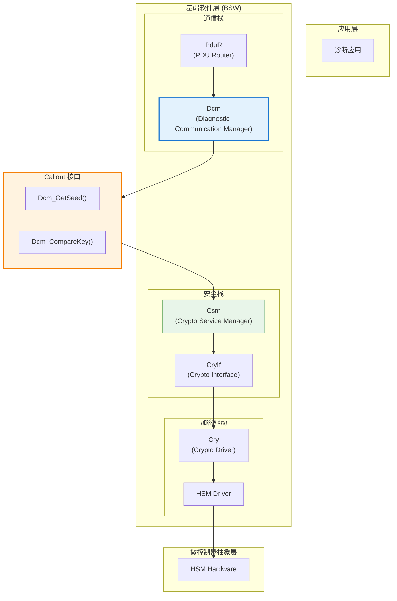
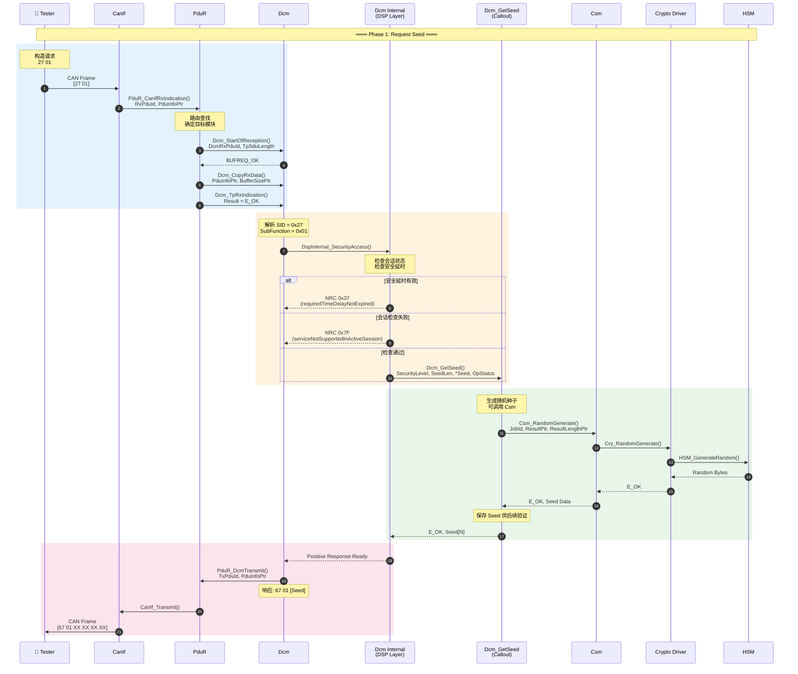
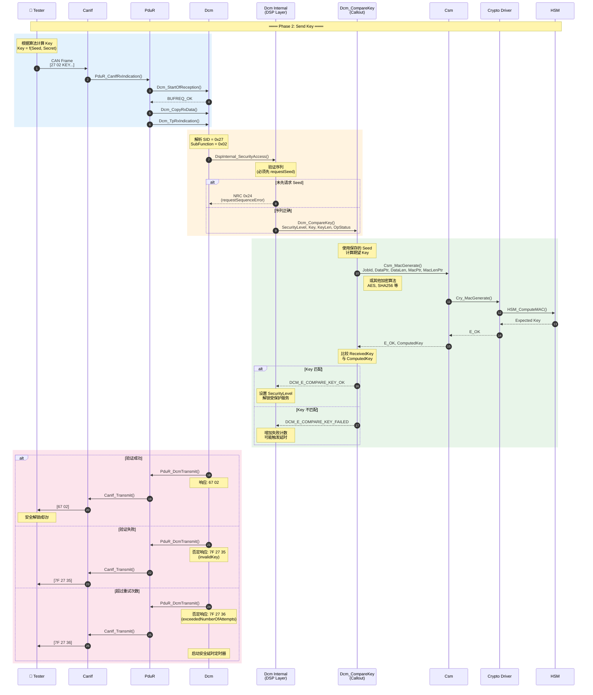
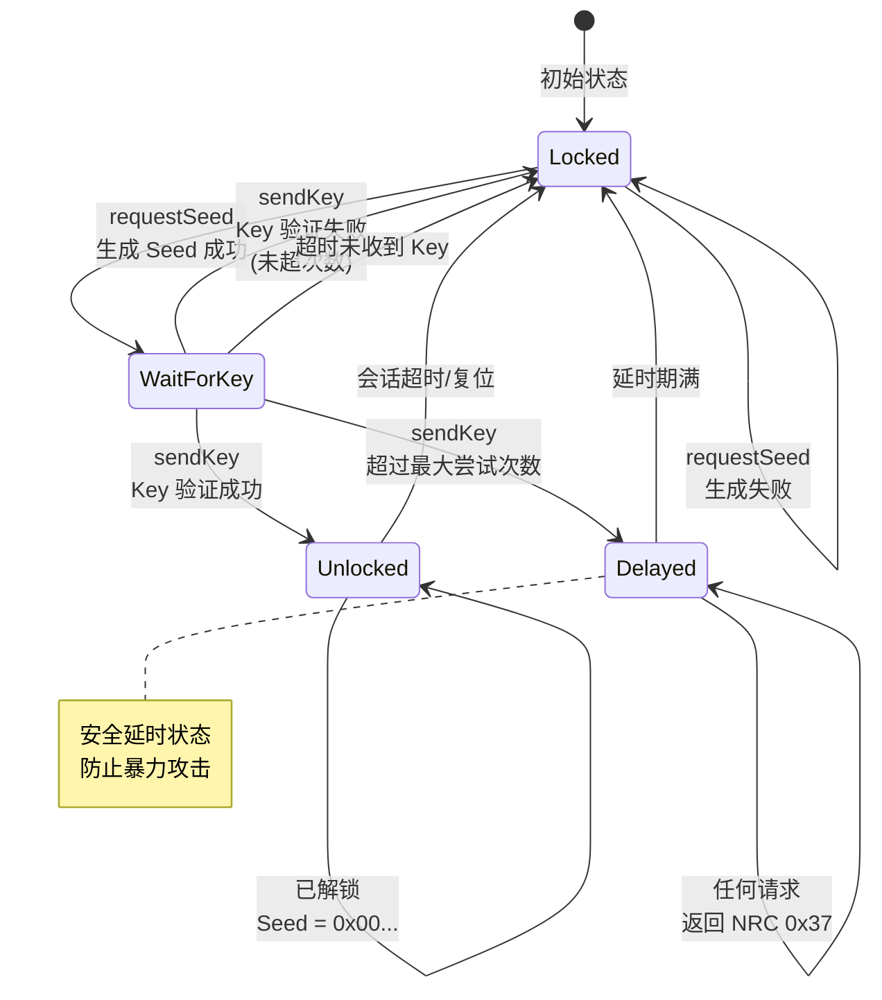

# UDS 0x27 Security Access 服务实现

> 本文档详述 UDS 安全访问服务 (SID 0x27) 在 AUTOSAR Classic Platform 中的完整调用栈，包含 PduR → Dcm → Callout → Crypto Driver 的交互流程。

## 服务概述

### Security Access 机制

| 属性 | 描述 |
|------|------|
| **服务标识** | SID = 0x27 |
| **标准依据** | ISO 14229-1 |
| **目的** | 解锁受保护的诊断服务 |
| **机制** | Seed & Key 挑战-响应认证 |
| **安全等级** | 支持多个 Security Level (0x01-0x7E) |

### 子功能定义

| Sub-Function | 名称 | 描述 |
|--------------|------|------|
| 0x01 | requestSeed (Level 1) | 请求安全等级 1 的种子 |
| 0x02 | sendKey (Level 1) | 发送安全等级 1 的密钥 |
| 0x03 | requestSeed (Level 2) | 请求安全等级 2 的种子 |
| 0x04 | sendKey (Level 2) | 发送安全等级 2 的密钥 |
| ... | ... | 奇数=requestSeed, 偶数=sendKey |
| 0x7F | requestSeed (Level 64) | 最高安全等级种子请求 |

---

## AUTOSAR 模块架构

### 涉及模块



---

## 完整调用栈序列图

### Phase 1: Request Seed (0x27 0x01)



### Phase 2: Send Key (0x27 0x02)



---

## Callout 函数实现

### Dcm_GetSeed 实现模板

```c
/* ============================================================
 * File: Dcm_SecurityAccess_Callout.c
 * Description: Security Access Callout Implementation
 * MISRA C:2012 Compliant
 * ============================================================ */

#include "Dcm.h"
#include "Csm.h"
#include "Rte_Dcm.h"

/* 存储生成的 Seed，供 CompareKey 使用 */
static uint8 Dcm_SecuritySeed[DCM_SECURITY_SEED_SIZE];
static boolean Dcm_SeedGenerated = FALSE;

/**
 * @brief Generate security seed for the requested security level
 * @param[in]  SecurityAccessType - Security level requested
 * @param[in]  SeedLen - Expected seed length
 * @param[out] Seed - Buffer to store generated seed
 * @param[in]  OpStatus - Operation status (initial, pending, cancel)
 * @return Std_ReturnType - E_OK, E_NOT_OK, DCM_E_PENDING
 */
Std_ReturnType Dcm_GetSeed(
    uint8 SecurityAccessType,
    uint8 SeedLen,
    uint8* Seed,
    Dcm_OpStatusType OpStatus)
{
    Std_ReturnType retVal = E_NOT_OK;
    Csm_ResultType csmResult;
    uint32 seedLength = (uint32)SeedLen;
    
    /* 参数有效性检查 */
    if (NULL_PTR == Seed)
    {
        /* MISRA Rule 15.5: 单一出口点 - 使用 retVal */
        retVal = E_NOT_OK;
    }
    else if (SeedLen > DCM_SECURITY_SEED_SIZE)
    {
        retVal = E_NOT_OK;
    }
    else
    {
        switch (OpStatus)
        {
            case DCM_INITIAL:
                /* 调用 Csm 生成随机数 */
                csmResult = Csm_RandomGenerate(
                    CSM_JOB_ID_RANDOM_SEED,
                    Seed,
                    &seedLength);
                
                if (CSM_E_OK == csmResult)
                {
                    /* 保存 Seed 供后续验证 */
                    (void)memcpy(Dcm_SecuritySeed, Seed, SeedLen);
                    Dcm_SeedGenerated = TRUE;
                    retVal = E_OK;
                }
                else if (CSM_E_BUSY == csmResult)
                {
                    retVal = DCM_E_PENDING;
                }
                else
                {
                    retVal = E_NOT_OK;
                }
                break;
                
            case DCM_PENDING:
                /* 检查异步操作结果 */
                csmResult = Csm_RandomGenerate(
                    CSM_JOB_ID_RANDOM_SEED,
                    Seed,
                    &seedLength);
                    
                if (CSM_E_OK == csmResult)
                {
                    (void)memcpy(Dcm_SecuritySeed, Seed, SeedLen);
                    Dcm_SeedGenerated = TRUE;
                    retVal = E_OK;
                }
                else if (CSM_E_BUSY == csmResult)
                {
                    retVal = DCM_E_PENDING;
                }
                else
                {
                    retVal = E_NOT_OK;
                }
                break;
                
            case DCM_CANCEL:
                /* 取消操作 */
                (void)Csm_CancelJob(CSM_JOB_ID_RANDOM_SEED);
                Dcm_SeedGenerated = FALSE;
                retVal = E_OK;
                break;
                
            default:
                /* 不应到达此处 */
                retVal = E_NOT_OK;
                break;
        }
    }
    
    return retVal;
}
```

### Dcm_CompareKey 实现模板

```c
/**
 * @brief Compare received key with expected key
 * @param[in] SecurityAccessType - Security level
 * @param[in] Key - Received key from tester
 * @param[in] KeyLen - Key length
 * @param[in] OpStatus - Operation status
 * @return Dcm_CompareKeyResultType
 */
Std_ReturnType Dcm_CompareKey(
    uint8 SecurityAccessType,
    const uint8* Key,
    uint8 KeyLen,
    Dcm_OpStatusType OpStatus)
{
    Std_ReturnType retVal = E_NOT_OK;
    uint8 expectedKey[DCM_SECURITY_KEY_SIZE];
    uint32 expectedKeyLen = DCM_SECURITY_KEY_SIZE;
    Csm_ResultType csmResult;
    uint8 idx;
    boolean keyMatch = TRUE;
    
    /* 参数检查 */
    if ((NULL_PTR == Key) || (FALSE == Dcm_SeedGenerated))
    {
        retVal = E_NOT_OK;
    }
    else
    {
        switch (OpStatus)
        {
            case DCM_INITIAL:
                /* 使用 Seed + Secret 计算期望 Key */
                /* 这里使用 HMAC-SHA256 作为示例 */
                csmResult = Csm_MacGenerate(
                    CSM_JOB_ID_SECURITY_MAC,
                    CRYPTO_OPERATIONMODE_SINGLECALL,
                    Dcm_SecuritySeed,
                    DCM_SECURITY_SEED_SIZE,
                    expectedKey,
                    &expectedKeyLen);
                
                if (CSM_E_OK == csmResult)
                {
                    /* 常数时间比较，防止时序攻击 */
                    for (idx = 0U; idx < KeyLen; idx++)
                    {
                        if (Key[idx] != expectedKey[idx])
                        {
                            keyMatch = FALSE;
                            /* 继续比较，不提前退出 */
                        }
                    }
                    
                    if (TRUE == keyMatch)
                    {
                        retVal = E_OK;
                    }
                    else
                    {
                        retVal = DCM_E_COMPARE_KEY_FAILED;
                    }
                    
                    /* 清除 Seed，一次性使用 */
                    Dcm_SeedGenerated = FALSE;
                    (void)memset(Dcm_SecuritySeed, 0x00U, 
                                 DCM_SECURITY_SEED_SIZE);
                }
                else if (CSM_E_BUSY == csmResult)
                {
                    retVal = DCM_E_PENDING;
                }
                else
                {
                    retVal = E_NOT_OK;
                }
                break;
                
            case DCM_PENDING:
                /* 处理异步响应 */
                /* ... 类似逻辑 ... */
                break;
                
            case DCM_CANCEL:
                (void)Csm_CancelJob(CSM_JOB_ID_SECURITY_MAC);
                retVal = E_OK;
                break;
                
            default:
                retVal = E_NOT_OK;
                break;
        }
    }
    
    return retVal;
}
```

---

## 状态机设计

### Security Access 状态机



### 否定响应码 (NRC)

| NRC | 名称 | 触发条件 |
|-----|------|----------|
| 0x12 | subFunctionNotSupported | 不支持的安全等级 |
| 0x13 | incorrectMessageLengthOrInvalidFormat | 消息格式错误 |
| 0x22 | conditionsNotCorrect | 条件不满足 |
| 0x24 | requestSequenceError | 未先请求 Seed |
| 0x35 | invalidKey | Key 验证失败 |
| 0x36 | exceededNumberOfAttempts | 超过最大尝试次数 |
| 0x37 | requiredTimeDelayNotExpired | 安全延时未到期 |

---

## 安全考量

### 防护措施

| 威胁 | 防护措施 | 实现位置 |
|------|----------|----------|
| **暴力破解** | 失败计数 + 指数延时 | Dcm 配置 |
| **时序攻击** | 常数时间比较 | CompareKey |
| **重放攻击** | 一次性 Seed | GetSeed |
| **Seed 预测** | HSM 真随机数 | Crypto Driver |
| **内存泄露** | 使用后清零 Seed/Key | Callout |

### Dcm 安全配置

```xml
<!-- Dcm 安全访问配置示例 -->
<ECUC-CONTAINER-VALUE>
  <SHORT-NAME>DcmDspSecurityRow_Level1</SHORT-NAME>
  <PARAMETER-VALUES>
    <ECUC-NUMERICAL-PARAM-VALUE>
      <DEFINITION-REF>/Dcm/DcmDspSecurityRow/DcmDspSecurityLevel</DEFINITION-REF>
      <VALUE>1</VALUE>
    </ECUC-NUMERICAL-PARAM-VALUE>
    <ECUC-NUMERICAL-PARAM-VALUE>
      <DEFINITION-REF>/Dcm/DcmDspSecurityRow/DcmDspSecuritySeedSize</DEFINITION-REF>
      <VALUE>4</VALUE>
    </ECUC-NUMERICAL-PARAM-VALUE>
    <ECUC-NUMERICAL-PARAM-VALUE>
      <DEFINITION-REF>/Dcm/DcmDspSecurityRow/DcmDspSecurityKeySize</DEFINITION-REF>
      <VALUE>4</VALUE>
    </ECUC-NUMERICAL-PARAM-VALUE>
    <ECUC-NUMERICAL-PARAM-VALUE>
      <DEFINITION-REF>/Dcm/DcmDspSecurityRow/DcmDspSecurityNumAttDelay</DEFINITION-REF>
      <VALUE>3</VALUE>
    </ECUC-NUMERICAL-PARAM-VALUE>
    <ECUC-NUMERICAL-PARAM-VALUE>
      <DEFINITION-REF>/Dcm/DcmDspSecurityRow/DcmDspSecurityDelayTime</DEFINITION-REF>
      <VALUE>10.0</VALUE> <!-- 10 秒延时 -->
    </ECUC-NUMERICAL-PARAM-VALUE>
  </PARAMETER-VALUES>
</ECUC-CONTAINER-VALUE>
```

---

*最后更新: 2026-01-25*
