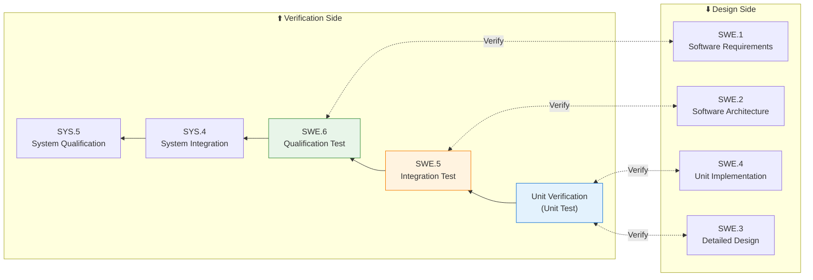
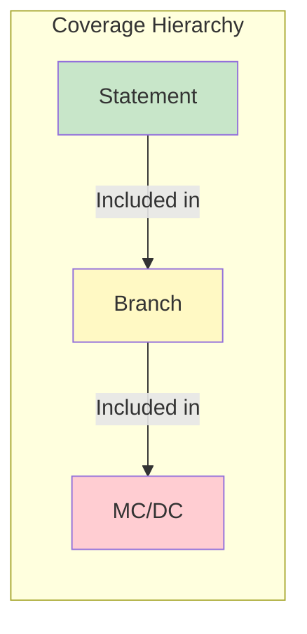
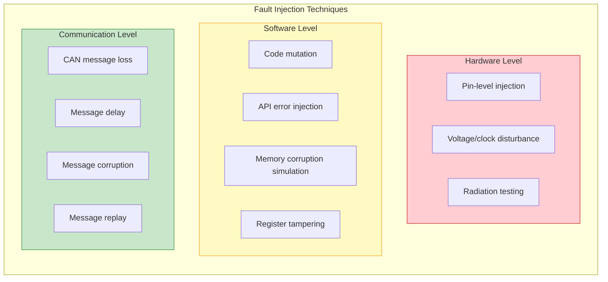
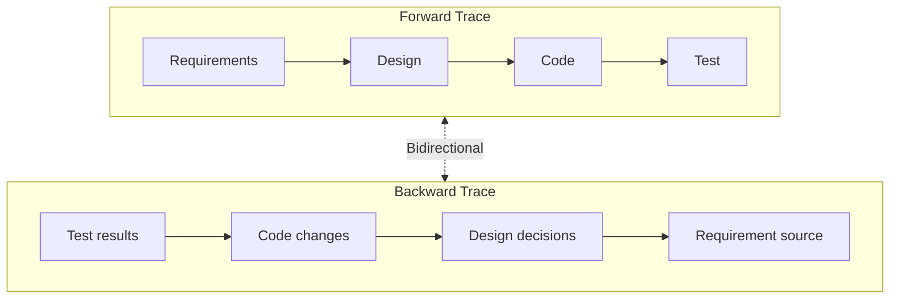
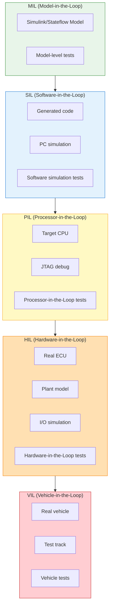

# Testing Strategy & Verification Methodology

> This document defines a layered testing strategy based on ASPICE SWE.5/SWE.6 and ISO 26262 Part 6, recommending verification methods and toolchains by ASIL level.

---

!!! success "💡 Field Insight from Michael Lin"
    **Background**: MC/DC compliance for an ASIL D brake control system

    **Key Challenges**:

    - Team lacked MC/DC understanding; coverage stuck at 85%
    - Test case design was ad-hoc and experience-based
    - No automated coverage monitoring; issues found late

    **My Solution**:

    1. Authored **MC/DC test design guidelines** with code examples and truth tables
    2. Introduced **VectorCAST + CI/CD automation**, checking coverage on every commit
    3. Built a **daily coverage dashboard** with red/yellow/green indicators
    4. Ran **test design workshops** with hands-on exercises

    **Quantified Results**:

    | Metric | Before | After | Improvement |
    |:-----|:------:|:------:|:----:|
    | MC/DC coverage | 85% | 98% | +15% |
    | Verification cycle | 8 weeks | 1.2 weeks | -85% |
    | Regression automation | 20% | 95% | +375% |
    | Defect escape rate | 8% | <2% | -75% |

---

## V-Model Right Side Mapping



---

## ASPICE Test Process Areas

### SWE.4 - Software Unit Verification

| Attribute | Description |
|------|------|
| **Purpose** | Verify software units meet detailed design |
| **Inputs** | Detailed design, source code, unit test specs |
| **Outputs** | Unit test report, coverage report |
| **Key activities** | Static analysis, unit testing, code review |

### SWE.5 - Software Integration & Testing

| Attribute | Description |
|------|------|
| **Purpose** | Verify integrated components meet architecture |
| **Inputs** | Architecture, integration strategy, verified units |
| **Outputs** | Integration test report, interface verification |
| **Key activities** | Interface tests, integration regression, resource tests |

### SWE.6 - Software Qualification Test

| Attribute | Description |
|------|------|
| **Purpose** | Confirm software meets requirements |
| **Inputs** | Software requirements, qualification test specs |
| **Outputs** | Qualification report, requirements traceability |
| **Key activities** | Functional, performance, boundary tests |

---

## ASIL Test Method Matrix

### Unit-Level Testing (SWE.4)

| Method | QM | ASIL A | ASIL B | ASIL C | ASIL D | ISO 26262 Ref |
|----------|:--:|:------:|:------:|:------:|:------:|----------------|
| **Requirements-based** | ○ | ++ | ++ | ++ | ++ | Table 10 |
| **Interface testing** | ○ | ++ | ++ | ++ | ++ | Table 10 |
| **Equivalence classes** | ○ | + | ++ | ++ | ++ | Table 10 |
| **Boundary values** | ○ | + | + | ++ | ++ | Table 10 |
| **Error guessing** | ○ | + | + | + | ++ | Table 10 |
| **Resource usage** | ○ | + | + | ++ | ++ | Table 11 |
| **Back-to-Back** | ○ | ○ | + | ++ | ++ | Table 11 |
| **Fault injection** | ○ | ○ | + | + | ++ | Table 11 |

> **Legend**: ++ = strongly recommended, + = recommended, ○ = optional

### Structural Coverage (SWE.4)

| Coverage | QM | ASIL A | ASIL B | ASIL C | ASIL D | Notes |
|------------|:--:|:------:|:------:|:------:|:------:|------|
| **Statement Coverage (SC)** | ○ | ++ | ++ | + | + | Each statement executed at least once |
| **Branch Coverage (BC)** | ○ | + | ++ | ++ | + | Each branch covered at least once |
| **MC/DC** | ○ | ○ | + | ++ | ++ | Modified condition/decision coverage |



### MC/DC Explanation

| Concept | Meaning |
|------|------|
| **Decision coverage** | Both true and false outcomes exercised |
| **Condition coverage** | Each atomic condition true and false |
| **MC/DC** | Each condition independently affects outcome |

**MC/DC Example**:

```c
// Decision: if (A && (B || C))
// Show A, B, C independently affect outcome

// Test cases:
// Case 1: A=T, B=T, C=X → Result=T  (A effect)
// Case 2: A=F, B=T, C=X → Result=F  (A effect)
// Case 3: A=T, B=T, C=F → Result=T  (B effect)
// Case 4: A=T, B=F, C=F → Result=F  (B effect)
// Case 5: A=T, B=F, C=T → Result=T  (C effect)
// Case 6: A=T, B=F, C=F → Result=F  (C effect)
```

---

### Integration Testing (SWE.5)

| Method | QM | ASIL A | ASIL B | ASIL C | ASIL D | Notes |
|----------|:--:|:------:|:------:|:------:|:------:|------|
| **Functional/black-box** | ○ | ++ | ++ | ++ | ++ | Based on interface specs |
| **Interface consistency** | ○ | ++ | ++ | ++ | ++ | Contract verification |
| **Error handling** | ○ | + | ++ | ++ | ++ | Exception paths |
| **Resource usage** | ○ | + | + | ++ | ++ | CPU, memory, stack |
| **Back-to-Back** | ○ | ○ | + | + | ++ | Model vs code consistency |
| **Fault injection** | ○ | ○ | + | ++ | ++ | Safety mechanism validation |
| **Call coverage** | ○ | + | ++ | ++ | ++ | Function call coverage |

### Qualification Testing (SWE.6)

| Method | QM | ASIL A | ASIL B | ASIL C | ASIL D | Notes |
|----------|:--:|:------:|:------:|:------:|:------:|------|
| **Requirements-based** | ○ | ++ | ++ | ++ | ++ | Requirements traceability |
| **Performance/timing** | ○ | + | ++ | ++ | ++ | WCET, response time |
| **Stress testing** | ○ | + | + | ++ | ++ | Boundary load |
| **Long-duration** | ○ | + | + | + | ++ | Stability validation |
| **Failure mode tests** | ○ | ○ | + | ++ | ++ | Safe-state triggering |
| **Penetration testing** | ○ | ○ | + | + | ++ | Cybersecurity (R155) |

---

## Fault Injection Strategy

### Fault Injection Categories



### Fault Injection Test Matrix

| Safety Mechanism | Injected Fault | Expected Behavior | ASIL Requirement |
|----------|----------|----------|-----------|
| **E2E Protection** | CRC error | Drop message, use fallback | B+ |
| **Watchdog** | Task timeout | Reset, safe state | C+ |
| **MPU Protection** | Illegal memory access | Exception, isolation | D |
| **Alive Counter** | Counter freeze | Detect comm loss | B+ |
| **Timeout Monitor** | Message loss | Degraded mode | B+ |
| **Range Check** | Out-of-range input | Saturate or reject | A+ |
| **Plausibility** | Inconsistent data | Sensor switch or degrade | C+ |

### Fault Injection Coverage Targets

| ASIL | Single-point coverage | Latent coverage | Multi-point coverage |
|------|--------------|--------------|--------------|
| ASIL A | Recommended | Optional | Optional |
| ASIL B | Required | Recommended | Optional |
| ASIL C | Required | Required | Recommended |
| ASIL D | Required (full) | Required (full) | Required |

---

## Test Automation & Toolchain

### Recommended Tool Matrix

| Test Stage | Tool Type | Commercial | Open Source |
|----------|----------|----------|----------|
| **Static analysis** | MISRA checks | Polyspace, PC-lint, QA-C | Cppcheck, Clang-Tidy |
| **Unit test** | Framework | VectorCAST, Tessy, Cantata | GoogleTest, Unity |
| **Coverage** | Code coverage | Testwell CTC++, BullseyeCoverage | gcov, lcov |
| **Integration** | HIL/SIL | dSPACE, NI VeriStand | Open HIL |
| **Model testing** | MBT | Simulink Test, BTC | - |
| **Fault injection** | Fault Injection | BTC EmbeddedTester, Razorcat | - |
| **Test management** | ALM | Polarion, codebeamer, Jama | - |
| **Traceability** | Requirements | DOORS, Polarion | ReqIF tools |

### CI/CD Integration Architecture

```mermaid
flowchart LR
    subgraph Dev["Development"]
        CODE["Source Code"]
        TEST["Test Cases"]
    end

    subgraph CI["CI Pipeline"]
        direction TB
        BUILD["Build"]
        STATIC["Static Analysis<br/>(MISRA/Coverity)"]
        UNIT["Unit Test<br/>(VectorCAST)"]
        COV["Coverage Analysis"]
        SIL["SIL Simulation"]
    end

    subgraph Artifact["Artifacts"]
        BIN["Binary"]
        REPORT["Test Reports"]
        TRACE["Traceability Matrix"]
    end

    subgraph HIL["HIL Environment"]
        HIL_RIG["HIL Test Bench"]
        FAULT["Fault Injection"]
    end

    Dev --> CI --> Artifact
    Artifact --> HIL

    style CI fill:#e3f2fd,stroke:#1976d2
    style HIL fill:#fff3e0,stroke:#f57c00
```



---

## Traceability Matrix

### Bidirectional Traceability



### Traceability Template

| Requirement ID | Description | Design Element | Code Module | Test Case | Result |
|---------|----------|----------|----------|----------|----------|
| SWR-001 | Brake response time ≤ 50 ms | SWA-003 | Brake_Control.c | TC-INT-015 | ✅ Pass |
| SWR-002 | CRC failure triggers NRC | SWA-007 | Dcm_Verification.c | TC-UNIT-042 | ✅ Pass |
| SWR-003 | Watchdog timeout safe state | SWA-012 | Wdg_Handler.c | TC-FI-008 | ✅ Pass |
| FSR-001 | ASIL D safety goal | SMS-001 | SafetyMonitor.c | TC-SYS-101 | ✅ Pass |

---

## Test Environment Architecture

### Multi-Level Test Environments



### Test Environment Applicability

| Test Type | MIL | SIL | PIL | HIL | VIL |
|----------|:---:|:---:|:---:|:---:|:---:|
| Functional logic | ✅ | ✅ | ✅ | ✅ | ✅ |
| Timing verification | ❌ | △ | ✅ | ✅ | ✅ |
| Resource usage | ❌ | ❌ | ✅ | ✅ | ✅ |
| I/O behavior | ❌ | ❌ | △ | ✅ | ✅ |
| EMC/Environmental | ❌ | ❌ | ❌ | △ | ✅ |
| Fault injection | ✅ | ✅ | ✅ | ✅ | △ |
| Regression testing | ✅ | ✅ | ✅ | △ | ❌ |

> **Legend**: ✅ = suitable, △ = partially suitable, ❌ = not suitable

---

## Test Report Templates

### Unit Test Report

```
╔════════════════════════════════════════════════════════════╗
║                    UNIT TEST REPORT                        ║
╠════════════════════════════════════════════════════════════╣
║ Module: Ecu_Safety.c                                       ║
║ Version: 2.1.0                                             ║
║ Date: 2026-01-25                                           ║
║ ASIL: D                                                    ║
╠════════════════════════════════════════════════════════════╣
║ TEST SUMMARY                                               ║
║ ├─ Total Test Cases:     156                               ║
║ ├─ Passed:               154                               ║
║ ├─ Failed:                 0                               ║
║ ├─ Blocked:                2                               ║
║ └─ Pass Rate:          98.7%                               ║
╠════════════════════════════════════════════════════════════╣
║ COVERAGE METRICS                                           ║
║ ├─ Statement Coverage:  99.2%  [Target: 95%] ✅            ║
║ ├─ Branch Coverage:     98.5%  [Target: 95%] ✅            ║
║ ├─ MC/DC Coverage:      97.8%  [Target: 95%] ✅            ║
║ └─ Function Coverage:  100.0%  [Target: 100%] ✅           ║
╠════════════════════════════════════════════════════════════╣
║ STATIC ANALYSIS                                            ║
║ ├─ MISRA Violations:       0 (Required)                    ║
║ ├─ MISRA Violations:       3 (Advisory, Deviation Filed)   ║
║ └─ Complexity (max):      12 (Limit: 15) ✅                ║
╚════════════════════════════════════════════════════════════╝
```

### Integration Test Report

```
╔════════════════════════════════════════════════════════════╗
║                 INTEGRATION TEST REPORT                    ║
╠════════════════════════════════════════════════════════════╣
║ Component: ADAS_Controller                                 ║
║ Integration Level: SW Integration                          ║
╠════════════════════════════════════════════════════════════╣
║ INTERFACE VERIFICATION                                     ║
║ ├─ COM Signals Tested:     48/48  (100%) ✅                ║
║ ├─ RTE Ports Verified:     24/24  (100%) ✅                ║
║ └─ E2E Protected Msgs:     16/16  (100%) ✅                ║
╠════════════════════════════════════════════════════════════╣
║ FAULT INJECTION RESULTS                                    ║
║ ├─ Safety Mechanisms:      12/12 Verified ✅               ║
║ ├─ Watchdog Trigger:       Pass                            ║
║ ├─ MPU Violation:          Pass                            ║
║ └─ E2E CRC Failure:        Pass                            ║
╚════════════════════════════════════════════════════════════╝
```

---

## Test KPI Metrics

| Metric | Definition | Target (ASIL D) |
|--------|------|---------------|
| **Requirement coverage** | Tested requirements / total | 100% |
| **Statement coverage** | Executed statements / total | ≥ 95% |
| **Branch coverage** | Covered branches / total | ≥ 95% |
| **MC/DC coverage** | MC/DC satisfied conditions / total | ≥ 95% |
| **Defect escape rate** | Missed defects / found defects | < 5% |
| **Regression pass rate** | Regression passed / total | 100% |
| **Fault injection coverage** | Verified safety mechanisms / total | 100% |

---

*Last updated: 2026-01-25*
