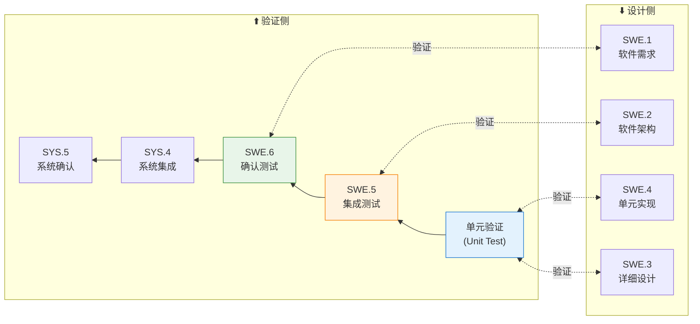
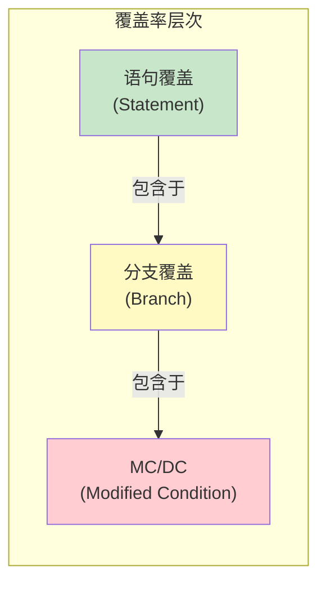
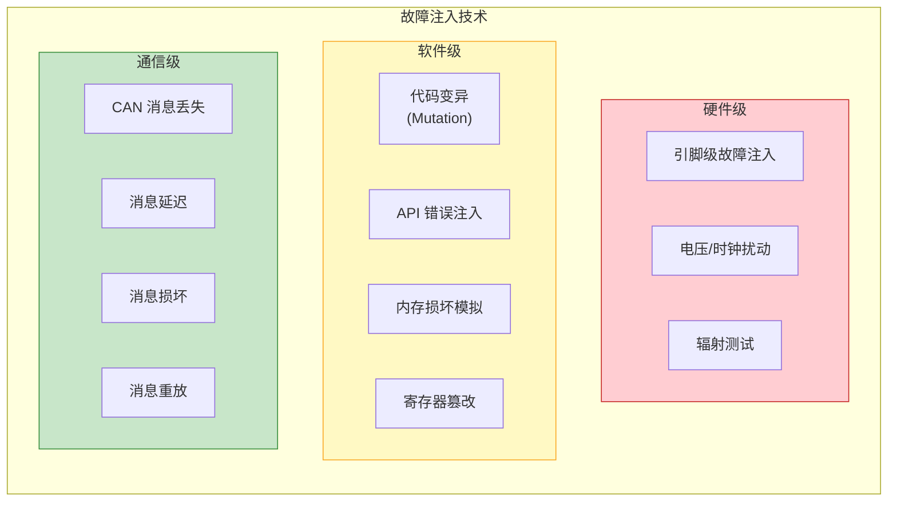
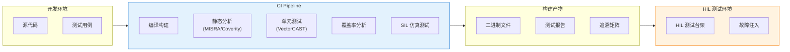
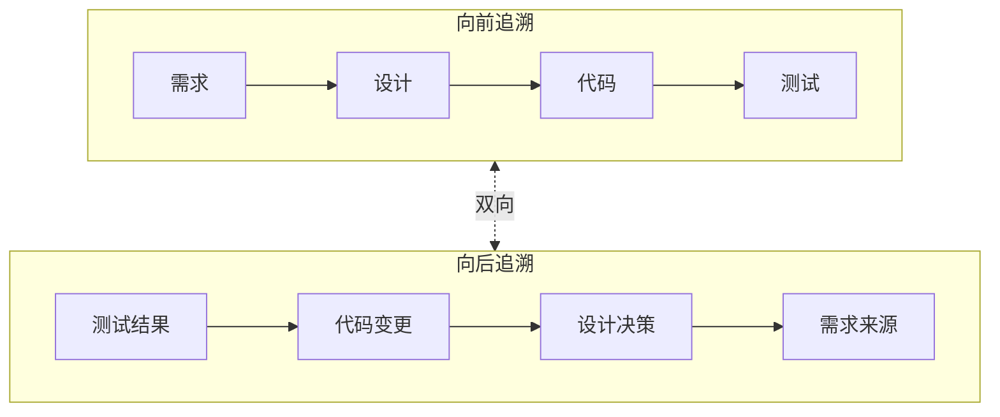
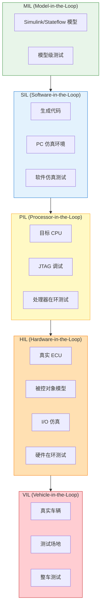

# 测试策略与验证方法论

> 本文档定义基于 ASPICE SWE.5/SWE.6 和 ISO 26262 Part 6 的分层测试策略，按 ASIL 等级推荐验证方法与工具链。

## V-Model 右侧映射



---

## ASPICE 测试过程域

### SWE.4 - 软件单元验证

| 属性 | 描述 |
|------|------|
| **目的** | 验证软件单元满足详细设计规格 |
| **输入** | 详细设计文档、源代码、单元测试规格 |
| **输出** | 单元测试报告、覆盖率报告 |
| **关键活动** | 静态分析、单元测试、代码审查 |

### SWE.5 - 软件集成与测试

| 属性 | 描述 |
|------|------|
| **目的** | 验证集成后的软件组件满足架构设计 |
| **输入** | 软件架构、集成策略、已验证单元 |
| **输出** | 集成测试报告、接口验证报告 |
| **关键活动** | 接口测试、集成回归测试、资源消耗测试 |

### SWE.6 - 软件确认测试

| 属性 | 描述 |
|------|------|
| **目的** | 确认软件满足软件需求规格 |
| **输入** | 软件需求规格、确认测试规格 |
| **输出** | 确认测试报告、需求追溯矩阵 |
| **关键活动** | 功能测试、性能测试、边界测试 |

---

## ASIL 分级测试方法矩阵

### 单元级测试 (SWE.4)

| 测试方法 | QM | ASIL A | ASIL B | ASIL C | ASIL D | ISO 26262 参考 |
|----------|:--:|:------:|:------:|:------:|:------:|----------------|
| **需求导向测试** | ○ | ++ | ++ | ++ | ++ | Table 10 |
| **接口测试** | ○ | ++ | ++ | ++ | ++ | Table 10 |
| **等价类划分** | ○ | + | ++ | ++ | ++ | Table 10 |
| **边界值分析** | ○ | + | + | ++ | ++ | Table 10 |
| **错误推测** | ○ | + | + | + | ++ | Table 10 |
| **资源消耗测试** | ○ | + | + | ++ | ++ | Table 11 |
| **Back-to-Back 测试** | ○ | ○ | + | ++ | ++ | Table 11 |
| **故障注入测试** | ○ | ○ | + | + | ++ | Table 11 |

> **图例**: ++ = 高度推荐, + = 推荐, ○ = 可选 (无专项要求)

### 结构覆盖率要求 (SWE.4)

| 覆盖率指标 | QM | ASIL A | ASIL B | ASIL C | ASIL D | 说明 |
|------------|:--:|:------:|:------:|:------:|:------:|------|
| **语句覆盖率 (SC)** | ○ | ++ | ++ | + | + | 每条语句至少执行一次 |
| **分支覆盖率 (BC)** | ○ | + | ++ | ++ | + | 每个分支至少覆盖一次 |
| **MC/DC** | ○ | ○ | + | ++ | ++ | 修正条件/判定覆盖 |



### MC/DC 覆盖率说明

| 条件 | 含义 |
|------|------|
| **判定覆盖** | 每个判定 (if/while) 的真假都被测试 |
| **条件覆盖** | 每个原子条件的真假都被测试 |
| **MC/DC** | 每个条件独立影响判定结果被证明 |

**MC/DC 示例**:

```c
// 判定: if (A && (B || C))
// 需要证明 A, B, C 各自独立影响结果

// 测试用例设计:
// Case 1: A=T, B=T, C=X → Result=T  (A影响)
// Case 2: A=F, B=T, C=X → Result=F  (A影响)
// Case 3: A=T, B=T, C=F → Result=T  (B影响)
// Case 4: A=T, B=F, C=F → Result=F  (B影响)
// Case 5: A=T, B=F, C=T → Result=T  (C影响)
// Case 6: A=T, B=F, C=F → Result=F  (C影响)
```

---

### 集成级测试 (SWE.5)

| 测试方法 | QM | ASIL A | ASIL B | ASIL C | ASIL D | 说明 |
|----------|:--:|:------:|:------:|:------:|:------:|------|
| **功能/黑盒测试** | ○ | ++ | ++ | ++ | ++ | 基于接口规格 |
| **接口一致性测试** | ○ | ++ | ++ | ++ | ++ | 验证接口契约 |
| **错误处理测试** | ○ | + | ++ | ++ | ++ | 异常路径验证 |
| **资源消耗测试** | ○ | + | + | ++ | ++ | CPU、内存、栈 |
| **Back-to-Back 测试** | ○ | ○ | + | + | ++ | 模型与代码一致 |
| **故障注入测试** | ○ | ○ | + | ++ | ++ | 验证安全机制 |
| **调用覆盖率** | ○ | + | ++ | ++ | ++ | 函数调用覆盖 |

### 确认级测试 (SWE.6)

| 测试方法 | QM | ASIL A | ASIL B | ASIL C | ASIL D | 说明 |
|----------|:--:|:------:|:------:|:------:|:------:|------|
| **基于需求的测试** | ○ | ++ | ++ | ++ | ++ | 需求追溯 |
| **性能/时序测试** | ○ | + | ++ | ++ | ++ | WCET、响应时间 |
| **压力测试** | ○ | + | + | ++ | ++ | 边界负载 |
| **长时间运行测试** | ○ | + | + | + | ++ | 稳定性验证 |
| **失效模式测试** | ○ | ○ | + | ++ | ++ | 安全状态触发 |
| **渗透测试** | ○ | ○ | + | + | ++ | 网络安全 (R155) |

---

## 故障注入测试策略

### 故障注入分类



### 故障注入测试用例矩阵

| 安全机制 | 注入故障 | 预期行为 | ASIL 要求 |
|----------|----------|----------|-----------|
| **E2E Protection** | CRC 错误 | 消息丢弃、使用 fallback | B+ |
| **Watchdog** | 任务超时 | 系统复位、安全状态 | C+ |
| **MPU Protection** | 非法内存访问 | 异常捕获、隔离 | D |
| **Alive Counter** | 计数器冻结 | 检测通信中断 | B+ |
| **Timeout Monitor** | 消息丢失 | 触发降级模式 | B+ |
| **Range Check** | 超范围输入 | 值饱和或拒绝 | A+ |
| **Plausibility** | 不一致数据 | 传感器切换或降级 | C+ |

### 故障注入覆盖目标

| ASIL | 单点故障覆盖 | 潜伏故障覆盖 | 多点故障覆盖 |
|------|--------------|--------------|--------------|
| ASIL A | 建议 | 可选 | 可选 |
| ASIL B | 要求 | 建议 | 可选 |
| ASIL C | 要求 | 要求 | 建议 |
| ASIL D | 要求 (完整) | 要求 (完整) | 要求 |

---

## 测试自动化与工具链

### 推荐工具矩阵

| 测试阶段 | 工具类型 | 商业工具 | 开源工具 |
|----------|----------|----------|----------|
| **静态分析** | MISRA 检查 | Polyspace, PC-lint, QA-C | Cppcheck, Clang-Tidy |
| **单元测试** | 框架 | VectorCAST, Tessy, Cantata | GoogleTest, Unity |
| **覆盖率** | 代码覆盖 | Testwell CTC++, BullseyeCoverage | gcov, lcov |
| **集成测试** | HIL/SIL | dSPACE, NI VeriStand | Open HIL |
| **模型测试** | MBT | Simulink Test, BTC | - |
| **故障注入** | Fault Injection | BTC EmbeddedTester, Razorcat | - |
| **测试管理** | ALM | Polarion, codebeamer, Jama | - |
| **追溯性** | Requirements | DOORS, Polarion | ReqIF tools |

### CI/CD 集成架构



---

## 追溯性矩阵

### 双向追溯要求



### 追溯矩阵模板

| 需求 ID | 需求描述 | 设计元素 | 代码模块 | 测试用例 | 测试结果 |
|---------|----------|----------|----------|----------|----------|
| SWR-001 | 制动请求响应时间 ≤ 50ms | SWA-003 | Brake_Control.c | TC-INT-015 | ✅ Pass |
| SWR-002 | CRC 校验失败触发 NRC | SWA-007 | Dcm_Verification.c | TC-UNIT-042 | ✅ Pass |
| SWR-003 | Watchdog 超时安全状态 | SWA-012 | Wdg_Handler.c | TC-FI-008 | ✅ Pass |
| FSR-001 | ASIL D 安全目标 | SMS-001 | SafetyMonitor.c | TC-SYS-101 | ✅ Pass |

---

## 测试环境架构

### 多级测试环境



### 测试环境适用性

| 测试类型 | MIL | SIL | PIL | HIL | VIL |
|----------|:---:|:---:|:---:|:---:|:---:|
| 功能逻辑 | ✅ | ✅ | ✅ | ✅ | ✅ |
| 时序验证 | ❌ | △ | ✅ | ✅ | ✅ |
| 资源消耗 | ❌ | ❌ | ✅ | ✅ | ✅ |
| I/O 行为 | ❌ | ❌ | △ | ✅ | ✅ |
| EMC/环境 | ❌ | ❌ | ❌ | △ | ✅ |
| 故障注入 | ✅ | ✅ | ✅ | ✅ | △ |
| 回归测试 | ✅ | ✅ | ✅ | △ | ❌ |

> **图例**: ✅ = 适合, △ = 部分适合, ❌ = 不适合

---

## 测试报告模板

### 单元测试报告

```
╔════════════════════════════════════════════════════════════╗
║                    UNIT TEST REPORT                        ║
╠════════════════════════════════════════════════════════════╣
║ Module: Ecu_Safety.c                                       ║
║ Version: 2.1.0                                             ║
║ Date: 2026-01-25                                           ║
║ ASIL: D                                                    ║
╠════════════════════════════════════════════════════════════╣
║ TEST SUMMARY                                               ║
║ ├─ Total Test Cases:     156                               ║
║ ├─ Passed:               154                               ║
║ ├─ Failed:                 0                               ║
║ ├─ Blocked:                2                               ║
║ └─ Pass Rate:          98.7%                               ║
╠════════════════════════════════════════════════════════════╣
║ COVERAGE METRICS                                           ║
║ ├─ Statement Coverage:  99.2%  [Target: 95%] ✅            ║
║ ├─ Branch Coverage:     98.5%  [Target: 95%] ✅            ║
║ ├─ MC/DC Coverage:      97.8%  [Target: 95%] ✅            ║
║ └─ Function Coverage:  100.0%  [Target: 100%] ✅           ║
╠════════════════════════════════════════════════════════════╣
║ STATIC ANALYSIS                                            ║
║ ├─ MISRA Violations:       0 (Required)                    ║
║ ├─ MISRA Violations:       3 (Advisory, Deviation Filed)   ║
║ └─ Complexity (max):      12 (Limit: 15) ✅                ║
╚════════════════════════════════════════════════════════════╝
```

### 集成测试报告

```
╔════════════════════════════════════════════════════════════╗
║                 INTEGRATION TEST REPORT                    ║
╠════════════════════════════════════════════════════════════╣
║ Component: ADAS_Controller                                 ║
║ Integration Level: SW Integration                          ║
╠════════════════════════════════════════════════════════════╣
║ INTERFACE VERIFICATION                                     ║
║ ├─ COM Signals Tested:     48/48  (100%) ✅                ║
║ ├─ RTE Ports Verified:     24/24  (100%) ✅                ║
║ └─ E2E Protected Msgs:     16/16  (100%) ✅                ║
╠════════════════════════════════════════════════════════════╣
║ FAULT INJECTION RESULTS                                    ║
║ ├─ Safety Mechanisms:      12/12 Verified ✅               ║
║ ├─ Watchdog Trigger:       Pass                            ║
║ ├─ MPU Violation:          Pass                            ║
║ └─ E2E CRC Failure:        Pass                            ║
╚════════════════════════════════════════════════════════════╝
```

---

## 测试度量 KPI

| 度量项 | 定义 | 目标 (ASIL D) |
|--------|------|---------------|
| **需求覆盖率** | 已测需求 / 总需求 | 100% |
| **语句覆盖率** | 已执行语句 / 总语句 | ≥ 95% |
| **分支覆盖率** | 已覆盖分支 / 总分支 | ≥ 95% |
| **MC/DC 覆盖率** | MC/DC 满足条件 / 总条件 | ≥ 95% |
| **缺陷逃逸率** | 遗漏缺陷 / 总发现缺陷 | < 5% |
| **回归通过率** | 回归测试通过 / 总回归用例 | 100% |
| **故障注入覆盖** | 已验证安全机制 / 总安全机制 | 100% |

---

*最后更新: 2026-01-25*
