# ASPICE V-Model Architecture Map

> This document presents the full Automotive SPICE V-Model architecture, mapping SYS (System Engineering) and SWE (Software Engineering) process areas to the design side (left) and verification side (right).

## V-Model Overall Architecture

```mermaid
%%{init: {'theme': 'base', 'themeVariables': { 'primaryColor': '#e1f5fe', 'primaryTextColor': '#01579b', 'primaryBorderColor': '#0288d1', 'lineColor': '#0288d1', 'secondaryColor': '#fff3e0', 'tertiaryColor': '#f3e5f5'}}}%%
flowchart TB
    subgraph Level1["📋 Level 1: Regulations & Standards"]
        direction LR
        REG["UN Regulations<br/>R79 | R152 | R155 | R156 | R171"]
        STD["ISO Standards<br/>ISO 26262 | ISO 21434 | ISO 21448"]
    end

    subgraph LeftSide["⬇️ Design Phase"]
        direction TB
        subgraph Level2_L["Level 2: System Analysis"]
            SYS1["SYS.1<br/>Requirements Elicitation"]
            SYS2["SYS.2<br/>System Requirements Analysis"]
        end

        subgraph Level3_L["Level 3: Architecture Design"]
            SYS3["SYS.3<br/>System Architectural Design"]
            SWE1["SWE.1<br/>SW Requirements Analysis"]
            SWE2["SWE.2<br/>SW Architectural Design"]
        end

        subgraph Level4_L["Level 4: Detailed Design"]
            SWE3["SWE.3<br/>SW Detailed Design"]
        end

        subgraph Level5_L["Level 5: Implementation"]
            SWE4["SWE.4<br/>SW Unit Verification"]
        end
    end

    subgraph RightSide["⬆️ Verification Phase"]
        direction TB
        subgraph Level5_R["Level 5: Unit Testing"]
            SWE4_T["Unit Testing"]
        end

        subgraph Level4_R["Level 4: Integration Testing"]
            SWE5["SWE.5<br/>SW Integration & Testing"]
        end

        subgraph Level3_R["Level 3: System Integration"]
            SWE6["SWE.6<br/>SW Qualification Testing"]
            SYS4["SYS.4<br/>System Integration & Testing"]
        end

        subgraph Level2_R["Level 2: System Verification"]
            SYS5["SYS.5<br/>System Qualification Testing"]
        end
    end

    %% Vertical flow connections
    Level1 --> Level2_L
    SYS1 --> SYS2
    SYS2 --> SYS3
    SYS3 --> SWE1
    SWE1 --> SWE2
    SWE2 --> SWE3
    SWE3 --> SWE4

    SWE4 -.->|Implementation| SWE4_T
    SWE4_T --> SWE5
    SWE5 --> SWE6
    SWE6 --> SYS4
    SYS4 --> SYS5

    %% Horizontal traceability links
    SYS2 <-.->|Requirements Traceability| SYS5
    SYS3 <-.->|Architecture Verification| SYS4
    SWE1 <-.->|Requirements Verification| SWE6
    SWE2 <-.->|Architecture Verification| SWE5
    SWE3 <-.->|Design Verification| SWE4_T

    style Level1 fill:#e3f2fd,stroke:#1976d2,stroke-width:2px
    style LeftSide fill:#e8f5e9,stroke:#388e3c,stroke-width:2px
    style RightSide fill:#fff3e0,stroke:#f57c00,stroke-width:2px
```

## Process Area Mapping Table

### System Engineering Process Areas (SYS)

| Process ID | Process Name | V-Model Position | Main Outputs | Corresponding Verification |
|--------|----------|-----------|------------|--------------|
| SYS.1 | Requirements Elicitation | Level 2 Left | Stakeholder requirements | SYS.5 System Qualification |
| SYS.2 | System Requirements Analysis | Level 2 Left | System requirements spec | SYS.5 System Qualification |
| SYS.3 | System Architectural Design | Level 3 Left | System architecture description | SYS.4 System Integration Testing |
| SYS.4 | System Integration & Testing | Level 3 Right | Integration test report | - |
| SYS.5 | System Qualification Testing | Level 2 Right | Qualification report | - |

### Software Engineering Process Areas (SWE)

| Process ID | Process Name | V-Model Position | Main Outputs | Corresponding Verification |
|--------|----------|-----------|------------|--------------|
| SWE.1 | Software Requirements Analysis | Level 3 Left | Software requirements spec | SWE.6 SW Qualification Testing |
| SWE.2 | Software Architectural Design | Level 3 Left | Software architecture description | SWE.5 SW Integration Testing |
| SWE.3 | Software Detailed Design | Level 4 Left | Detailed design doc | SWE.4 Unit Verification |
| SWE.4 | Software Unit Verification | Level 5 | Unit test report | - |
| SWE.5 | Software Integration & Testing | Level 4 Right | Integration test report | - |
| SWE.6 | Software Qualification Testing | Level 3 Right | Qualification test report | - |

## Layer Relationship Explanation

## Bidirectional Traceability Requirements

The core principle of the V-Model is **bidirectional traceability**:

1. **Forward Traceability**
   - Requirements → Design → Implementation
   - Ensures every requirement is implemented

2. **Backward Traceability**
   - Test cases → Requirements
   - Ensures every test maps to a requirement

3. **Horizontal Traceability**
   - Design phase ↔ Verification phase
   - Ensures verification covers corresponding design decisions

---

*Last updated: 2026-01-25*
