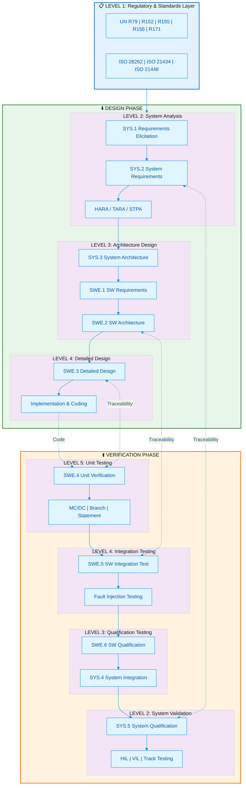

# 🏎️ Automotive Functional Safety & Software Architecture Knowledge Base

<!-- Professional Badges -->

 

**Enterprise-Grade Knowledge Repository for Automotive E/E Architecture, Functional Safety, and ASPICE-Compliant Software Development**

*Architecting the Future of Software-Defined Vehicles*

---

---

## 🎯 Executive Summary

This knowledge base provides **senior automotive software architects**, **functional safety engineers**, and **E/E system engineers** with end-to-end technical assets — from regulatory compliance to code implementation.

It covers the **full V-Model lifecycle**: UN ECE regulations, MISRA C++ coding rules, STPA system analysis, and MC/DC test coverage, forming a complete knowledge loop.

> *"Excellence in automotive software is not an option — it's a mandate."*

---

## 📐 V-Model Architecture Map

---

## 🗂️ Knowledge Funnel — Hierarchical Navigation

> A layered knowledge architecture, from regulations down to code.

### 🔷 Level 1 — Regulatory & Standards Foundation

*Building Compliance from Ground Zero*

| Document | Scope | Key Content |
|:---------|:------|:------------|
| 📄 [**Regulations Matrix**](./docs/01_Standards_Level/Regulations_Matrix.md) | UN ECE Regulations | Core boundaries: R79 (Steering), R152 (AEBS), R155 (CSMS), R156 (SUMS), R171 (CMS) |

**Core Competencies:**
- UN Type Approval interpretation and system boundary definition
- CSMS/SUMS management system certification requirements
- Regulation linkage matrix and compliance checklist

---

### 🔶 Level 2 — System Analysis & Safety Engineering

*Hazard to Safety Goal — Mastering HARA, TARA, and STPA*

| Document | Scope | Key Content |
|:---------|:------|:------------|
| 📄 [**HARA / TARA / STPA Guide**](./docs/02_System_Analysis/HARA_TARA_STPA_Guide.md) | Risk Analysis | Functional & cybersecurity analysis comparison, STPA control loop modeling |
| 📄 [**Hardware Reliability**](./docs/02_System_Analysis/Hardware_Reliability.md) | HW Metrics | FTA/FMEA/FMEDA for SPFM/LFM/PMHF calculations |

**Core Competencies:**
- STPA control structures and UCA identification
- HARA vs TARA input/output mapping
- ISO 26262 hardware metrics (ASIL D: SPFM ≥ 99%, LFM ≥ 90%)

---

### 🟢 Level 3 — Software Architecture Design

*AUTOSAR, SOA, and Secure Communication Patterns*

| Document | Scope | Key Content |
|:---------|:------|:------------|
| 📄 [**CP/AP Hybrid Architecture**](./docs/03_Software_Architecture/CP_AP_Hybrid_Arch.md) | AUTOSAR | CP + AP hybrid communication, SOME/IP, DDS, Hypervisor isolation |
| 📄 [**DoIP Routing Strategy**](./docs/03_Software_Architecture/DoIP_Routing_Strategy.md) | Diagnostics | DoIP sequences, Routing Activation, DoIP-to-CAN conversion |

**Core Competencies:**
- SOME/IP service discovery and DDS QoS selection
- Type-1 Hypervisor partitioning
- MPU memory protection and FFI (ASIL D + QM coexistence)
- DoIP gateway routing table and protocol conversion

---

### 🟡 Level 4 — Detailed Design & Implementation

*From Specification to MISRA-Compliant Code*

| Document | Scope | Key Content |
|:---------|:------|:------------|
| 📄 [**UDS 0x27 Security Access**](./docs/04_Implementation/UDS_0x27_SecurityAccess.md) | Diagnostics | PduR → Dcm → Callout → Crypto Driver stack, Seed/Key implementation |
| 📄 [**MISRA C++ Golden Rules**](./docs/04_Implementation/MISRA_Cpp_Golden_Rules.md) | Coding Standard | Top 10 critical rules, Bad vs Good, static analysis integration |
| 📄 [**Memory Mapping Design**](./docs/04_Implementation/Memory_Mapping_Design.md) | MemMap | AUTOSAR MemMap.h, linker script ASIL partitioning, MPU linkage |

**Core Competencies:**
- UDS security access state machine and anti-bruteforce mechanisms
- MISRA C++:2008/2023 practical application
- Linker script design (ASIL D code → dedicated Flash sector)
- Callout design patterns and async handling

---

### 🔴 Level 5 — Verification & Validation

*Closing the V-Model Loop with Rigor*

| Document | Scope | Key Content |
|:---------|:------|:------------|
| 📄 [**Testing Strategy**](./docs/05_Verification/Testing_Strategy.md) | SWE.5/SWE.6 | ASIL test matrix, MC/DC, fault injection, HIL/SIL/MIL environments |

**Core Competencies:**
- MC/DC design and test case derivation
- Fault injection matrix (safety mechanism verification)
- Bidirectional traceability (Requirement ↔ Test ↔ Code)
- CI/CD automated test pipelines

---
