```mermaid
flowchart LR
    subgraph Standards["Level 1: Standards"]
        REG[UN R79/R152/R155/R156]
        ISO[ISO 26262/21434]
    end

    subgraph Design["Design Phase"]
        SYS1[SYS.1 Requirements]
        SYS2[SYS.2 Analysis]
        SYS3[SYS.3 Architecture]
        SWE1[SWE.1 SW Req]
        SWE2[SWE.2 SW Arch]
        SWE3[SWE.3 Detail Design]
        CODE[Implementation]
    end

    subgraph Verify["Verification Phase"]
        UT[Unit Test]
        IT[Integration Test]
        QT[Qualification Test]
        ST[System Test]
    end

    Standards --> Design
    SYS1 --> SYS2
    SYS2 --> SYS3
    SYS3 --> SWE1
    SWE1 --> SWE2
    SWE2 --> SWE3
    SWE3 --> CODE

    CODE --> UT
    UT --> IT
    IT --> QT
    QT --> ST

    SYS2 -.-> ST
    SWE2 -.-> IT
    SWE3 -.-> UT

    style Standards fill:#e3f2fd,stroke:#1565c0
    style Design fill:#e8f5e9,stroke:#2e7d32
    style Verify fill:#fff3e0,stroke:#ef6c00
```

# 🏎️ Automotive Functional Safety & Software Architecture Knowledge Base

<!-- Hero Section -->

## I am Michael Lin

### Automotive Software & Functional Safety Architect

🇩🇪 **10+ years of front-line automotive electronics quality & architecture in Germany**

🏆 **Led and delivered multiple ASIL D programs and ISO/SAE 21434 compliance**

🤖 **Creator of Compliance-Wächter — an AI-driven compliance copilot**

📍 **Quality Manager at MAGNA, focused on cybersecurity compliance (UN R155)**

| 🎯 85% | 📄 200+ | 🔧 30% |
|:------:|:-------:|:------:|
| Validation cycle reduced | TARA documents auto-generated daily | Architecture rework reduced |

---

---

## 🎯 Overview

This knowledge base is the crystallization of **10+ years of hands-on experience** in the German automotive electronics industry, built for **senior software architects**, **functional safety engineers**, and **E/E systems engineers**.

It covers the **full V-Model lifecycle**: from UN ECE regulations to MISRA C++ coding rules, from STPA system analysis to MC/DC test coverage — forming a closed-loop knowledge system.

!!! quote "My Mission"
    *"Transform complex German automotive compliance requirements into executable engineering practices for Chinese teams."*

---

## 📐 V-Model Architecture Overview

---

## 🗂️ Knowledge Funnel — Layered Navigation

!!! info "My Experience Architecture"
    This system comes from real projects with German OEMs and Tier-1s. Every module includes **real cases** and **quantified outcomes**.

---

### 🔷 Level 1 — Regulations & Standards

*Building Compliance from Ground Zero*

| Document | Scope | Key Content |
|:-----|:-----|:---------|
| 📄 [**Regulations Matrix**](01_Standards_Level/Regulations_Matrix.md) | UN ECE Regulations | Core boundaries: R79, R152, R155, R156, R171 |

!!! success "💡 Field Insight"
    **Background**: Type Approval for ADAS domain controller at a German OEM

    **Challenge**: First time facing R155/R156 dual certification, with no internal process

    **My Contribution**:

    - Designed a **CSMS-SUMS unified compliance framework** to merge both regulations
    - Built **RXSWIN version management** for OTA traceability
    - **Outcome**: Passed TÜV SÜD audit, becoming the customer’s first R155/R156 dual-certified product

---

### 🔶 Level 2 — System Analysis & Safety Engineering

*Hazard to Safety Goal — Mastering HARA, TARA, and STPA*

| Document | Scope | Key Content |
|:-----|:-----|:---------|
| 📄 [**HARA / TARA / STPA Guide**](02_System_Analysis/HARA_TARA_STPA_Guide.md) | Risk Analysis | Functional & cybersecurity analysis, STPA control loop modeling |
| 📄 [**Hardware Reliability Analysis**](02_System_Analysis/Hardware_Reliability.md) | Hardware Metrics | FTA/FMEA/FMEDA for SPFM/LFM/PMHF calculations |

!!! success "💡 Field Insight"
    **Background**: ASIL D brake system certification at MAGNA

    **Challenge**: HARA and TARA teams worked in silos; risk results could not align

    **My Contribution**:

    - Designed a **HARA-TARA joint review template** to unify mappings
    - Introduced **STPA control structure analysis**, finding 3 UCAs missed by traditional FMEA
    - **Outcome**: Risk coverage +**40%**, review cycle reduced from 6 weeks to **2 weeks**

---

### 🟢 Level 3 — Software Architecture Design

*AUTOSAR, SOA, and Secure Communication Patterns*

| Document | Scope | Key Content |
|:-----|:-----|:---------|
| 📄 [**CP/AP Hybrid Architecture**](03_Software_Architecture/CP_AP_Hybrid_Arch.md) | AUTOSAR | Classic + Adaptive integration, SOME/IP, DDS, Hypervisor |
| 📄 [**DoIP Routing Strategy**](03_Software_Architecture/DoIP_Routing_Strategy.md) | Diagnostics | DoIP sequence, Routing Activation, DoIP-to-CAN conversion |

!!! success "💡 Field Insight"
    **Background**: AUTOSAR AP + CP hybrid platform on a domain controller

    **Challenge**: ASIL D safety and QM infotainment co-existed; MPU isolation was disputed

    **My Contribution**:

    - Led **FFI (Freedom from Interference) verification**
    - Designed **MPU region partitioning** for ASIL D/B/QM boundaries
    - Coordinated SW/HW teams to validate **Hypervisor + MPU dual isolation**
    - **Outcome**: Architecture review passed in one round, rework reduced **30%**

---

### 🟡 Level 4 — Detailed Design & Implementation

*From Specification to MISRA-Compliant Code*

| Document | Scope | Key Content |
|:-----|:-----|:---------|
| 📄 [**UDS 0x27 Security Access**](04_Implementation/UDS_0x27_SecurityAccess.md) | Diagnostic Security | Full call stack: PduR → Dcm → Callout → Crypto Driver |
| 📄 [**MISRA C++ Golden Rules**](04_Implementation/MISRA_Cpp_Golden_Rules.md) | Coding Rules | Top 10 critical rules with Bad vs Good examples |
| 📄 [**Memory Mapping Design**](04_Implementation/Memory_Mapping_Design.md) | MemMap | AUTOSAR MemMap.h principles, ASIL linker partitions |

!!! success "💡 Field Insight"
    **Background**: MISRA C++ compliance remediation for an ECU mass production codebase

    **Challenge**: 5000+ MISRA violations, developer resistance

    **My Contribution**:

    - Prioritized **“Top 10 critical rules first”** for risk-driven remediation
    - Designed **MISRA deviation management** for justified exceptions
    - Ran **coding standard workshops** to build team awareness
    - **Outcome**: Critical violations cleared; remediation cut from 6 months to **2 months**

---

### 🔴 Level 5 — Verification & Validation

*Closing the V-Model Loop with Rigor*

| Document | Scope | Key Content |
|:-----|:-----|:---------|
| 📄 [**Testing Strategy**](05_Verification/Testing_Strategy.md) | SWE.5/SWE.6 | ASIL test matrix, MC/DC coverage, fault injection |

!!! success "💡 Field Insight"
    **Background**: MC/DC coverage below target on an ASIL D program

    **Challenge**: Limited MC/DC know-how; coverage stalled at 85%

    **My Contribution**:

    - Authored **MC/DC test design guidelines** with code examples
    - Introduced **automated coverage toolchain** for real-time tracking
    - Built a **daily coverage dashboard** to drive continuous improvement
    - **Outcome**: Coverage improved from 85% to **98%**, verification cycle shortened **85%**

---

## 🚀 Compliance-Wächter — The Solution I’m Building

!!! tip "Solving Industry Pain Points"
    I’ve seen too many strong Chinese suppliers struggle with **UN R155 / ISO 21434** compliance.

    Manual TARA analysis is slow, error-prone, and often rejected by German OEMs.

    **Compliance-Wächter** is an AI-driven compliance copilot that automates TARA documentation with LLMs.

| 🎯 -70% | 📄 200+/day | ⏱️ Seconds |
|:-----------:|:----------:|:----------:|
| Compliance paperwork | Auto-generated TARA docs | Threat scenario analysis |

**If you’re a Homologation or Cybersecurity Manager facing R155, contact me to become an MVP test partner.**

[:material-rocket-launch: Learn about Compliance-Wächter](https://compliance-waechter.com){ .md-button .md-button--primary }
[:material-email: Contact Me](mailto:haiqing.lin@compliance-waechter.com){ .md-button }

---

## 🛠️ Tech Stack & Standards Coverage

| Domain | Standards & Frameworks | My Experience |
|:----:|:----------|:---------|
| **Functional Safety** | ISO 26262:2018, IEC 61508 | Multiple ASIL D certifications |
| **Cybersecurity** | ISO/SAE 21434, UN R155/R156 | CSMS/SUMS system building |
| **Process Capability** | ASPICE 3.1, ISO/IEC 33000 | CL3 assessment support |
| **Software Architecture** | AUTOSAR Classic 4.4, Adaptive R22-11 | CP/AP hybrid design |
| **Diagnostics** | ISO 14229 (UDS), ISO 13400 (DoIP) | Stack integration & debugging |
| **Coding Standards** | MISRA C:2012, MISRA C++:2023 | Code review & remediation |
| **Verification** | MC/DC, Fault Injection, HIL/SIL | Test strategy & toolchain selection |

---

## 📊 Quantified Results

| Metric | Value | Notes |
|:-----|:----:|:-----|
| 🎯 Validation cycle reduction | **85%** | Process optimization & automation |
| 📉 Architecture rework reduction | **30%** | Early review & FFI validation |
| 📈 MISRA compliance increase | **100%** | Zero critical violations |
| ⏱️ Safety analysis cycle | **-67%** | From 6 weeks down to 2 weeks |
| 📄 TARA docs generated | **200+/day** | Compliance-Wächter automation |

---

## 📈 Roadmap

- [x] Level 1: Regulations Matrix (UN R79, R152, R155, R156, R171)
- [x] Level 2: HARA/TARA/STPA Guide + Hardware Reliability
- [x] Level 3: AUTOSAR CP/AP Architecture + DoIP Routing
- [x] Level 4: UDS Implementation + MISRA Rules + MemMap
- [x] Level 5: Testing Strategy & Coverage Metrics
- [ ] **Coming Soon**: OTA Update Workflow (A/B Partition)
- [ ] **Coming Soon**: Secure Boot Chain Design
- [ ] **Coming Soon**: SOTIF Analysis Template

---

## 📜 License & Disclaimer

This knowledge base is proprietary and provided for reference only.

All referenced standards (ISO, UN ECE, AUTOSAR) are trademarks of their respective organizations.

---

**Engineered with Precision. Validated with Rigor. Delivered with Excellence.**

*© 2026 Michael Lin — Automotive Software Excellence*
