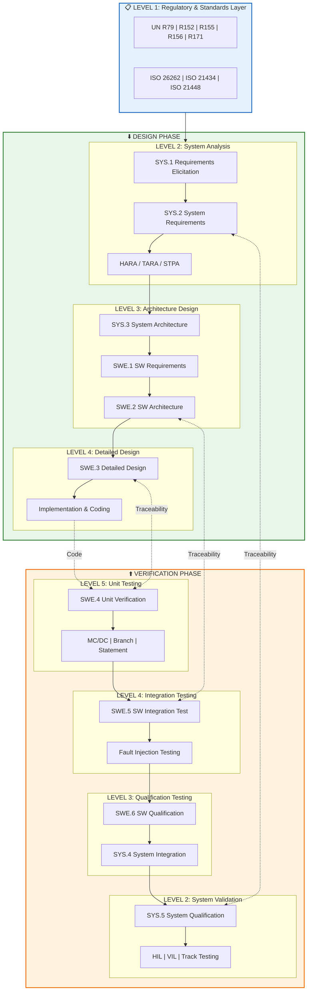

# 🏎️ 汽车功能安全与软件架构知识库


---

**Enterprise-Grade Knowledge Repository for Automotive E/E Architecture, Functional Safety, and ASPICE-Compliant Software Development**

*Architecting the Future of Software-Defined Vehicles*

---

## 🎯 知识库概述

本知识库为 **高级汽车软件架构师**、**功能安全工程师** 和 **E/E 系统工程师** 提供从法规合规到代码实现的全栈技术资产。

覆盖 **V-Model 全生命周期**，从 UN ECE 法规解读到 MISRA C++ 编码规范，从 STPA 系统分析到 MC/DC 测试覆盖，构建完整的知识闭环。

!!! quote "Excellence Mandate"
    *"Excellence in automotive software is not an option — it's a mandate."*

---

## 📐 V-Model 架构总览



---

## 🗂️ 知识漏斗 — 层级导航

!!! info "导航指南"
    从宏观法规到微观代码，逐层下钻的知识架构

### 🔷 Level 1 — 法规与标准基础

*Building Compliance from Ground Zero*

| 文档 | 范围 | 核心内容 |
|:-----|:-----|:---------|
| 📄 [**法规矩阵**](01_Standards_Level/Regulations_Matrix.md) | UN ECE Regulations | R79 (转向), R152 (AEBS), R155 (CSMS), R156 (SUMS), R171 (CMS) 核心边界约束 |

**核心能力:**

- UN Type Approval 法规解读与系统边界定义
- CSMS/SUMS 管理体系认证要求
- 法规间关联矩阵与合规检查清单

---

### 🔶 Level 2 — 系统分析与安全工程

*Hazard to Safety Goal — Mastering HARA, TARA, and STPA*

| 文档 | 范围 | 核心内容 |
|:-----|:-----|:---------|
| 📄 [**HARA / TARA / STPA 指南**](02_System_Analysis/HARA_TARA_STPA_Guide.md) | 风险分析 | 功能安全与网络安全风险分析方法论对比，STPA 控制回路建模 |
| 📄 [**硬件可靠性分析**](02_System_Analysis/Hardware_Reliability.md) | 硬件度量 | FTA/FMEA/FMEDA 在 SPFM/LFM/PMHF 计算中的应用 |

**核心能力:**

- STPA 控制结构图绘制与 UCA 识别
- HARA vs TARA 输入/输出映射
- ISO 26262 硬件度量计算 (ASIL D: SPFM ≥ 99%, LFM ≥ 90%)

---

### 🟢 Level 3 — 软件架构设计

*AUTOSAR, SOA, and Secure Communication Patterns*

| 文档 | 范围 | 核心内容 |
|:-----|:-----|:---------|
| 📄 [**CP/AP 混合架构**](03_Software_Architecture/CP_AP_Hybrid_Arch.md) | AUTOSAR | Classic + Adaptive Platform 混合通信，SOME/IP, DDS, Hypervisor 隔离 |
| 📄 [**DoIP 路由策略**](03_Software_Architecture/DoIP_Routing_Strategy.md) | 诊断通信 | DoIP 完整序列图，Routing Activation, DoIP-to-CAN 协议转换 |

**核心能力:**

- SOME/IP 服务发现与 DDS QoS 策略选择
- Type-1 Hypervisor 多分区隔离设计
- MPU 内存保护实现 Freedom from Interference (ASIL D + QM 共存)
- DoIP 诊断网关路由表与协议转换

---

### 🟡 Level 4 — 详细设计与实现

*From Specification to MISRA-Compliant Code*

| 文档 | 范围 | 核心内容 |
|:-----|:-----|:---------|
| 📄 [**UDS 0x27 安全访问**](04_Implementation/UDS_0x27_SecurityAccess.md) | 诊断安全 | PduR → Dcm → Callout → Crypto Driver 完整调用栈，Seed/Key 实现 |
| 📄 [**MISRA C++ 核心规则**](04_Implementation/MISRA_Cpp_Golden_Rules.md) | 编码规范 | 10 条致命规则 Bad vs Good 对比，静态分析工具链集成 |
| 📄 [**内存映射设计**](04_Implementation/Memory_Mapping_Design.md) | MemMap | AUTOSAR MemMap.h 原理，链接器脚本 ASIL 分区，MPU 联动配置 |

**核心能力:**

- UDS 安全访问状态机与防暴力攻击机制
- MISRA C++:2008/2023 规则实战应用
- 链接器脚本设计 (ASIL D 代码 → 独立 Flash Sector)
- Callout 函数设计模式与异步操作处理

---

### 🔴 Level 5 — 验证与确认

*Closing the V-Model Loop with Rigor*

| 文档 | 范围 | 核心内容 |
|:-----|:-----|:---------|
| 📄 [**测试策略**](05_Verification/Testing_Strategy.md) | SWE.5/SWE.6 | ASIL 分级测试方法矩阵，MC/DC 覆盖率，故障注入策略，HIL/SIL/MIL 测试环境 |

**核心能力:**

- MC/DC 覆盖率设计与测试用例推导
- 故障注入测试矩阵 (安全机制验证)
- 双向追溯性实现 (Requirement ↔ Test Case ↔ Code)
- CI/CD 集成自动化测试流水线

---

## 🏛️ 项目结构

```
📁 knowledge-base/
├── 📄 index.md                              # 首页
├── 📄 ASPICE_V_Model_Map.md                 # V-Model 完整架构图
│
└── 📁 docs/
    ├── 📁 01_Standards_Level/               # 法规与标准
    │   └── 📄 Regulations_Matrix.md
    │
    ├── 📁 02_System_Analysis/               # 系统分析
    │   ├── 📄 HARA_TARA_STPA_Guide.md
    │   └── 📄 Hardware_Reliability.md
    │
    ├── 📁 03_Software_Architecture/         # 软件架构
    │   ├── 📄 CP_AP_Hybrid_Arch.md
    │   └── 📄 DoIP_Routing_Strategy.md
    │
    ├── 📁 04_Implementation/                # 详细设计与实现
    │   ├── 📄 UDS_0x27_SecurityAccess.md
    │   ├── 📄 MISRA_Cpp_Golden_Rules.md
    │   └── 📄 Memory_Mapping_Design.md
    │
    └── 📁 05_Verification/                  # 测试与验证
        └── 📄 Testing_Strategy.md
```

---

## 🛠️ 技术栈与标准覆盖

| 领域 | 标准与框架 |
|:----:|:----------|
| **功能安全** | ISO 26262:2018, IEC 61508 |
| **网络安全** | ISO/SAE 21434, UN R155/R156, TARA |
| **预期功能安全** | ISO 21448 (SOTIF) |
| **过程能力** | ASPICE 3.1, ISO/IEC 33000 |
| **软件架构** | AUTOSAR Classic 4.4, Adaptive R22-11 |
| **诊断协议** | ISO 14229 (UDS), ISO 13400 (DoIP), ISO 15765 (CAN TP) |
| **编码规范** | MISRA C:2012, MISRA C++:2023, CERT C |
| **验证方法** | MC/DC, Fault Injection, SIL/HIL/VIL |

---

## 🎓 目标读者

| 🏗️ 系统架构师 | 💻 软件工程师 | ✅ 质量与安全 |
|:--------------|:-------------|:-------------|
| E/E 架构师、功能安全经理 | 嵌入式开发工程师、BSW 集成工程师 | 功能安全工程师、测试架构师 |
| *Designing next-gen zonal architecture* | *Building ASIL D compliant software* | *Ensuring ISO 26262 compliance* |

---

## 📊 合规覆盖矩阵

| 标准 | 覆盖主题 | 状态 |
|:-----|:---------|:----:|
| **ISO 26262** | HARA, ASIL, TSR/FSR, HSI, FFI, SPFM/LFM/PMHF | ✅ |
| **ISO 21434** | TARA, CAL, CSMS, Threat Scenarios | ✅ |
| **ASPICE** | SYS.1-5, SWE.1-6, SUP.8, MAN.3 | ✅ |
| **AUTOSAR** | CP BSW, AP ara::, SOME/IP, DDS | ✅ |
| **UN R155/R156** | CSMS, SUMS, RXSWIN, Type Approval | ✅ |
| **MISRA C++** | 2008/2023 Rules, Deviations | ✅ |

---

## 📈 路线图

- [x] Level 1: 法规矩阵 (UN R79, R152, R155, R156, R171)
- [x] Level 2: HARA/TARA/STPA 指南 + 硬件可靠性
- [x] Level 3: AUTOSAR CP/AP 架构 + DoIP 路由
- [x] Level 4: UDS 实现 + MISRA 规则 + MemMap
- [x] Level 5: 测试策略与覆盖率指标
- [ ] **Coming Soon**: OTA 更新工作流 (A/B Partition)
- [ ] **Coming Soon**: 安全启动链设计
- [ ] **Coming Soon**: SOTIF 分析模板

---

## 📜 许可与声明

本知识库为专有内容，仅供内部参考使用。

所有引用的标准 (ISO, UN ECE, AUTOSAR) 为各自组织的商标。

---

**Engineered with Precision. Validated with Rigor. Delivered with Excellence.**

*© 2026 Automotive Software Excellence Center*
