# 🏎️ 汽车功能安全与软件架构知识库

<!-- Hero Section -->

## 我是 Michael Lin

### 汽车软件与功能安全架构专家

🇩🇪 **10+ 年德国一线汽车电子质量与架构实战经验**

🏆 **曾领导并交付多个 ASIL D 项目、ISO/SAE 21434 合规落地**

🤖 **创建 Compliance-Wächter — AI 驱动的合规 Copilot 工具**

📍 **现任 MAGNA 质量经理，专注网络安全合规 (UN R155)**

| 🎯 85% | 📄 200+ | 🔧 30% |
|:------:|:-------:|:------:|
| 验证周期缩短 | 日均自动生成 TARA 文档 | 架构审查返工减少 |

---

---

## 🎯 知识库概述

本知识库是我 **10+ 年德国汽车电子行业实战经验** 的结晶，专为 **高级汽车软件架构师**、**功能安全工程师** 和 **E/E 系统工程师** 设计。

覆盖 **V-Model 全生命周期**，从 UN ECE 法规解读到 MISRA C++ 编码规范，从 STPA 系统分析到 MC/DC 测试覆盖，构建完整的知识闭环。

!!! quote "我的使命"
    *"将复杂的德国汽车合规要求，转化为中国团队可执行的工程实践。"*

---

## 📐 V-Model 架构总览

```mermaid
flowchart LR
    subgraph Standards["Level 1: Standards"]
        REG[UN R79/R152/R155/R156]
        ISO[ISO 26262/21434]
    end

    subgraph Design["Design Phase"]
        SYS1[SYS.1 Requirements]
        SYS2[SYS.2 Analysis]
        SYS3[SYS.3 Architecture]
        SWE1[SWE.1 SW Req]
        SWE2[SWE.2 SW Arch]
        SWE3[SWE.3 Detail Design]
        CODE[Implementation]
    end

    subgraph Verify["Verification Phase"]
        UT[Unit Test]
        IT[Integration Test]
        QT[Qualification Test]
        ST[System Test]
    end

    Standards --> Design
    SYS1 --> SYS2
    SYS2 --> SYS3
    SYS3 --> SWE1
    SWE1 --> SWE2
    SWE2 --> SWE3
    SWE3 --> CODE

    CODE --> UT
    UT --> IT
    IT --> QT
    QT --> ST

    SYS2 -.-> ST
    SWE2 -.-> IT
    SWE3 -.-> UT

    style Standards fill:#e3f2fd,stroke:#1565c0
    style Design fill:#e8f5e9,stroke:#2e7d32
    style Verify fill:#fff3e0,stroke:#ef6c00
```

---

## 🗂️ 知识漏斗 — 层级导航

!!! info "我的经验架构"
    这套知识体系源于我在德国 OEM 和 Tier-1 项目中的实战积累，每个模块都包含**真实案例**和**量化成果**。

---

### 🔷 Level 1 — 法规与标准基础

*Building Compliance from Ground Zero*

| 文档 | 范围 | 核心内容 |
|:-----|:-----|:---------|
| 📄 [**法规矩阵**](01_Standards_Level/Regulations_Matrix.md) | UN ECE Regulations | R79, R152, R155, R156, R171 核心边界约束 |

!!! success "💡 我的实战洞察"
    **项目背景**: 某德国 OEM 的 ADAS 域控制器 Type Approval 项目
    
    **挑战**: 客户首次面对 R155/R156 双重认证，内部流程完全空白
    
    **我的贡献**: 
    
    - 设计了 **CSMS-SUMS 一体化合规框架**，将两个法规要求整合到统一流程
    - 建立 **RXSWIN 版本管理体系**，确保 OTA 更新可追溯
    - **成果**: 项目通过 TÜV SÜD 审核，成为该客户首个 R155/R156 双认证产品

---

### 🔶 Level 2 — 系统分析与安全工程

*Hazard to Safety Goal — Mastering HARA, TARA, and STPA*

| 文档 | 范围 | 核心内容 |
|:-----|:-----|:---------|
| 📄 [**HARA / TARA / STPA 指南**](02_System_Analysis/HARA_TARA_STPA_Guide.md) | 风险分析 | 功能安全与网络安全风险分析方法论，STPA 控制回路建模 |
| 📄 [**硬件可靠性分析**](02_System_Analysis/Hardware_Reliability.md) | 硬件度量 | FTA/FMEA/FMEDA 在 SPFM/LFM/PMHF 计算中的应用 |

!!! success "💡 我的实战洞察"
    **项目背景**: MAGNA 某制动系统 ASIL D 功能安全认证
    
    **挑战**: HARA 与 TARA 分析团队各自为战，风险评估结果无法对齐
    
    **我的贡献**: 
    
    - 设计 **HARA-TARA 联合评审模板**，将功能安全与网络安全风险统一映射
    - 引入 **STPA 控制结构分析**，识别出传统 FMEA 遗漏的 3 个 UCA
    - **成果**: 安全分析覆盖率提升 **40%**，评审周期从 6 周缩短至 **2 周**

---

### 🟢 Level 3 — 软件架构设计

*AUTOSAR, SOA, and Secure Communication Patterns*

| 文档 | 范围 | 核心内容 |
|:-----|:-----|:---------|
| 📄 [**CP/AP 混合架构**](03_Software_Architecture/CP_AP_Hybrid_Arch.md) | AUTOSAR | Classic + Adaptive Platform 混合通信，SOME/IP, DDS, Hypervisor |
| 📄 [**DoIP 路由策略**](03_Software_Architecture/DoIP_Routing_Strategy.md) | 诊断通信 | DoIP 完整序列图，Routing Activation, DoIP-to-CAN 协议转换 |

!!! success "💡 我的实战洞察"
    **项目背景**: 某域控制器 AUTOSAR AP + CP 混合架构落地
    
    **挑战**: ASIL D 安全功能与 QM 娱乐功能共存，MPU 隔离策略争议不断
    
    **我的贡献**: 
    
    - 主导制定 **FFI (Freedom from Interference) 验证方案**
    - 设计 **MPU 区域划分表**，明确 ASIL D/B/QM 内存边界
    - 协调软硬件团队，完成 **Hypervisor + MPU 双重隔离** 验证
    - **成果**: 架构评审一次通过，返工率降低 **30%**

---

### 🟡 Level 4 — 详细设计与实现

*From Specification to MISRA-Compliant Code*

| 文档 | 范围 | 核心内容 |
|:-----|:-----|:---------|
| 📄 [**UDS 0x27 安全访问**](04_Implementation/UDS_0x27_SecurityAccess.md) | 诊断安全 | PduR → Dcm → Callout → Crypto Driver 完整调用栈 |
| 📄 [**MISRA C++ 核心规则**](04_Implementation/MISRA_Cpp_Golden_Rules.md) | 编码规范 | 10 条致命规则 Bad vs Good 对比 |
| 📄 [**内存映射设计**](04_Implementation/Memory_Mapping_Design.md) | MemMap | AUTOSAR MemMap.h 原理，链接器脚本 ASIL 分区 |

!!! success "💡 我的实战洞察"
    **项目背景**: 某 ECU 量产代码 MISRA C++ 合规整改
    
    **挑战**: 遗留代码 5000+ MISRA 违规，开发团队抵触情绪严重
    
    **我的贡献**: 
    
    - 制定 **"10 条致命规则优先"** 策略，聚焦高风险违规
    - 设计 **MISRA Deviation 管理流程**，合理豁免非关键违规
    - 组织 **代码规范培训 workshop**，提升团队意识
    - **成果**: 关键违规清零，整改周期从预估 6 个月缩短至 **2 个月**

---

### 🔴 Level 5 — 验证与确认

*Closing the V-Model Loop with Rigor*

| 文档 | 范围 | 核心内容 |
|:-----|:-----|:---------|
| 📄 [**测试策略**](05_Verification/Testing_Strategy.md) | SWE.5/SWE.6 | ASIL 分级测试方法矩阵，MC/DC 覆盖率，故障注入 |

!!! success "💡 我的实战洞察"
    **项目背景**: 某 ASIL D 项目 MC/DC 覆盖率不达标
    
    **挑战**: 测试团队对 MC/DC 理解不足，覆盖率长期停滞在 85%
    
    **我的贡献**: 
    
    - 编写 **MC/DC 测试用例设计指南**，配合具体代码示例
    - 引入 **自动化覆盖率分析工具链**，实时监控进度
    - 建立 **每日覆盖率看板**，推动团队持续改进
    - **成果**: 覆盖率从 85% 提升至 **98%**，验证周期缩短 **85%**

---

## 🚀 Compliance-Wächter — 我正在构建的解决方案

!!! tip "解决行业痛点"
    我见证了太多优秀的中国供应商在 **UN R155 / ISO 21434** 合规上苦苦挣扎。
    
    手动 TARA 分析缓慢、易错，且经常被德国 OEM 退回。
    
    **Compliance-Wächter** 是一个 AI 驱动的合规 Copilot，通过大语言模型自动化 TARA 文档生成。

| 🎯 减少 70% | 📄 200+/天 | ⏱️ 秒级生成 |
|:-----------:|:----------:|:----------:|
| 合规文书工作 | 自动生成 TARA 文档 | 威胁场景分析 |

**如果你是 Homologation 或 Cybersecurity Manager，正在面对 R155 挑战，欢迎联系我成为 MVP 测试伙伴。**

[:material-rocket-launch: 了解 Compliance-Wächter](https://compliance-waechter.com){ .md-button .md-button--primary }
[:material-email: 联系我](mailto:haiqing.lin@compliance-waechter.com){ .md-button }

---

## 🛠️ 技术栈与标准覆盖

| 领域 | 标准与框架 | 我的经验 |
|:----:|:----------|:---------|
| **功能安全** | ISO 26262:2018, IEC 61508 | 多个 ASIL D 项目认证经验 |
| **网络安全** | ISO/SAE 21434, UN R155/R156 | 主导 CSMS/SUMS 体系建设 |
| **过程能力** | ASPICE 3.1, ISO/IEC 33000 | CL3 评估支持经验 |
| **软件架构** | AUTOSAR Classic 4.4, Adaptive R22-11 | CP/AP 混合架构设计 |
| **诊断协议** | ISO 14229 (UDS), ISO 13400 (DoIP) | 诊断栈集成与调试 |
| **编码规范** | MISRA C:2012, MISRA C++:2023 | 代码审查与整改指导 |
| **验证方法** | MC/DC, Fault Injection, HIL/SIL | 测试策略制定与工具链选型 |

---

## 📊 量化成果

| 指标 | 数值 | 说明 |
|:-----|:----:|:-----|
| 🎯 验证周期缩短 | **85%** | 通过流程优化和工具链自动化 |
| 📉 架构返工减少 | **30%** | 通过前置评审和 FFI 验证 |
| 📈 MISRA 合规提升 | **100%** | 关键规则零违规 |
| ⏱️ 安全分析周期 | **-67%** | 从 6 周缩短至 2 周 |
| 📄 TARA 文档生成 | **200+/天** | Compliance-Wächter 自动化 |

---

## 📈 路线图

- [x] Level 1: 法规矩阵 (UN R79, R152, R155, R156, R171)
- [x] Level 2: HARA/TARA/STPA 指南 + 硬件可靠性
- [x] Level 3: AUTOSAR CP/AP 架构 + DoIP 路由
- [x] Level 4: UDS 实现 + MISRA 规则 + MemMap
- [x] Level 5: 测试策略与覆盖率指标
- [ ] **Coming Soon**: OTA 更新工作流 (A/B Partition)
- [ ] **Coming Soon**: 安全启动链设计
- [ ] **Coming Soon**: SOTIF 分析模板

---

## 📜 许可与声明

本知识库为专有内容，仅供参考使用。

所有引用的标准 (ISO, UN ECE, AUTOSAR) 为各自组织的商标。

---

**Engineered with Precision. Validated with Rigor. Delivered with Excellence.**

*© 2026 Michael Lin — Automotive Software Excellence*
